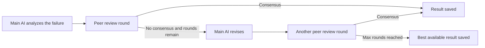

# Adding Peer Review with Multiple AI Models

You want difficult failures to get a second opinion before you trust the AI's triage. Peer review keeps your normal main model in place and adds other models that can confirm the result or force another pass when the first answer looks shaky.

## Prerequisites
- A working JJI setup and a successful single-model analysis flow. See [Running Your First Analysis](quickstart.html).
- A primary AI provider and model already configured for normal analyses.
- Every peer provider you plan to use must be installed and authenticated where JJI runs.

## Quick example

```bash
jji analyze \
  --job-name my-job \
  --build-number 42 \
  --peers "cursor:gpt-5.4-xhigh,gemini:gemini-2.5-pro" \
  --peer-analysis-max-rounds 3
```

This runs the usual analysis, adds two peer reviewers, and lets the discussion continue for up to three rounds before JJI accepts the final triage.

## Step-by-step

1. Choose where peer review should be the default.

| Scope | Use this when | What to set |
| --- | --- | --- |
| Server default | Every caller should inherit the same peer reviewers | `PEER_AI_CONFIGS` and `PEER_ANALYSIS_MAX_ROUNDS` |
| CLI profile default | Your `jji` runs should reuse the same peers | `peers` and `peer_analysis_max_rounds` in `~/.config/jji/config.toml` |
| One run only | You want to override peers for a single analysis | `--peers` and `--peer-analysis-max-rounds` |

Set server defaults in `.env` or your container environment:

```dotenv
AI_PROVIDER=claude
AI_MODEL=your-model-name
PEER_AI_CONFIGS=cursor:gpt-5.4-xhigh,gemini:gemini-2.5-pro
PEER_ANALYSIS_MAX_ROUNDS=3
```

Or set a personal CLI default in `~/.config/jji/config.toml`:

```toml
[defaults]
peers = "cursor:gpt-5.4-xhigh,gemini:gemini-2.5-pro"
peer_analysis_max_rounds = 3
```

> **Note:** The main analysis still uses your primary `AI_PROVIDER` and `AI_MODEL`. Peer reviewers challenge that result; they do not replace your main model.

2. Run the analysis.

If you already set defaults, a normal `jji analyze` command will use them:

```bash
jji analyze \
  --job-name my-job \
  --build-number 42
```

If you want a one-off override, add the peer flags:

```bash
jji analyze \
  --job-name my-job \
  --build-number 42 \
  --peers "cursor:gpt-5.4-xhigh,gemini:gemini-2.5-pro" \
  --peer-analysis-max-rounds 5
```

`--peers` uses a comma-separated `provider:model` list. `--peer-analysis-max-rounds` accepts `1` through `10`, and the default is `3`.

> **Tip:** The same `provider:model,provider:model` format is used in `PEER_AI_CONFIGS`, `peers`, and `--peers`.

3. Follow the debate while the run is active.

```bash
jji status JOB_ID
```

The CLI prints a `Poll:` URL when you queue the job. Open that URL in the browser to see the live status page, including the main AI, the peer models, and progress messages for each review and revision round.



4. Review the outcome after completion.

```bash
jji results show JOB_ID --full
```

In the browser report, look for the `Peer Analysis` section. It shows whether each debated failure reached `Consensus` or `No Consensus`, how many rounds were used, and a round-by-round timeline of what each model said.

For the manual review flow after the AI finishes, see [Reviewing, Commenting, and Reclassifying Failures](reviewing-commenting-and-reclassifying-failures.html).

5. Re-run with different peers when a hard failure still looks unclear.

```bash
jji re-analyze JOB_ID
```

The CLI shortcut repeats the stored settings. If you want to change the peer list, turn peer review off for just the rerun, or adjust max rounds, use the report page's `Re-Analyze` dialog and submit a new analysis from there.

## Advanced Usage

Use this command to see provider/model pairs that have already produced successful analyses in your environment:

```bash
jji ai-configs
```

That is the fastest way to pick peer models that already work with your current runtime and authentication setup.

Use rounds to control how much debate you want:

| Rounds | What changes |
| --- | --- |
| `1` | One peer-review pass only |
| `3` | Default behavior |
| Higher values | More chances for the main AI to revise after disagreements |
| `10` | Highest allowed limit |

From round `2` onward, each peer sees the other peers' previous responses. Extra rounds are most useful when the first round disagrees, not when every model already agrees immediately.

You can add more than one peer by listing more `provider:model` entries. JJI also reuses one peer debate across failures that share the same underlying error, so repeated failures with the same signature do not each start a separate discussion.

## Troubleshooting

- If `--peers` or `peers` is rejected, use `provider:model,provider:model` format and remove any trailing comma.
- If you get an unsupported-provider error, use the provider names supported by your JJI install, such as `claude`, `gemini`, or `cursor`, and make sure that provider's CLI is available in the same runtime.
- If `--peer-analysis-max-rounds` is rejected, use a value from `1` to `10`.
- If the run is much slower than usual, remember that each round calls every peer and may trigger another main-model revision.
- If the report has no `Peer Analysis` section, peers were not enabled for that run, or the Jenkins job had no test report and fell back to console-only analysis.
- If the run completes but the peers did not help, JJI keeps the main AI result when all peer calls fail. Check peer authentication and model names first.

## Related Pages

- [Analyzing Jenkins Jobs](analyzing-jenkins-jobs.html)
- [Improving Analysis with Repository Context](improving-analysis-with-repository-context.html)
- [Monitoring and Re-Running Analyses](monitoring-and-rerunning-analyses.html)
- [Analyzing JUnit XML and Raw Failures](analyzing-junit-xml-and-raw-failures.html)
- [Configuration and Environment Reference](configuration-and-environment-reference.html)