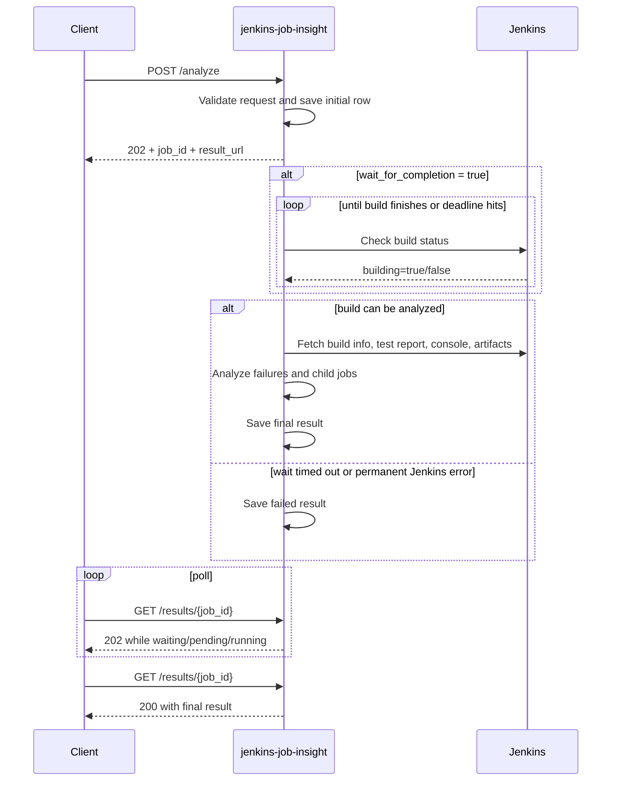
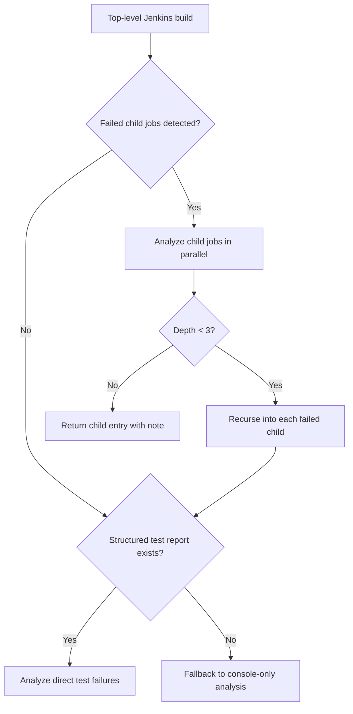

# Analyze Jenkins Jobs

`POST /analyze` is the Jenkins-backed entry point in `jenkins-job-insight`. You give JJI a `job_name` and `build_number`, and it creates a stored analysis job that you can follow with `GET /results/{job_id}` or the built-in browser route `/status/{job_id}`.

> **Note:** A Jenkins build that failed can still produce `status: "completed"` if JJI finished analyzing it successfully. In this API, `failed` means the analysis job itself failed.

## Before You Submit

JJI needs two things somewhere in the merged configuration for the request:

- AI configuration: `AI_PROVIDER` and `AI_MODEL`, or per-request `ai_provider` and `ai_model`
- Jenkins connectivity: server defaults or per-request `jenkins_url`, `jenkins_user`, `jenkins_password`, and optionally `jenkins_ssl_verify`

The container example exposes the core environment variables like this:

```73:82:docker-compose.yaml
      - JENKINS_URL=${JENKINS_URL:-https://jenkins.example.com}
      - JENKINS_USER=${JENKINS_USER:-your-username}
      - JENKINS_PASSWORD=${JENKINS_PASSWORD:-your-api-token}

      # ===================
      # AI CLI Configuration
      # ===================
      # AI_PROVIDER: claude, gemini, or cursor
      - AI_PROVIDER=${AI_PROVIDER:?AI_PROVIDER is required}
      - AI_MODEL=${AI_MODEL:?AI_MODEL is required}
```

The example CLI config also shows the default waiting behavior for Jenkins-backed runs:

```29:31:config.example.toml
wait_for_completion = true
poll_interval_minutes = 2
max_wait_minutes = 0  # 0 = no limit (wait forever)
```

Request-body values override server defaults for that run. That includes `wait_for_completion`, `poll_interval_minutes`, `max_wait_minutes`, `tests_repo_url`, and Jenkins connection fields.

## What You Send

A real queued submission in the test suite looks like this:

```128:145:tests/test_main.py
with patch("jenkins_job_insight.main.process_analysis_with_id"):
    response = test_client.post(
        "/analyze",
        json={
            "job_name": "test",
            "build_number": 123,
            "tests_repo_url": "https://github.com/example/repo",
            "ai_provider": "claude",
            "ai_model": "test-model",
        },
    )
    assert response.status_code == 202
    data = response.json()
    assert data["status"] == "queued"
    assert data["base_url"] == ""
    assert data["result_url"].startswith("/results/")
```

The fields that matter most for Jenkins-backed analysis are:

| Field | Required | What it does |
| --- | --- | --- |
| `job_name` | Yes | Jenkins job name. Folder-style names like `folder/job-name` are supported. |
| `build_number` | Yes | Jenkins build number to inspect. |
| `wait_for_completion` | No | If `true` (default), JJI waits for a still-running Jenkins build to finish before analysis starts. |
| `poll_interval_minutes` | No | Minutes between Jenkins status checks while waiting. Default: `2`. |
| `max_wait_minutes` | No | Maximum wait time before JJI gives up. `0` means no limit. |
| `tests_repo_url` | No | Repository to clone so the AI can inspect source and test code. |
| `jenkins_url`, `jenkins_user`, `jenkins_password`, `jenkins_ssl_verify` | No | Per-request Jenkins overrides. |
| `get_job_artifacts` and artifact size/context fields | No | Control whether JJI downloads build artifacts and how much artifact context it feeds into analysis. |

When `tests_repo_url` is set, JJI clones it once and reuses that workspace for the top-level job and any recursively analyzed child jobs.

The same endpoint also accepts shared analysis options such as `enable_jira`, `raw_prompt`, `peer_ai_configs`, and `additional_repos`, but the fields above are the ones that most directly change Jenkins-backed behavior.

A few important validation rules:

- Missing required fields or invalid types return `422`.
- `poll_interval_minutes` must be greater than `0`.
- `max_wait_minutes` cannot be negative.
- If JJI cannot resolve an AI provider or model, `POST /analyze` fails fast with `400` instead of queueing a broken job.

## Async By Design

`POST /analyze` is asynchronous only. It always queues work and returns `202 Accepted`.

```1060:1118:src/jenkins_job_insight/main.py
@app.post("/analyze", status_code=202, response_model=None)
async def analyze(
    request: Request,
    body: AnalyzeRequest,
    background_tasks: BackgroundTasks,
    *,
    settings: Settings = Depends(get_settings),
) -> dict:
    """Submit a Jenkins job for analysis.

    Returns immediately with a job_id. Poll /results/{job_id} for status.
    """
    logger.debug(f"Starting analysis for {body.job_name} #{body.build_number}")
    base_url = _extract_base_url()

    # Validate AI config early -- fail fast before queuing invalid jobs.
    _resolve_ai_config(body)

    # Generate job_id here so we can return it to the client for polling
    job_id = str(uuid.uuid4())
    merged = _merge_settings(body, settings)

    # ...

    await save_result(
        job_id,
        jenkins_url,
        "waiting" if can_resume_wait else "pending",
        initial_result,
    )
    background_tasks.add_task(process_analysis_with_id, job_id, body, merged)
    message = f"Analysis job queued. Poll /results/{job_id} for status."

    response: dict = {
        "status": "queued",
        "job_id": job_id,
        "message": message,
    }

    return _attach_result_links(response, base_url, job_id)
```

That submit response gives you:

- `status: "queued"`
- `job_id`
- `message`
- `result_url`
- `base_url`

Unless `PUBLIC_BASE_URL` is configured, `result_url` is a relative path like `/results/{job_id}`.

### Sync vs Async

| Use case | Endpoint | Execution model |
| --- | --- | --- |
| Analyze a Jenkins build by `job_name` and `build_number` | `POST /analyze` | Async only. Returns `202` and a `job_id`. |
| Analyze raw failures or JUnit XML you already have | `POST /analyze-failures` | Synchronous request/response. |

> **Note:** `wait_for_completion` does not make `POST /analyze` synchronous. It only changes whether the queued background job pauses in a Jenkins-monitoring phase before analysis begins.

> **Warning:** The older `?sync=true` style is not part of the current `POST /analyze` contract.

This is asynchronous, but it is still implemented inside the application process with FastAPI background tasks, not an external worker queue.

### Job Lifecycle

A Jenkins-backed analysis typically moves through these stored states:

- `waiting`: JJI accepted the request and is polling Jenkins for the target build to finish
- `pending`: JJI accepted the request and queued it without a waiting phase
- `running`: analysis is actively executing
- `completed`: the result is ready
- `failed`: the analysis failed, or the Jenkins wait phase failed

Because `POST /analyze` uses in-process background tasks, restart behavior matters:

- `waiting` jobs can be resumed on startup
- `pending` and `running` jobs are marked `failed` on startup because their background task is gone

## Waiting For Jenkins

If you submit a build that is still running and leave `wait_for_completion` at its default value of `true`, JJI does not start analysis immediately. It first polls Jenkins until the build reaches a terminal state.

The wait loop does three user-visible things:

- returns success as soon as Jenkins reports `building: false`
- keeps polling through transient transport problems like `OSError` and `TimeoutError`
- stops immediately on permanent problems like Jenkins `404` or other non-transient errors

```751:798:src/jenkins_job_insight/main.py
    if max_wait_minutes > 0:
        deadline: float | None = _time.monotonic() + max_wait_minutes * 60
    else:
        deadline = None  # No limit

    while True:
        try:
            build_info = await asyncio.to_thread(
                client.get_build_info_safe, job_name, build_number
            )

            if build_info and not build_info.get("building", True):
                logger.info(
                    f"Jenkins job {job_name} #{build_number} completed "
                    f"with result: {build_info.get('result')}"
                )
                return True, ""

            logger.info(f"Jenkins job {job_name} #{build_number} still running")

        except jenkins.NotFoundException:
            # ...
            return False, f"Jenkins job {job_name} #{build_number} not found (404)"

        except (OSError, TimeoutError) as e:
            logger.warning(f"Transient error checking Jenkins status: {e}")

        except Exception as e:
            logger.error(f"Non-transient error checking Jenkins status: {e}")
            return False, f"Jenkins poll failed: {e}"

        if deadline is not None:
            remaining = deadline - _time.monotonic()
            if remaining <= 0:
                break
            await asyncio.sleep(min(poll_interval_minutes * 60, remaining))
        else:
            await asyncio.sleep(poll_interval_minutes * 60)
```

Practical rules:

- `max_wait_minutes = 0` means wait indefinitely.
- If the wait times out, the stored job becomes `failed` before AI analysis starts.
- If `wait_for_completion` is `false`, JJI skips the wait and moves straight to `running`.
- If the merged settings do not include a Jenkins URL, the wait phase is skipped even when `wait_for_completion` is `true`, but the later analysis step still needs Jenkins access to fetch the build.

> **Warning:** `wait_for_completion=false` means JJI starts analysis against the current Jenkins state. If the build is still running, the result may reflect incomplete logs or test reports.

## Polling And The Built-In Status Page

Once you have a `job_id`, `GET /results/{job_id}` is the durable source of truth.

```1332:1355:src/jenkins_job_insight/main.py
@app.get("/results/{job_id}", response_model=None)
async def get_job_result(request: Request, job_id: str, response: Response):
    """Retrieve stored result by job_id, or serve SPA for browser requests."""
    # Content negotiation: browsers requesting HTML get the SPA
    accept = request.headers.get("accept", "")
    if "text/html" in accept and "application/json" not in accept:
        result = await get_result(job_id)
        if result and result.get("status") in IN_PROGRESS_STATUSES:
            return RedirectResponse(url=f"/status/{job_id}", status_code=302)
        return _serve_spa()

    logger.debug(f"GET /results/{job_id}")
    result = await get_result(job_id)
    if not result:
        raise HTTPException(status_code=404, detail="Job not found")
    _attach_result_links(result, _extract_base_url(), job_id)
    # ...
    if result.get("status") in IN_PROGRESS_STATUSES:
        response.status_code = 202
    return result
```

What that means in practice:

- API clients poll `GET /results/{job_id}` until the status becomes `completed` or `failed`.
- `GET /results/{job_id}` returns `202` while the job is `waiting`, `pending`, or `running`.
- The same route returns `200` once the stored job is in a terminal state.
- Browsers that request `/results/{job_id}` early are redirected to the UI route `/status/{job_id}` instead of seeing a half-finished report.

The response wrapper includes top-level fields such as `job_id`, `status`, `jenkins_url`, `created_at`, `base_url`, and `result_url`, plus a nested `result` object. During in-progress states, that nested `result` can already contain `request_params`, `progress_phase`, and `progress_log`. When the job finishes, it holds the full analysis payload. Sensitive request fields are stripped from API responses.

The built-in status page polls every 10 seconds and automatically navigates to the final report when analysis finishes:

```10:18:frontend/src/pages/StatusPage.tsx
const POLL_MS = 10_000

const phaseLabels: Record<string, string> = {
  waiting_for_jenkins: 'Waiting for Jenkins build to complete...',
  analyzing: 'Analyzing test failures with AI...',
  analyzing_child_jobs: 'Analyzing child job failures...',
  analyzing_failures: 'Analyzing test failures...',
  enriching_jira: 'Searching Jira for matching bugs...',
  saving: 'Saving results...',
}
```

```101:143:frontend/src/pages/StatusPage.tsx
    async function poll() {
      if (inFlight || cancelled) return
      inFlight = true
      try {
        const res = await api.get<ResultResponse>(`/results/${jobId}`)
        if (cancelled) return
        setError('')
        setData(res)

        if (res.status === 'completed') {
          stopPolling()
          navigate(`/results/${jobId}`, { replace: true })
        } else if (res.status === 'failed') {
          stopPolling()
          setTerminalErrorKind('failed')
          setError(res.result?.error ?? 'Analysis failed')
        }
      } catch (err) {
        // ...
      } finally {
        inFlight = false
      }
    }

    poll()
    intervalRef.current = setInterval(poll, POLL_MS)
```

Common progress phases you may see in `result.progress_phase` or `result.progress_log`:

- `waiting_for_jenkins`
- `analyzing`
- `analyzing_child_jobs`
- `analyzing_failures`
- `enriching_jira`
- `saving`

The phase history is stored server-side, so refreshing `/status/{job_id}` does not lose the progress log.

> **Tip:** If peer analysis is enabled for your server or request, you may also see phases like `peer_review_round_1` and `orchestrator_revising_round_1`.



## Callbacks

Callbacks are not part of the current `POST /analyze` flow.

> **Warning:** There is no `callback_url`, `callback_headers`, `CALLBACK_URL`, or `CALLBACK_HEADERS` support in the current codebase for Jenkins analysis.

Use one of these supported patterns instead:

- poll `GET /results/{job_id}` from automation
- open `/status/{job_id}` in a browser while the job is still in progress
- open `/results/{job_id}` once the job reaches `completed` or `failed`

## Successful Builds

JJI checks the Jenkins build result before it starts failure extraction. If Jenkins says the build passed, JJI returns a normal completed result with an empty `failures` list.

```1470:1483:src/jenkins_job_insight/analyzer.py
    build_result = build_info.get("result")
    if build_result == "SUCCESS":
        return AnalysisResult(
            job_id=job_id,
            job_name=request.job_name,
            build_number=request.build_number,
            jenkins_url=HttpUrl(jenkins_build_url),
            status="completed",
            summary="Build passed successfully. No failures to analyze.",
            ai_provider=ai_provider,
            ai_model=ai_model,
            failures=[],
        )
```

That is why a passing Jenkins build still produces a stored analysis result:

- `status` is `completed`
- `summary` is `Build passed successfully. No failures to analyze.`
- `failures` is empty

> **Note:** A successful build is not treated as an API error. It is a successful analysis result with nothing to classify.

## Recursive Child-Job Analysis

`POST /analyze` does not stop at the top-level Jenkins build. For pipeline-style or orchestrator jobs, JJI looks for failed downstream builds and analyzes them recursively.

Child-job discovery checks:

- `subBuilds`
- `actions[].triggeredBuilds`
- console output as a fallback when Jenkins metadata does not list child jobs

Only child jobs with result `FAILURE` or `UNSTABLE` are followed.

When JJI finds failed children, it analyzes them in parallel and nests the results. If recursion reaches the safety limit, the child entry is returned with a note instead of recursing forever.

```1172:1178:src/jenkins_job_insight/analyzer.py
    if depth >= max_depth:
        return ChildJobAnalysis(
            job_name=job_name,
            build_number=build_number,
            jenkins_url=jenkins_url,
            note="Max depth reached - analysis stopped to prevent infinite recursion",
        )
```

```1214:1270:src/jenkins_job_insight/analyzer.py
    if failed_children:
        # Recursively analyze failed children IN PARALLEL with bounded concurrency
        child_tasks: list[Coroutine[Any, Any, Any]] = [
            analyze_child_job(
                child_name,
                child_num,
                jenkins_client,
                jenkins_base_url,
                depth + 1,
                max_depth,
                # ...
            )
            for child_name, child_num in failed_children
        ]
        child_results = await run_parallel_with_limit(child_tasks)

        # ...

        return ChildJobAnalysis(
            job_name=job_name,
            build_number=build_number,
            jenkins_url=jenkins_url,
            summary=summary,
            failures=[],  # Pipeline has no direct failures
            failed_children=child_analyses,
        )
```

How to read the result:

- Direct child jobs appear in `child_job_analyses`.
- Nested descendants appear in `failed_children`.
- A pipeline wrapper can have `failures: []` and still contain real failures underneath in child jobs.
- Leaf jobs are analyzed like normal builds: JJI prefers structured test reports, and falls back to console-only analysis when no report exists.

A stored result with child-job nesting looks like this in the tests:

```1265:1281:tests/test_main.py
        result_data = {
            "status": "completed",
            "summary": "",
            "failures": [],
            "child_job_analyses": [
                {
                    "job_name": "child-1",
                    "build_number": 5,
                    "failures": [
                        {
                            "test_name": "test_foo",
                            "error": "err",
                            "analysis": {"classification": "CODE ISSUE"},
                        }
                    ],
                    "failed_children": [],
                }
            ],
        }
```

> **Note:** The recursion limit is `3`. When JJI hits that limit, it preserves the child entry and adds a note explaining that recursion stopped.



## Common Responses

| HTTP status | When you should expect it |
| --- | --- |
| `202 Accepted` | `POST /analyze` was accepted and queued, or `GET /results/{job_id}` is returning an in-progress job. |
| `200 OK` | `GET /results/{job_id}` returned a terminal result. |
| `400 Bad Request` | JJI could not resolve a valid AI provider or model before queueing. |
| `404 Not Found` | You requested a `job_id` that does not exist. |
| `422 Unprocessable Entity` | The request body failed validation. |

> **Tip:** Jenkins connectivity problems, missing Jenkins permissions, wait timeouts, and similar runtime issues usually appear as a stored `failed` result after queueing. Poll the `job_id` to see the final error message.


## Related Pages

- [POST /analyze](api-post-analyze.html)
- [Quickstart](quickstart.html)
- [Pipeline Analysis and Failure Deduplication](pipeline-analysis-and-failure-deduplication.html)
- [Jenkins, Repository Context, and Prompts](jenkins-repository-and-prompts.html)
- [HTML Reports and Dashboard](html-reports-and-dashboard.html)