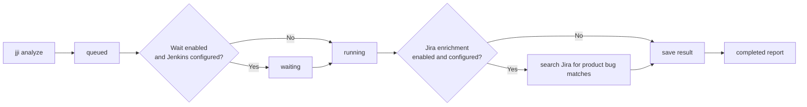

# Analyzing Jenkins Jobs

Queue a Jenkins build when you already know the job name and build number and want a report you can review instead of digging through Jenkins by hand. The main choices are whether to wait for the build to finish, how much artifact context to include, and whether to enrich product-bug findings with Jira matches.

## Prerequisites
- A running JJI server, and `jji` pointed at it with `--server`, `JJI_SERVER`, or `~/.config/jji/config.toml`
- A Jenkins job name and build number
- Jenkins access configured on the server or supplied on the command line
- An AI provider/model available on the server, or chosen per run with `--provider` and `--model`
- Optional Jira URL, credentials, and project key if you want Jira enrichment
- Need the initial setup first? See [Running Your First Analysis](quickstart.html)

## Quick Example
```bash
jji analyze --job-name my-job --build-number 42
jji results show <job-id>
```

```text
Job queued: <job-id>
Status: queued
Poll: /results/<job-id>
```

The first command queues the analysis and prints the poll URL. The second command shows the current summary while the run is queued, waiting on Jenkins, running, or complete.

## Step-by-Step
1. Queue the Jenkins build.
```bash
jji analyze --job-name my-job --build-number 42
```

If your job lives inside folders, keep the Jenkins path style, such as `folder/job-name`. If you do not keep a default server in config, prefix the command with `jji --server http://localhost:8000`.

2. Check what state the queued run is in.
```bash
jji results show <job-id>
jji results dashboard
```

| Status | What it means |
| --- | --- |
| `pending` | JJI has accepted the run and queued the work. |
| `waiting` | JJI is polling Jenkins until the build finishes. |
| `running` | JJI is collecting failures and analyzing them. |
| `completed` | The report is ready. |
| `failed` | Waiting or analysis ended with an error. |



3. Choose whether JJI should wait for Jenkins before it analyzes the build.
```bash
jji analyze --job-name my-job --build-number 42 --wait
jji analyze --job-name my-job --build-number 42 --no-wait
jji analyze --job-name my-job --build-number 42 --wait --poll-interval 5 --max-wait 30
```

| Option | Effect |
| --- | --- |
| `--wait` | Wait for Jenkins to finish before analysis starts. |
| `--no-wait` | Skip waiting and analyze immediately. |
| `--poll-interval 5` | Poll Jenkins every 5 minutes while waiting. |
| `--max-wait 30` | Fail the run after 30 minutes of waiting. |

> **Note:** The built-in wait defaults are `--wait`, a 2-minute poll interval, and `--max-wait 0`, which means "wait as long as needed."

If Jenkins is not configured for the run, JJI skips the waiting step even when wait is enabled.

> **Warning:** `--no-wait` is best when the Jenkins build is already finished, or when you intentionally want a snapshot of whatever Jenkins exposes at that moment.

4. Override Jenkins or AI settings for just this run.
```bash
jji analyze \
  --job-name my-job \
  --build-number 42 \
  --provider gemini \
  --model gemini-2.5-pro \
  --jenkins-url https://jenkins.local \
  --jenkins-user admin \
  --jenkins-password <token> \
  --no-jenkins-ssl-verify
```

Use this when the run needs different Jenkins access, a different model, or different SSL behavior than your usual defaults. Command-line flags override values from your environment or `~/.config/jji/config.toml` for that one run only.

5. Decide how much build-artifact context to include.
```bash
jji analyze --job-name my-job --build-number 42 --no-get-job-artifacts
jji analyze --job-name my-job --build-number 42 --get-job-artifacts --jenkins-artifacts-max-size-mb 50
```

Artifact downloads are enabled by default. When available, JJI downloads build artifacts, unpacks tar and zip archives when possible, and uses that material as extra context for the analysis.

> **Note:** The default artifact size cap is 500 MB. Oversize or failed downloads are skipped instead of failing the whole analysis.

6. Turn Jira enrichment on or off for the run.
```bash
jji analyze \
  --job-name my-job \
  --build-number 42 \
  --jira \
  --jira-url https://jira.example.com \
  --jira-project-key PROJ \
  --jira-email user@example.com \
  --jira-api-token <api-token> \
  --jira-max-results 10
```

| Jira deployment | Use these flags |
| --- | --- |
| Cloud | `--jira --jira-url ... --jira-project-key ... --jira-email ... --jira-api-token ...` |
| Server/Data Center | `--jira --jira-url ... --jira-project-key ... --jira-pat ...` |

Use `--no-jira` when you want a clean run with no Jira lookups, even if Jira is normally enabled for your server profile. Jira enrichment happens after analysis, and matches are attached only to failures classified as product bugs.

> **Tip:** If you omit both `--jira` and `--no-jira`, JJI follows its configured default behavior. In practice, Jira matches only appear when the Jira URL, credentials, and project key are all available.

## Advanced Usage
```bash
jji results show --full <job-id>
jji analyze --job-name my-job --build-number 42 --tests-repo-url https://github.com/org/tests:feature/bar
```

The full results view is useful when you want to confirm the exact stored request parameters for a run, including wait settings, provider/model, artifact settings, and Jira toggles. Appending `:branch-or-tag` to `--tests-repo-url` lets you pin analysis context to a specific ref for a single run.

For self-signed endpoints, use `--no-jenkins-ssl-verify` or `--no-jira-ssl-verify` only on the runs that need them. That keeps your normal defaults strict while still letting one-off runs succeed.

Pipeline builds are supported too. If the parent job fails because child jobs failed, the finished report includes child-job analyses even when the parent has no direct failed tests of its own.

If Jenkins has no structured test report, JJI falls back to console-based analysis. Peer review flags do not apply in that console-only path; for that workflow, see [Adding Peer Review with Multiple AI Models](adding-peer-review-with-multiple-ai-models.html).

If you want to analyze failures without a live Jenkins build, see [Analyzing JUnit XML and Raw Failures](analyzing-junit-xml-and-raw-failures.html).

## Troubleshooting
- `Error: No server specified.` Point `jji` at a server with `--server`, set `JJI_SERVER`, or add a default server to `~/.config/jji/config.toml`.
- `Job not found` or an immediate Jenkins 404 while waiting. Double-check `--job-name` and `--build-number`; jobs inside folders must use `folder/job-name`.
- `Timed out waiting for Jenkins job ...`. Increase `--max-wait`, use `--max-wait 0` for no time limit, or switch to `--no-wait`.
- The run completed with no failures. The Jenkins build finished successfully, so JJI returned a completed result with nothing to analyze.
- Artifact evidence is missing. Make sure artifact downloads are enabled and consider raising `--jenkins-artifacts-max-size-mb`.
- No Jira matches appeared. Confirm Jira was enabled for the run, the Jira URL and project key are set, and valid Cloud or Server/DC credentials were supplied. Remember that Jira matches are only attached to product bug results.

## Related Pages

- [Running Your First Analysis](quickstart.html)
- [Monitoring and Re-Running Analyses](monitoring-and-rerunning-analyses.html)
- [Improving Analysis with Repository Context](improving-analysis-with-repository-context.html)
- [Adding Peer Review with Multiple AI Models](adding-peer-review-with-multiple-ai-models.html)
- [Analyzing JUnit XML and Raw Failures](analyzing-junit-xml-and-raw-failures.html)