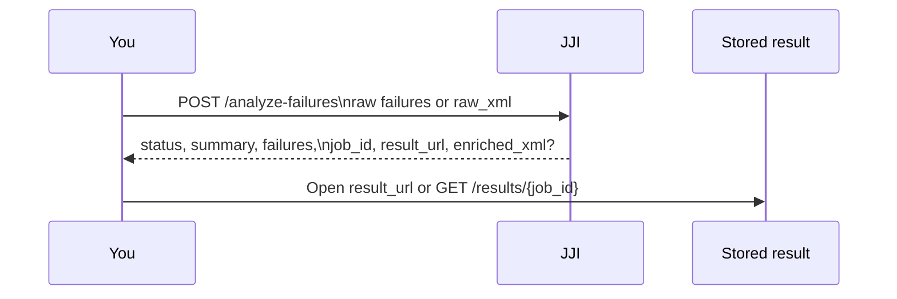

# Analyzing JUnit XML and Raw Failures

Use this workflow when you already have failing test output and want JJI to classify it immediately without waiting on a Jenkins build. It is the fastest way to turn a local test run, a CI artifact, or custom parser output into a stored report you can reopen later.

## Prerequisites
- A running JJI server. If you still need to start one, see [Running Your First Analysis](quickstart.html).
- An AI provider and model available either as server defaults (`AI_PROVIDER`, `AI_MODEL`) or in each request as `ai_provider` and `ai_model`.
- One input source: a parsed failure list or a JUnit XML file.

> **Note:** You do not need Jenkins credentials for this workflow.

## Quick Example

```bash
JJI_SERVER=http://localhost:8000

curl -sS "$JJI_SERVER/analyze-failures" \
  -H 'Content-Type: application/json' \
  --data @- <<'JSON'
{
  "failures": [
    {
      "test_name": "test_foo",
      "error_message": "assert False",
      "stack_trace": "File test.py, line 10"
    }
  ],
  "ai_provider": "claude",
  "ai_model": "your-model-name"
}
JSON
```

That response is already final. Check the JSON `status`, then keep `job_id` or `result_url` if you want to reopen the stored result later.

## Step-by-Step

1. Pick the input mode that matches what you already have.

| Send this | Use it when | What you get back |
| --- | --- | --- |
| `failures` | Another tool already parsed the failures | Final analysis JSON, `job_id`, and `result_url` |
| `raw_xml` | You already have a JUnit XML artifact | Everything above, plus `enriched_xml` with AI annotations |

> **Warning:** Send exactly one input source. `failures` and `raw_xml` are mutually exclusive, and `failures: []` is rejected.

2. Post your JUnit XML and save the enriched report.

```python
import os
from pathlib import Path
import requests

server = os.environ["JJI_SERVER"]
raw_xml = Path("report.xml").read_text()

response = requests.post(
    f"{server}/analyze-failures",
    json={
        "raw_xml": raw_xml,
        "ai_provider": "claude",
        "ai_model": "your-model-name",
    },
    timeout=600,
)
response.raise_for_status()
result = response.json()

if result["status"] != "completed":
    raise SystemExit(result["summary"])

Path("report.enriched.xml").write_text(result["enriched_xml"])
print(result["summary"])
print(result["result_url"])
```

In JUnit XML mode, JJI parses the failing testcases, analyzes them, and returns the same report with extra metadata and readable AI output attached.

3. Use the returned artifacts.



- Use `failures` in the JSON response for automation.
- Use `result_url` to open the stored report in a browser or fetch it again with `GET /results/{job_id}`.
- Use `enriched_xml` when you want the AI annotations embedded back into your JUnit artifact.
- Continue the manual review flow from the stored report. See [Reviewing, Commenting, and Reclassifying Failures](reviewing-commenting-and-reclassifying-failures.html) for details.

4. Know what JJI adds in JUnit XML mode.

- `report_url` on the first `testsuite`
- `ai_classification` and `ai_details` on enriched failing testcases
- a readable AI summary in `system-out`

> **Tip:** Keep the full stack trace when you send structured failures. JJI groups repeated failures by the error message plus the first five stack-trace lines, but the full trace still gives the model better context.

## Advanced Usage

### How JJI reads JUnit XML

| In your XML | JJI uses |
| --- | --- |
| `<failure message="...">` or `<error message="...">` | `error_message` comes from the `message` attribute |
| No `message` attribute | the first line of the element text becomes `error_message` |
| `classname` and `name` | `test_name` becomes `classname.name` |
| Only `name` | `test_name` uses `name` alone |
| `<error>` | `status` becomes `ERROR` |
| `<failure>` | `status` becomes `FAILED` |

### Useful request options

| Option | Use it when | Example |
| --- | --- | --- |
| `tests_repo_url` | The model should inspect your test repo | `"tests_repo_url": "https://github.com/org/my-tests:develop"` |
| `additional_repos` | The model also needs product or infrastructure repos | `[{"name":"infra","url":"https://github.com/org/infra","ref":"main"}]` |
| `raw_prompt` | You want request-specific instructions | `"raw_prompt": "Treat platform outages as product issues unless the test itself is broken."` |
| `peer_ai_configs` | You want extra reviewer models | `[{"ai_provider":"gemini","ai_model":"pro"}]` |
| `peer_analysis_max_rounds` | You want more or fewer reviewer rounds | `7` |
| `enable_jira` | You want matching Jira issues attached when Jira is configured | `true` |

- `tests_repo_url` accepts a `:ref` suffix, such as `https://github.com/org/my-tests:develop`.
- Each `additional_repos` entry can also carry a `ref`, and every `name` must be unique.
- Omit `peer_ai_configs` or `additional_repos` to use server defaults. Send `[]` to turn either one off for just one request.
- `peer_analysis_max_rounds` accepts `1` through `10`.
- When you need request-level Jira settings, send `jira_url`, `jira_project_key`, `jira_email`, plus either `jira_pat` or `jira_api_token`.

### Automate a pytest-generated JUnit file

```bash
export JJI_SERVER=http://localhost:8000
export JJI_AI_PROVIDER=claude
export JJI_AI_MODEL=your-model-name
pytest --junitxml=report.xml --analyze-with-ai
```

The repository includes a ready-to-copy pytest helper for this flow. It posts the generated XML to JJI and rewrites the XML file only when `enriched_xml` comes back.

- `JJI_TIMEOUT` controls the helper's HTTP timeout and defaults to `600` seconds.
- Invalid `JJI_TIMEOUT` values fall back to `600`.
- The helper skips enrichment on dry runs, all-pass runs, or when `--junitxml` or the required `JJI_*` settings are missing.

### Output behavior worth knowing

- `POST /analyze-failures` is synchronous. You get a final `completed` or `failed` result in the response body right away.
- If the XML has no failing testcases, JJI returns `completed`, keeps the original XML, and sets the summary to `No test failures found in the provided XML.`
- If several tests share the same failure signature, one analysis is reused across that group instead of re-running the model for every testcase.
- `enriched_xml` is only returned when you send `raw_xml`.
- If the server does not set `PUBLIC_BASE_URL`, `result_url` and XML `report_url` are relative paths.
- `raw_xml` accepts payloads up to `50,000,000` characters.

## Troubleshooting

- `400 No AI provider configured` or `400 No AI model configured`: send `ai_provider` and `ai_model` in the request, or configure server defaults with `AI_PROVIDER` and `AI_MODEL`.
- `400 Invalid XML`: the string in `raw_xml` is not valid XML.
- `422` before analysis starts: you sent both `failures` and `raw_xml`, sent neither, or used `failures: []`.
- HTTP 200 but analysis still failed: this endpoint reports runtime failures in the JSON `status` and `summary`. Check those fields before you overwrite any XML artifacts.
- No `enriched_xml` in the response: you used `failures` mode instead of `raw_xml`, or the request finished with `status: "failed"`.
- `result_url` is relative: the server is running without `PUBLIC_BASE_URL`. Use it as a path on that server, or configure a public base URL if you need absolute links.

## Related Pages

- [Running Your First Analysis](quickstart.html)
- [Reviewing, Commenting, and Reclassifying Failures](reviewing-commenting-and-reclassifying-failures.html)
- [Improving Analysis with Repository Context](improving-analysis-with-repository-context.html)
- [Adding Peer Review with Multiple AI Models](adding-peer-review-with-multiple-ai-models.html)
- [REST API Reference](rest-api-reference.html)