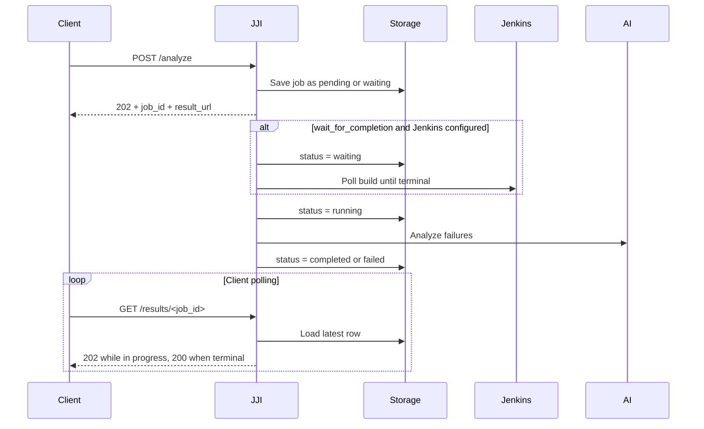

# API Overview

`jenkins-job-insight` exposes a FastAPI JSON API for submitting analyses, polling stored results, reviewing failures, searching history, and optionally creating follow-up GitHub or Jira issues. The same application also serves the React UI and the generated API docs, so one server handles both people-facing pages and machine-facing JSON.

The API is built around stored analysis records. Whether you submit a Jenkins build or raw failures, JJI creates a job record, attaches review and history data to it, and exposes that same result through automation-friendly endpoints and browser-friendly pages.

## At a Glance

| Area | Main routes | What they are for |
| --- | --- | --- |
| Submission | `POST /analyze`, `POST /analyze-failures` | Start a Jenkins-backed analysis or analyze a failure list/JUnit XML directly |
| Results | `GET /results`, `GET /results/<job_id>`, `DELETE /results/<job_id>` | List jobs, fetch one stored result, or delete a job and its related data |
| Dashboard and discovery | `GET /api/dashboard`, `GET /api/capabilities`, `GET /ai-configs`, `GET /health` | Feed the UI, advertise enabled issue workflows, list known AI configs, and support probes |
| Review workflow | Comment, review, override, and enrichment routes under `/results/<job_id>/...` | Add discussion, mark failures reviewed, override root-cause classification, and enrich comment links |
| Issue workflows | GitHub preview/create routes and Jira preview/create routes under `/results/<job_id>/...` | Draft and create follow-up issues from a stored failure |
| History | `GET /history/failures`, `GET /history/test/<test_name>`, `GET /history/search`, `GET /history/stats/<job_name>`, `POST /history/classify` | Browse recurring failures, inspect one test, find matching signatures, get job-level stats, and add history labels |

> **Tip:** Use `GET /results` when you want a small recent-jobs list. Use `GET /api/dashboard` when you want the richer, UI-style summary feed with review, comment, and failure counts.

## Submitting Analysis Jobs

Most analysis settings can come either from the request body or from server defaults. The sample environment file shows the basics JJI expects for Jenkins-backed analysis:

```4:19:.env.example
JENKINS_URL=https://jenkins.example.com
JENKINS_USER=your-username
JENKINS_PASSWORD=your-api-token
JENKINS_SSL_VERIFY=true

# ===================
# AI CLI Configuration
# ===================
# Choose AI provider (required): "claude", "gemini", or "cursor"
AI_PROVIDER=claude

# AI model to use (required, applies to any provider)
# Can also be set per-request in webhook body
AI_MODEL=your-model-name
```

### `POST /analyze`

Use `POST /analyze` when JJI should go to Jenkins, gather the available context, and analyze the build asynchronously. The response is always `202 Accepted`, and it returns immediately with a new `job_id` plus link metadata you can poll or open later.

```131:145:tests/test_main.py
response = test_client.post(
    "/analyze",
    json={
        "job_name": "test",
        "build_number": 123,
        "tests_repo_url": "https://github.com/example/repo",
        "ai_provider": "claude",
        "ai_model": "test-model",
    },
)
assert response.status_code == 202
data = response.json()
assert data["status"] == "queued"
assert data["base_url"] == ""
assert data["result_url"].startswith("/results/")
```

That immediate `queued` response is only the submission acknowledgment. The stored job then moves through the normal job states described below.

### `POST /analyze-failures`

Use `POST /analyze-failures` when you already have failure data or raw JUnit XML and do not need JJI to talk to Jenkins first. This route runs synchronously, but it still creates and stores a `job_id`, so the finished result can be revisited later just like a Jenkins-backed analysis.

```368:391:tests/test_main.py
response = test_client.post(
    "/analyze-failures",
    json={
        "failures": [
            {
                "test_name": "test_foo",
                "error_message": "assert False",
                "stack_trace": "File test.py, line 10",
            }
        ],
        "ai_provider": "claude",
        "ai_model": "test-model",
    },
)
assert response.status_code == 200
data = response.json()
assert data["status"] == "completed"
assert data["ai_provider"] == "claude"
assert data["ai_model"] == "test-model"
assert "job_id" in data
assert len(data["failures"]) == 1
assert data["failures"][0]["test_name"] == "test_foo"
assert data["base_url"] == ""
assert data["result_url"].startswith("/results/")
```

If you send `raw_xml`, JJI extracts failures first and can return `enriched_xml` with the analysis written back into the report.

> **Tip:** If your test runner already emits JUnit XML, `POST /analyze-failures` is the simplest API path to integrate.



> **Note:** `POST /analyze-failures` skips the Jenkins wait and returns its final body in the original request, but it still follows the same stored-job pattern under the hood.

## Job States

JJI uses one submission-only word and five stored job states. The stored enum is defined in the result model:

```374:385:src/jenkins_job_insight/models.py
class AnalysisResult(BaseModel):
    """Complete analysis result for a Jenkins job."""

    job_id: str = Field(description="Unique identifier for the analysis job")
    job_name: str = Field(default="", description="Jenkins job name")
    build_number: int = Field(default=0, description="Jenkins build number")
    jenkins_url: HttpUrl | None = Field(
        default=None,
        description="URL of the analyzed Jenkins job (None for non-Jenkins analysis)",
    )
    status: Literal["pending", "waiting", "running", "completed", "failed"] = Field(
        description="Current status of the analysis"
    )
```

- `queued` is the immediate submit response from `POST /analyze`.
- `pending` means a job row exists, but analysis has not started yet.
- `waiting` means JJI accepted the request and is still monitoring Jenkins before analysis begins.
- `running` means analysis is actively executing.
- `completed` means the final result is stored and ready to read.
- `failed` means the job reached a terminal error state.

> **Note:** `queued` is not a stored state. It is just the initial `POST /analyze` response body.

The worker code makes the `waiting` and `running` transitions explicit:

```830:867:src/jenkins_job_insight/main.py
if settings.wait_for_completion and settings.jenkins_url:
    await update_status(job_id, "waiting")
    await _safe_update_progress_phase("waiting_for_jenkins")

    completed, wait_error = await _wait_for_jenkins_completion(
        jenkins_url=settings.jenkins_url,
        job_name=body.job_name,
        build_number=body.build_number,
        jenkins_user=settings.jenkins_user,
        jenkins_password=settings.jenkins_password,
        jenkins_ssl_verify=settings.jenkins_ssl_verify,
        poll_interval_minutes=settings.poll_interval_minutes,
        max_wait_minutes=settings.max_wait_minutes,
    )

    if not completed:
        await update_status(
            job_id,
            "failed",
            {
                "job_name": body.job_name,
                "build_number": body.build_number,
                "error": wait_error,
            },
        )
        return

await update_status(job_id, "running")
await _safe_update_progress_phase("analyzing")
```

Startup recovery is state-aware too. Waiting jobs are preserved for resumption, but orphaned `pending` and `running` rows are marked `failed` because their in-process background task is gone.

```624:652:tests/test_storage.py
with patch.object(storage, "DB_PATH", setup_test_db):
    await storage.save_result("p1", "http://j/1", "pending")
    await storage.save_result("r1", "http://j/2", "running")
    await storage.save_result(
        "w1",
        "http://j/3",
        "waiting",
        {
            "job_name": "w",
            "build_number": 1,
            "request_params": {
                "tests_repo_url": "https://example.invalid/tests",
            },
        },
    )
    await storage.save_result(
        "c1", "http://j/4", "completed", {"summary": "ok"}
    )

    waiting = await storage.mark_stale_results_failed()
    assert len(waiting) == 1
    assert waiting[0]["job_id"] == "w1"

    assert (await storage.get_result("p1"))["status"] == "failed"
    assert (await storage.get_result("r1"))["status"] == "failed"
    assert (await storage.get_result("w1"))["status"] == "waiting"
    assert (await storage.get_result("c1"))["status"] == "completed"
```

## Results, Review, and History

Once a job exists, you usually read it through one of three views:

- `GET /results` for a lightweight recent-jobs list
- `GET /api/dashboard` for a richer summary feed used by the UI
- the per-job result route, which returns the full stored payload for JSON clients and doubles as the browser report URL

`GET /results` defaults to `50` items and caps `limit` at `100`. The per-job JSON response adds capability flags and uses HTTP `202` while work is still in flight:

```1347:1355:src/jenkins_job_insight/main.py
_attach_result_links(result, _extract_base_url(), job_id)
settings = get_settings()
result["capabilities"] = {
    "github_issues": settings.github_issues_enabled,
    "jira_bugs": settings.jira_enabled,
}
if result.get("status") in IN_PROGRESS_STATUSES:
    response.status_code = 202
return result
```

Use `/ai-configs` when you want the distinct provider/model pairs already seen in completed analyses.

### Review and collaboration endpoints

The comment reader deliberately returns both discussion and review state together, which keeps the UI and API client logic simple.

```1142:1147:tests/test_main.py
response = test_client.get("/results/job-test-2/comments")
assert response.status_code == 200
data = response.json()
assert "comments" in data
assert "reviews" in data
assert len(data["comments"]) == 1
```

Manual root-cause overrides are applied to the whole grouped failure signature, not just the one row you clicked:

```1889:1895:src/jenkins_job_insight/storage.py
) -> list[str]:
    """Override the classification of a failure in failure_history.

    Updates ALL failure_history rows sharing the same error_signature
    (within the same job) so that grouped failures stay in sync.
    Also inserts a test_classifications entry so the AI can learn from
    human overrides.
```

### Issue preview and creation

Issue workflows are server-capability-driven. Use `GET /api/capabilities` if your own client needs to decide whether GitHub or Jira actions should be shown.

```2289:2300:src/jenkins_job_insight/main.py
@app.get("/api/capabilities")
async def get_capabilities(settings: Settings = Depends(get_settings)) -> dict:
    """Report which post-analysis automation features are available.

    These capabilities indicate whether the server is configured to
    automatically create GitHub issues or Jira bugs from analysis results.
    They require server-level credentials (GITHUB_TOKEN, JIRA_API_TOKEN, etc.)
    and cannot be provided per-request.
    """
    return {
        "github_issues": settings.github_issues_enabled,
        "jira_bugs": settings.jira_enabled,
    }
```

Preview endpoints draft content and can return duplicate suggestions. Create endpoints actually create the issue and automatically add a tracker comment back onto the result.

The create endpoints are intentionally classification-aware:

- GitHub issue creation is for `CODE ISSUE` results.
- Jira bug creation is for `PRODUCT BUG` results.
- If you call the wrong tracker for the current classification, the API returns `422` and tells you which tracker to use instead.

> **Warning:** Issue preview/create routes use server-level GitHub and Jira configuration. They do not let each caller supply its own repository target or tracker credentials.

### Two classification systems

JJI has two related but different classification layers:

- Root-cause classification: `CODE ISSUE` or `PRODUCT BUG`
- Historical labels: `FLAKY`, `REGRESSION`, `INFRASTRUCTURE`, `KNOWN_BUG`, `INTERMITTENT`

The read-side classifications lookup is intentionally limited to the root-cause layer; the broader history labels are meant to surface through the failure-history APIs instead.

```1688:1700:src/jenkins_job_insight/storage.py
"""Get visible test classifications in the primary (override) domain.

Only returns classifications with visible=1 **and** a primary
classification (CODE ISSUE / PRODUCT BUG).  History-system labels
(FLAKY, REGRESSION, etc.) written by ``set_test_classification()``
are intentionally excluded because they belong to the history
domain and are consumed via ``failure_history`` queries (e.g.
``get_all_failures()``, ``get_test_history()``), not here.

The ``_PRIMARY_CLASSIFICATIONS_SQL`` filter is intentional: the
``POST /history/classify`` endpoint writes history labels that are
never meant to appear in this reader.  History labels are consumed
via ``GET /history/failures`` instead.
```

For day-to-day use, that means:

- Use result-level override endpoints when you want to change JJI's root-cause answer.
- Use `POST /history/classify` when you want to record a broader history label like `FLAKY` or `KNOWN_BUG`.
- Use `GET /history/failures` for paginated browsing, `GET /history/test/<test_name>` for per-test drill-down, `GET /history/search` for matching error signatures, and `GET /history/stats/<job_name>` for aggregate job-level trends.

> **Warning:** The `jji_username` cookie is a lightweight identity mechanism for UI flow and attribution, not a full authentication boundary. Deploy JJI on a trusted network.

## Absolute URLs in Responses

Submission and result responses add two helper fields:

- `base_url`: the trusted public base URL for this deployment, or `""` if none is configured
- `result_url`: the canonical link to the stored result/report

The URL builder trusts only `PUBLIC_BASE_URL`:

```146:164:src/jenkins_job_insight/main.py
def _extract_base_url() -> str:
    """Extract the external base URL for building public-facing links.

    When ``PUBLIC_BASE_URL`` is set, it is used directly as the trusted
    origin.  Otherwise the function returns an empty string so that
    callers produce relative URLs, avoiding host-header injection.

    Returns:
        Base URL without trailing slash (e.g. "https://example.com"),
        or an empty string when no trusted origin is configured.
    """
    settings = get_settings()
    if settings.public_base_url:
        return settings.public_base_url.rstrip("/")

    logger.debug(
        "PUBLIC_BASE_URL is not set; returning empty base URL (relative paths)"
    )
    return ""
```

The tests show the absolute-URL case clearly:

```240:263:tests/test_main.py
os.environ["PUBLIC_BASE_URL"] = "https://myapp.example.com"
get_settings.cache_clear()
try:
    with patch.object(storage, "DB_PATH", temp_db_path):
        from starlette.testclient import TestClient
        from jenkins_job_insight.main import app

        with (
            TestClient(app) as client,
            patch("jenkins_job_insight.main.process_analysis_with_id"),
        ):
            response = client.post(
                "/analyze",
                json=self._analyze_body(),
                headers={
                    "X-Forwarded-Proto": "https",
                    "X-Forwarded-Host": "other.example.com",
                },
            )
            assert response.status_code == 202
            data = response.json()
            assert data["base_url"] == "https://myapp.example.com"
            assert data["result_url"].startswith(
                "https://myapp.example.com/results/"
            )
```

That same link strategy is reused when JJI enriches JUnit XML. The first `testsuite` gets a `report_url` property pointing back to the stored result:

```131:142:src/jenkins_job_insight/xml_enrichment.py
# Add report_url to the first testsuite only
if report_url:
    first_testsuite = next(root.iter("testsuite"), None)
    # If root itself is a testsuite, use it
    if first_testsuite is None and root.tag == "testsuite":
        first_testsuite = root
    if first_testsuite is not None:
        ts_props = first_testsuite.find("properties")
        if ts_props is None:
            ts_props = ET.Element("properties")
            first_testsuite.insert(0, ts_props)
        _add_property(ts_props, "report_url", report_url)
```

> **Warning:** Forwarded `Host` or `X-Forwarded-*` headers are not used to build public links. If you want absolute URLs in API responses, issue previews, or enriched XML, set `PUBLIC_BASE_URL` explicitly.

> **Tip:** `PUBLIC_BASE_URL` is especially important when JJI sits behind a reverse proxy, ingress, or non-default public port.

## OpenAPI and Swagger

The API documentation is generated from the FastAPI app itself. The application metadata currently sets the OpenAPI title to `Jenkins Job Insight` and the schema version to `0.1.0`.

```447:452:src/jenkins_job_insight/main.py
app = FastAPI(
    title="Jenkins Job Insight",
    description="Analyzes Jenkins job failures and classifies them as code or product issues",
    version="0.1.0",
    lifespan=lifespan,
)
```

The test suite verifies both the raw schema and the Swagger UI:

```962:973:tests/test_main.py
def test_openapi_schema_available(self, test_client) -> None:
    """Test that OpenAPI schema is available."""
    response = test_client.get("/openapi.json")
    assert response.status_code == 200
    schema = response.json()
    assert schema["info"]["title"] == "Jenkins Job Insight"
    assert schema["info"]["version"] == "0.1.0"

def test_docs_available(self, test_client) -> None:
    """Test that docs endpoint is available."""
    response = test_client.get("/docs")
    assert response.status_code == 200
```

In the default local setup, the same port serves the API, the UI, and the docs:

```32:56:docker-compose.yaml
# Ports: Web UI + API served on the same port
ports:
  - "8000:8000"   # Web UI (React) + REST API
  # Dev mode: Vite HMR for frontend hot-reload (uncomment with DEV_MODE=true)
  # - "5173:5173"

# Persist SQLite database across container restarts
# The ./data directory on host maps to /data in container
volumes:
  - ./data:/data
  # Optional: Mount gcloud credentials for Vertex AI authentication
  # Uncomment if using CLAUDE_CODE_USE_VERTEX=1 with Application Default Credentials
  # - ~/.config/gcloud:/home/appuser/.config/gcloud:ro
  # Dev mode: mount source for hot-reload (uncomment with DEV_MODE=true)
  # - ./src:/app/src
  # - ./frontend:/app/frontend


# Restart policy: container restarts unless explicitly stopped
restart: unless-stopped

# Health check configuration
# Verifies the service is responding on /health endpoint
healthcheck:
  test: ["CMD", "curl", "-f", "http://localhost:8000/health"]
```

That makes these the most useful discovery URLs in a local deployment:

- [http://localhost:8000/openapi.json](http://localhost:8000/openapi.json) for tooling and raw schema inspection
- [http://localhost:8000/docs](http://localhost:8000/docs) for Swagger UI
- [http://localhost:8000/health](http://localhost:8000/health) for a fast smoke test

> **Note:** JJI uses the same lightweight username-cookie flow for browser pages. If a browser visit to `/docs` lands on `/register`, register a username once and reopen the docs page.

> **Tip:** Swagger is the fastest way to explore request and response shapes for the JSON API, while the per-job report pages and dashboard are better for interactive human triage.


## Related Pages

- [POST /analyze](api-post-analyze.html)
- [POST /analyze-failures](api-post-analyze-failures.html)
- [Results, Reports, and Dashboard Endpoints](api-results-and-dashboard.html)
- [Schemas and Data Models](api-schemas-and-models.html)
- [Overview](overview.html)