# POST /analyze-failures

Use `POST /analyze-failures` when you already have failure data and want the final AI analysis back in a single HTTP call. It does not fetch anything from Jenkins, but it does reuse the same grouped-analysis pipeline, stores the result, and returns a `job_id` plus a `result_url` you can open later.

> **Note:** This endpoint is synchronous. A successful HTTP response already contains the finished analysis body. You do not get a queued-job response from this route.

The immediate response is the direct-failure result shape, not the Jenkins job result shape. That means the `POST` response does **not** include top-level Jenkins fields like `job_name`, `build_number`, or `jenkins_url`.

## Request Body

Send exactly one of `failures` or `raw_xml`:

```409:426:src/jenkins_job_insight/models.py
class AnalyzeFailuresRequest(BaseAnalysisRequest):
    """Request payload for direct failure analysis (no Jenkins)."""

    failures: list[TestFailure] | None = Field(
        default=None, description="Raw test failures to analyze"
    )
    raw_xml: Annotated[str, Field(max_length=50_000_000)] | None = Field(
        default=None,
        description="Raw JUnit XML content to extract failures from and enrich with analysis results",
    )

    @model_validator(mode="after")
    def check_input_source(self) -> "AnalyzeFailuresRequest":
        if self.failures and self.raw_xml:
            raise ValueError("Provide either 'failures' or 'raw_xml', not both")
        if not self.failures and not self.raw_xml:
            raise ValueError("Either 'failures' or 'raw_xml' must be provided")
        return self
```

### Direct Failures: `failures`

Use `failures` when your test runner or CI system already knows which tests failed.

| Field | Type | Required | Notes |
| --- | --- | --- | --- |
| `test_name` | string | Yes | Fully qualified test name |
| `error_message` | string | No | Defaults to `""` |
| `stack_trace` | string | No | Defaults to `""` |
| `duration` | number | No | Defaults to `0.0` |
| `status` | string | No | Defaults to `FAILED` |

Actual request example from the test suite:

```368:380:tests/test_main.py
response = test_client.post(
    "/analyze-failures",
    json={
        "failures": [
            {
                "test_name": "test_foo",
                "error_message": "assert False",
                "stack_trace": "File test.py, line 10",
            }
        ],
        "ai_provider": "claude",
        "ai_model": "test-model",
    },
)
```

> **Tip:** Include both `error_message` and `stack_trace` whenever you can. The endpoint uses them to group identical failures, so better raw input usually means fewer duplicate AI calls and cleaner results.

> **Note:** `duration` and input `status` are accepted on input, but they are not echoed back in the analysis result. The response `failures[]` array uses the analysis result shape, not the input `TestFailure` shape.

### Raw JUnit XML: `raw_xml`

Use `raw_xml` when you already produce JUnit XML and want the service to both analyze failures and write the result back into an XML report.

Actual XML sample used by the endpoint tests:

```648:656:tests/test_main.py
SAMPLE_XML = """<?xml version="1.0" encoding="UTF-8"?>
<testsuite name="TestSuite" tests="2" failures="1" errors="0">
    <testcase classname="tests.test_auth" name="test_login" time="0.5">
        <failure message="assert False" type="AssertionError">
            at tests/test_auth.py:42
        </failure>
    </testcase>
    <testcase classname="tests.test_auth" name="test_logout" time="0.1"/>
</testsuite>"""
```

When `raw_xml` is used, the service:

- scans `<testcase>` elements for `<failure>` and `<error>` children
- builds `test_name` as `classname.name` when `classname` exists, or just `name` when it does not
- sets extracted failure `status` to `FAILED` for `<failure>` and `ERROR` for `<error>`
- uses the XML element's `message` attribute as `error_message` when present
- falls back to the first line of the element text when `message` is missing
- rejects malformed XML with `400`
- limits `raw_xml` to `50,000,000` characters

> **Tip:** If your CI already emits JUnit XML, `raw_xml` is usually the better fit because you get both structured JSON and an `enriched_xml` document you can save back to disk.

## Common Request Options

These options work in both input modes.

| Field | Type | What it does |
| --- | --- | --- |
| `ai_provider` | `claude` \| `gemini` \| `cursor` | AI provider to use. Required unless the server already has `AI_PROVIDER` configured. |
| `ai_model` | string | AI model to use. Required unless the server already has `AI_MODEL` configured. |
| `tests_repo_url` | URL | Clones one repository and makes it available to the AI for code exploration. |
| `additional_repos` | array of `{name, url}` | Adds extra repositories to the AI workspace. |
| `raw_prompt` | string | Appends extra instructions to the AI prompt. |
| `ai_cli_timeout` | positive integer | Timeout for AI CLI calls, in minutes. |
| `peer_ai_configs` | array of `{ai_provider, ai_model}` | Adds peer reviewers for consensus-style analysis. |
| `peer_analysis_max_rounds` | integer `1-10` | Maximum peer debate rounds. |
| `enable_jira` | boolean | Forces Jira matching on or off for this request. |
| `jira_url`, `jira_email`, `jira_api_token`, `jira_pat`, `jira_project_key`, `jira_ssl_verify`, `jira_max_results` | mixed | Per-request Jira overrides. |

`additional_repos` request-side validation is strict:

- every entry needs a unique `name`
- `name` cannot contain `/`, `\`, or `..`
- `name` cannot start with `.`
- `build-artifacts` is reserved and cannot be used
- `url` must be a valid URL

> **Note:** Omit `peer_ai_configs` to inherit the server default from `PEER_AI_CONFIGS`. Send `[]` to disable peer review for this request.

> **Note:** If you leave `enable_jira` unset, Jira matching only runs when the server is fully configured with Jira URL, credentials, and project key.

## Validation

### `422` request-body validation errors

These are rejected before the handler starts running analysis:

- both `failures` and `raw_xml` were provided
- neither `failures` nor `raw_xml` was provided
- `failures` was an empty array
- `raw_xml` exceeded the `50,000,000` character limit
- request-body `ai_provider` was not one of `claude`, `gemini`, or `cursor`
- request-body `tests_repo_url` or repo URLs were invalid
- `peer_ai_configs` contained an invalid provider or blank `ai_model`
- `peer_analysis_max_rounds` was outside `1-10`
- `additional_repos` had invalid names or duplicate names

### `400` handler or effective-config errors

These come from runtime validation after the request body itself is accepted:

- no effective AI provider was available after combining request fields and server defaults
- no effective AI model was available after combining request fields and server defaults
- `raw_xml` was malformed and could not be parsed

> **Warning:** `failures: []` is rejected with `422`, but a valid JUnit XML document with zero failing testcases is **not** an error. In that case the endpoint returns `200` with `status: "completed"` and the original XML.

## Processing Flow

```mermaid
flowchart LR
    A[POST /analyze-failures] --> B{Input mode}
    B -->|failures| C[Use provided failure objects]
    B -->|raw_xml| D[Parse JUnit XML]
    D --> E[Extract failing testcases]
    C --> F[Group by error signature]
    E --> F
    F --> G[Create analysis workspace]
    G --> H[Clone tests_repo_url and additional_repos if configured]
    H --> I[Analyze each unique group in parallel]
    I --> J[Optional peer review]
    J --> K[Optional Jira matching for PRODUCT BUG results]
    K --> L{raw_xml supplied?}
    L -->|yes| M[Inject analysis into XML and add report_url]
    L -->|no| N[Skip XML enrichment]
    M --> O[Save result]
    N --> O
    O --> P[Return final JSON response]
```



Failures are deduplicated by hashing the error message plus the first five lines of the stack trace:

```273:291:src/jenkins_job_insight/analyzer.py
def get_failure_signature(failure: TestFailure) -> str:
    """Create a signature for grouping identical failures.

    Uses error message and first few lines of stack trace to identify
    failures that are essentially the same issue.
    """
    # Use error message and first 5 lines of stack trace for deduplication.
    # Intentionally limited to 5 lines: different stack depths for the same
    # root cause (e.g., varying call-site depth) should still collapse into
    # one group so the AI analyzes each unique error only once.
    stack_lines = failure.stack_trace.split("\n")[:5]
    signature_text = f"{failure.error_message}|{'|'.join(stack_lines)}"
    return hashlib.sha256(signature_text.encode()).hexdigest()
```

That has a few practical effects:

- tests with the same underlying error are analyzed once and share the same final analysis
- unique error groups are analyzed in parallel
- repository context is cloned into a temporary workspace when available
- repository clone failures are best-effort warnings, not hard request failures
- peer review adds a `peer_debate` trail when enabled
- Jira matching can enrich `PRODUCT BUG` results with `jira_matches`

> **Tip:** Treat `summary` as human-readable text. If you are automating against this endpoint, use structured fields like `status`, `failures[]`, `error_signature`, and `analysis.classification` instead of parsing the summary string.

## Response Body

A successful `POST /analyze-failures` request returns `200` with these top-level fields:

| Field | Type | Notes |
| --- | --- | --- |
| `job_id` | string | Unique ID for the stored result |
| `status` | `completed` \| `failed` | Final status for this synchronous request |
| `summary` | string | Human-readable summary |
| `ai_provider` | string | Provider used for analysis |
| `ai_model` | string | Model used for analysis |
| `failures` | array | Analyzed failure results |
| `enriched_xml` | string or `null` | Present only for `raw_xml` mode |
| `base_url` | string | `PUBLIC_BASE_URL` when configured, otherwise `""` |
| `result_url` | string | Stored result URL, absolute when `PUBLIC_BASE_URL` is set and relative otherwise |

A failure item in the response looks like this in the test fixtures:

```75:89:tests/conftest.py
return FailureAnalysis(
    test_name="test_login_success",
    error="AssertionError: Expected 200, got 500",
    analysis=AnalysisDetail(
        classification="PRODUCT BUG",
        affected_tests=["test_login_success"],
        details="The authentication service is returning an error.",
        product_bug_report=ProductBugReport(
            title="Login fails with valid credentials",
            severity="high",
            component="auth",
            description="Users cannot log in even with correct username and password",
            evidence="Error: Authentication service returned 500",
        ),
    ),
)
```

Each `failures[]` item contains:

| Field | Type | Notes |
| --- | --- | --- |
| `test_name` | string | Failed test name |
| `error` | string | Error message used for this analyzed failure |
| `error_signature` | string | SHA-256 signature used for deduplication |
| `analysis.classification` | string | `CODE ISSUE` or `PRODUCT BUG` |
| `analysis.affected_tests` | array of strings | Tests covered by the same analysis |
| `analysis.details` | string | Main explanation |
| `analysis.artifacts_evidence` | string | Evidence text when available |
| `analysis.code_fix` | object | Present only for `CODE ISSUE` |
| `analysis.product_bug_report` | object | Present only for `PRODUCT BUG` |
| `peer_debate` | object | Present only when peer analysis was enabled |

`analysis.code_fix` and `analysis.product_bug_report` are mutually exclusive. When a field does not apply, it is omitted from the JSON rather than returned as `false`.

If peer review runs, `peer_debate` adds:

- `consensus_reached`
- `rounds_used`
- `max_rounds`
- `ai_configs`
- `rounds`

Each round records the provider, model, role (`orchestrator` or `peer`), classification, details, and whether the peer agreed with the orchestrator.

### Important response cases

- Valid analysis result: `200` with `status: "completed"`.
- Runtime analysis failure: `200` with `status: "failed"` and a summary such as `Analysis failed: ...`.
- Valid XML with no failing testcases: `200` with `status: "completed"`, empty `failures`, and the original XML returned in `enriched_xml`.
- Partial group failure: the response can still be `completed` if at least some unique error groups finished successfully.

> **Warning:** Do not rely on HTTP status alone. Runtime analysis errors come back as `200` with `status: "failed"` in the JSON body.

> **Note:** If some unique error groups succeed and others fail, the overall response can still be `completed`. Check `summary` and the actual `failures[]` array before assuming every submitted failure was analyzed.

### Saved result at `result_url`

This endpoint also saves the analysis so you can fetch it later from `GET /results/{job_id}`.

That saved result is wrapped under `result`, alongside timestamps and overall status. For direct-failure analysis, the stored `jenkins_url` is empty. Saved `request_params` are preserved for later viewing, but sensitive values are redacted from HTTP responses.

## Enriched XML

`enriched_xml` is returned only in `raw_xml` mode.

- If `raw_xml` contained failing testcases and analysis ran, `enriched_xml` is the original XML plus injected AI metadata.
- If `raw_xml` was valid but had no failures, `enriched_xml` is the original XML unchanged.
- If you used direct `failures` mode, `enriched_xml` is `null`.

The XML enrichment code injects structured properties into each matching `<testcase>`:

```237:297:src/jenkins_job_insight/xml_enrichment.py
properties = testcase.find("properties")
if properties is None:
    properties = ET.SubElement(testcase, "properties")

_add_property(properties, "ai_classification", analysis.get("classification", ""))
_add_property(properties, "ai_details", analysis.get("details", ""))

affected = analysis.get("affected_tests", [])
if affected:
    _add_property(properties, "ai_affected_tests", ", ".join(affected))

code_fix = analysis.get("code_fix")
if code_fix and isinstance(code_fix, dict):
    _add_property(properties, "ai_code_fix_file", code_fix.get("file", ""))
    _add_property(properties, "ai_code_fix_line", str(code_fix.get("line", "")))
    _add_property(properties, "ai_code_fix_change", code_fix.get("change", ""))

bug_report = analysis.get("product_bug_report")
if bug_report and isinstance(bug_report, dict):
    _add_property(properties, "ai_bug_title", bug_report.get("title", ""))
    _add_property(properties, "ai_bug_severity", bug_report.get("severity", ""))
    _add_property(properties, "ai_bug_component", bug_report.get("component", ""))
    _add_property(
        properties, "ai_bug_description", bug_report.get("description", "")
    )

    jira_matches = bug_report.get("jira_matches", [])
    for idx, match in enumerate(jira_matches):
        if isinstance(match, dict):
            _add_property(
                properties, f"ai_jira_match_{idx}_key", match.get("key", "")
            )
            # ... additional Jira match properties omitted for brevity ...

text = _format_analysis_text(analysis)
if text:
    system_out = testcase.find("system-out")
    if system_out is None:
        system_out = ET.SubElement(testcase, "system-out")
        system_out.text = text
    else:
        existing = system_out.text or ""
        system_out.text = (
            f"{existing}\n\n--- AI Analysis ---\n{text}" if existing else text
        )
```

In practice, that means:

- Core testcase properties: `ai_classification`, `ai_details`, `ai_affected_tests`
- Code-fix properties: `ai_code_fix_file`, `ai_code_fix_line`, `ai_code_fix_change`
- Product-bug properties: `ai_bug_title`, `ai_bug_severity`, `ai_bug_component`, `ai_bug_description`
- Jira-match properties: `ai_jira_match_<n>_key`, `ai_jira_match_<n>_summary`, `ai_jira_match_<n>_status`, `ai_jira_match_<n>_url`, `ai_jira_match_<n>_priority`, `ai_jira_match_<n>_score`

It also adds:

- a human-readable analysis summary under `<system-out>`
- a testsuite-level `report_url` property on the first `<testsuite>`

A few details matter here:

- testcase matching is done by exact `(classname, name)` pairs derived from the analyzed `test_name`
- if a testcase already has `<system-out>`, the AI text is appended under `--- AI Analysis ---`
- `report_url` is `/results/{job_id}` by default, or an absolute URL when `PUBLIC_BASE_URL` is configured

> **Note:** `enriched_xml` is a summary layer, not a lossless copy of the JSON response. Fields such as `error_signature`, `peer_debate`, `artifacts_evidence`, `product_bug_report.evidence`, and `jira_search_keywords` stay in JSON only.

> **Note:** Absolute links come only from `PUBLIC_BASE_URL`. When it is unset, `base_url` is `""`, `result_url` is relative, and the XML `report_url` is also relative. The server does not trust `Host` or `X-Forwarded-*` headers to invent a public URL.

## Configuration

At minimum, the server needs an AI provider and model, unless you send both in the request body.

Actual defaults from `.env.example`:

```14:19:.env.example
# Choose AI provider (required): "claude", "gemini", or "cursor"
AI_PROVIDER=claude

# AI model to use (required, applies to any provider)
# Can also be set per-request in webhook body
AI_MODEL=your-model-name
```

Optional peer-analysis defaults from `.env.example`:

```52:57:.env.example
# ===================
# Peer Analysis (Optional)
# ===================
# Enable multi-AI consensus by configuring peer AI providers
# PEER_AI_CONFIGS=cursor:gpt-5.4-xhigh,gemini:gemini-2.5-pro
# PEER_ANALYSIS_MAX_ROUNDS=3
```

You can also configure server-side defaults for:

- `TESTS_REPO_URL`
- `AI_CLI_TIMEOUT`
- `JIRA_URL`, `JIRA_PAT`, `JIRA_EMAIL`, `JIRA_API_TOKEN`, `JIRA_PROJECT_KEY`, `JIRA_SSL_VERIFY`, `JIRA_MAX_RESULTS`
- `ADDITIONAL_REPOS`
- `PUBLIC_BASE_URL`

`PUBLIC_BASE_URL` is especially important for this endpoint because it controls:

- the `base_url` field in the JSON response
- whether `result_url` is absolute or relative
- whether `report_url` in `enriched_xml` is absolute or relative

## CI / Pytest Integration

The repository includes a checked-in helper that reads a JUnit XML file, posts it to `POST /analyze-failures`, and writes the returned `enriched_xml` back to disk:

```93:122:examples/pytest-junitxml/conftest_junit_ai_utils.py
server_url = os.environ.get("JJI_SERVER", "")
raw_xml = xml_path.read_text()

try:
    timeout_value = int(os.environ.get("JJI_TIMEOUT", "600"))
except ValueError:
    logger.warning("Invalid JJI_TIMEOUT value, using default 600 seconds")
    timeout_value = 600

try:
    response = requests.post(
        f"{server_url.rstrip('/')}/analyze-failures",
        json={
            "raw_xml": raw_xml,
            "ai_provider": ai_provider,
            "ai_model": ai_model,
        },
        timeout=timeout_value,
    )
    response.raise_for_status()
    result = response.json()
except Exception as ex:
    logger.exception(f"Failed to enrich JUnit XML, original preserved. {ex}")
    return

if enriched_xml := result.get("enriched_xml"):
    xml_path.write_text(enriched_xml)
    logger.info("JUnit XML enriched with AI analysis: %s", xml_path)
else:
    logger.info("No enriched XML returned (no failures or analysis failed)")
```

This is a good pattern to follow in CI:

- keep the original XML if the request fails
- only overwrite the report when `enriched_xml` is present
- prefer `raw_xml` mode when you want a machine-readable enriched report, not just a JSON response

> **Tip:** In the checked-in container setup, the API is served on `http://localhost:8000`, so `JJI_SERVER=http://localhost:8000` is the expected local default.


## Related Pages

- [Analyze Raw Failures and JUnit XML](direct-failure-analysis.html)
- [Pytest JUnit XML Integration](pytest-junitxml-integration.html)
- [API Overview](api-overview.html)
- [Results, Reports, and Dashboard Endpoints](api-results-and-dashboard.html)
- [Schemas and Data Models](api-schemas-and-models.html)