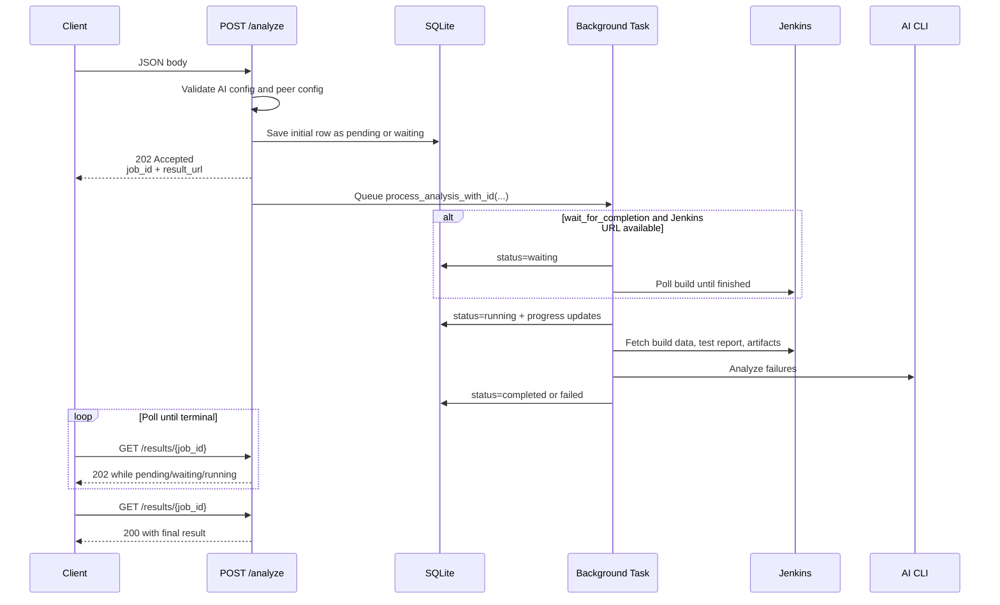

# POST /analyze

`POST /analyze` queues analysis of a Jenkins build. You send a Jenkins `job_name` and `build_number`, optionally override AI, Jenkins, Jira, or repository-context settings for that one run, and `jenkins-job-insight` returns immediately with a `job_id` plus `result_url`.

| Quick fact | Value |
| --- | --- |
| Submit response | `202 Accepted` |
| Request format | JSON body |
| Sync mode | Async only |
| Polling endpoint | `GET /results/{job_id}` |
| In-browser progress view | `/status/{job_id}` |
| Callback fields | Not supported |

```1060:1118:src/jenkins_job_insight/main.py
@app.post("/analyze", status_code=202, response_model=None)
async def analyze(
    request: Request,
    body: AnalyzeRequest,
    background_tasks: BackgroundTasks,
    *,
    settings: Settings = Depends(get_settings),
) -> dict:
    """Submit a Jenkins job for analysis.

    Returns immediately with a job_id. Poll /results/{job_id} for status.
    """
    logger.debug(f"Starting analysis for {body.job_name} #{body.build_number}")
    base_url = _extract_base_url()

    # Validate AI config early -- fail fast before queuing invalid jobs.
    _resolve_ai_config(body)

    # Generate job_id here so we can return it to the client for polling
    job_id = str(uuid.uuid4())
    merged = _merge_settings(body, settings)

    # Validate peer configs early -- fail fast before returning 202.
    resolved_peers = _validate_peer_configs(body, merged)
    jenkins_url = build_jenkins_url(
        merged.jenkins_url, body.job_name, body.build_number
    )
    # Save initial pending state before queueing background task.
    initial_result: dict = {
        "job_name": body.job_name,
        "build_number": body.build_number,
        "request_params": _build_request_params(
            body,
            merged,
            body.ai_provider or AI_PROVIDER,
            body.ai_model or AI_MODEL,
            peer_ai_configs_resolved=resolved_peers,
        ),
    }
    can_resume_wait = merged.wait_for_completion and bool(merged.jenkins_url)
    await save_result(
        job_id,
        jenkins_url,
        "waiting" if can_resume_wait else "pending",
        initial_result,
    )
    background_tasks.add_task(process_analysis_with_id, job_id, body, merged)

    response: dict = {
        "status": "queued",
        "job_id": job_id,
        "message": message,
    }

    return _attach_result_links(response, base_url, job_id)
```

## How It Works



## Request Body

`POST /analyze` uses the `AnalyzeRequest` model from `src/jenkins_job_insight/models.py`. Only `job_name` and `build_number` are required. All other fields are optional per-request overrides.

### Required fields

| Field | Type | Required | Description |
| --- | --- | --- | --- |
| `job_name` | string | Yes | Jenkins job name. It can include folders, such as `folder/job-name`. |
| `build_number` | integer | Yes | Jenkins build number to analyze. |

### AI and repository-context fields

| Field | Type | Description |
| --- | --- | --- |
| `tests_repo_url` | URL | Repository to clone for source-code context during analysis. |
| `ai_provider` | string | AI provider for this run. Valid values are `claude`, `gemini`, and `cursor`. |
| `ai_model` | string | AI model identifier for this run. |
| `ai_cli_timeout` | integer `> 0` | AI CLI timeout in minutes. |
| `raw_prompt` | string | Extra instructions appended to the built-in analysis prompt. |
| `peer_ai_configs` | array | Peer reviewers for consensus analysis. Each entry is an object with `ai_provider` and `ai_model`. Omit the field to inherit the server default; send `[]` to disable peers for this request. |
| `peer_analysis_max_rounds` | integer `1`-`10` | Maximum debate rounds for peer analysis. The request model default is `3`. |
| `additional_repos` | array | Extra repositories to clone for AI context. Each entry is `{ "name": "...", "url": "..." }`. Names must be unique and safe as subdirectory names. |

### Jira fields

| Field | Type | Description |
| --- | --- | --- |
| `enable_jira` | boolean | Force Jira matching on or off for this run. |
| `jira_url` | string | Jira base URL override. |
| `jira_email` | string | Jira Cloud email override. |
| `jira_api_token` | string | Jira Cloud API token override. |
| `jira_pat` | string | Jira Server/Data Center PAT override. |
| `jira_project_key` | string | Jira project key override. |
| `jira_ssl_verify` | boolean | Jira TLS verification override. |
| `jira_max_results` | integer `> 0` | Maximum Jira matches to fetch. |

### Jenkins and wait controls

| Field | Type | Description |
| --- | --- | --- |
| `wait_for_completion` | boolean | Wait for a still-running Jenkins build to finish before analysis begins. |
| `poll_interval_minutes` | integer `> 0` | Minutes between Jenkins status polls. |
| `max_wait_minutes` | integer `>= 0` | Maximum wait time in minutes. `0` means no limit. |
| `jenkins_url` | string | Jenkins base URL override. |
| `jenkins_user` | string | Jenkins username override. |
| `jenkins_password` | string | Jenkins password or API token override. |
| `jenkins_ssl_verify` | boolean | Jenkins TLS verification override. |
| `get_job_artifacts` | boolean | Enable or disable artifact download for AI context. |
| `jenkins_artifacts_max_size_mb` | integer `> 0` | Per-request artifact size cap. |
| `jenkins_artifacts_context_lines` | integer `> 0` | Per-request artifact excerpt cap. |

### Validation rules worth knowing

- `ai_provider` must resolve to one of `claude`, `gemini`, or `cursor`.
- `ai_model` must be present either in the request or in server defaults.
- `poll_interval_minutes`, `ai_cli_timeout`, `jira_max_results`, and artifact-size/context limits must be greater than `0`.
- `max_wait_minutes` can be `0`, but it cannot be negative.
- `peer_analysis_max_rounds` must be between `1` and `10`.
- `additional_repos[].name` values must be unique.

A real request from the test suite looks like this:

```131:145:tests/test_main.py
response = test_client.post(
    "/analyze",
    json={
        "job_name": "test",
        "build_number": 123,
        "tests_repo_url": "https://github.com/example/repo",
        "ai_provider": "claude",
        "ai_model": "test-model",
    },
)
assert response.status_code == 202
data = response.json()
assert data["status"] == "queued"
assert data["result_url"].startswith("/results/")
```

The sample config shipped with the repository shows these monitoring defaults:

```25:31:config.example.toml
# Peer analysis (multi-AI consensus)
# peers = "cursor:gpt-5.4-xhigh,gemini:gemini-2.5-pro"
# peer_analysis_max_rounds = 3
# Monitoring
wait_for_completion = true
poll_interval_minutes = 2
max_wait_minutes = 0  # 0 = no limit (wait forever)
```

> **Note:** If you omit optional fields, JJI uses the server's configured defaults.

> **Warning:** A `202 Accepted` response means the job was queued. It does not mean Jenkins access, waiting, or AI analysis has already succeeded.

## Sync Flag

`POST /analyze` is async-only in the current codebase. It does not use query parameters, and it does not support a `sync` flag.

```139:142:tests/test_cli_client.py
def handler(request):
    body = _parse_analyze_request(request)
    assert "sync" not in body
    return httpx.Response(202, json=response_data)
```

> **Note:** `wait_for_completion` is not a sync flag. It only changes what the background task does before analysis starts. The HTTP response is still `202 Accepted`.

## Response Schema

The first response from `POST /analyze` is only the queue-submission wrapper. The full analysis is retrieved later from `GET /results/{job_id}`.

### Submit response from `POST /analyze`

| Field | Type | Description |
| --- | --- | --- |
| `status` | string | Always `queued` for a successful submit. |
| `job_id` | string | Server-generated identifier for the queued job. |
| `message` | string | Human-readable queue message. |
| `base_url` | string | Trusted public base URL from `PUBLIC_BASE_URL`, or an empty string when the server returns relative links. |
| `result_url` | string | URL for `GET /results/{job_id}`. Relative unless `PUBLIC_BASE_URL` is configured. |

### Polling response from `GET /results/{job_id}`

`GET /results/{job_id}` is the canonical place to read status and the final stored result.

```1332:1355:src/jenkins_job_insight/main.py
@app.get("/results/{job_id}", response_model=None)
async def get_job_result(request: Request, job_id: str, response: Response):
    """Retrieve stored result by job_id, or serve SPA for browser requests."""
    accept = request.headers.get("accept", "")
    if "text/html" in accept and "application/json" not in accept:
        result = await get_result(job_id)
        if result and result.get("status") in IN_PROGRESS_STATUSES:
            return RedirectResponse(url=f"/status/{job_id}", status_code=302)
        return _serve_spa()

    result = await get_result(job_id)
    if not result:
        raise HTTPException(status_code=404, detail="Job not found")
    _attach_result_links(result, _extract_base_url(), job_id)
    result["capabilities"] = {
        "github_issues": settings.github_issues_enabled,
        "jira_bugs": settings.jira_enabled,
    }
    if result.get("status") in IN_PROGRESS_STATUSES:
        response.status_code = 202
    return result
```

| Field | Type | Description |
| --- | --- | --- |
| `job_id` | string | Job identifier. |
| `jenkins_url` | string | Stored Jenkins build URL for the job. |
| `status` | string | One of `pending`, `waiting`, `running`, `completed`, or `failed`. |
| `result` | object or `null` | The stored payload for the job. While the job is active this may be a partial progress payload; once finished it becomes the final analysis or error payload. |
| `created_at` | string | Creation timestamp for the stored job row. |
| `analysis_started_at` | string or `null` | When analysis actually began. |
| `completed_at` | string or `null` | When the job reached a terminal state. |
| `base_url` | string | Trusted public base URL, or an empty string when the server returns relative links. |
| `result_url` | string | Canonical URL for the same result resource. |
| `capabilities` | object | Server-advertised feature flags for the UI, currently `github_issues` and `jira_bugs`. |

`GET /results/{job_id}` returns `202 Accepted` while the job is `pending`, `waiting`, or `running`, and `200 OK` once it is `completed` or `failed`.

### `result` while a job is still in progress

While the job is active, `result` may contain lightweight progress data rather than the final analysis payload.

| Field | Type | Description |
| --- | --- | --- |
| `job_name` | string | Jenkins job name that was queued. |
| `build_number` | integer | Jenkins build number that was queued. |
| `progress_phase` | string | Latest phase name. |
| `progress_log` | array | Ordered phase history with timestamps. |
| `request_params` | object | Effective non-secret request settings echoed back for UI and polling clients. |

Sensitive request fields are stripped before JJI returns `request_params` over HTTP:

```169:195:src/jenkins_job_insight/encryption.py
def strip_sensitive_from_response(result_data: dict) -> dict:
    """Remove sensitive fields from ``request_params`` before returning to API consumers."""
    if not result_data or "request_params" not in result_data:
        return result_data
    request_params = result_data.get("request_params")
    if request_params is None:
        return result_data
    result = dict(result_data)
    if not isinstance(request_params, dict):
        result.pop("request_params", None)
        return result
    params = dict(request_params)
    for key in RESPONSE_REDACTED_KEYS:
        params.pop(key, None)
    result["request_params"] = params
    return result
```

> **Note:** Credentials sent in the request body are accepted and stored for internal use, but they are not echoed back in polling responses.

### Final analysis payload inside `result`

When the job finishes successfully, `result` follows the `AnalysisResult` shape from `src/jenkins_job_insight/models.py`.

| Field | Type | Description |
| --- | --- | --- |
| `job_id` | string | Analysis job ID. |
| `job_name` | string | Jenkins job name. |
| `build_number` | integer | Jenkins build number. |
| `jenkins_url` | URL or `null` | URL of the analyzed Jenkins build. |
| `status` | string | Usually `completed`; some analysis-level failures can store `failed`. |
| `summary` | string | Human-readable summary of the run. |
| `ai_provider` | string | AI provider used. |
| `ai_model` | string | AI model used. |
| `failures` | array | Top-level failure analyses for the job. |
| `child_job_analyses` | array | Failed child jobs in pipeline-style builds. |

A passing Jenkins build still produces a completed payload. In that case, `summary` is `Build passed successfully. No failures to analyze.` and `failures` is empty.

### `failures[]`

| Field | Type | Description |
| --- | --- | --- |
| `test_name` | string | Failed test name. |
| `error` | string | Error message or exception. |
| `error_signature` | string | SHA-256 signature used for deduplication. |
| `analysis` | object | Structured AI analysis. |
| `peer_debate` | object or `null` | Peer-consensus trail when peer analysis was enabled. |

### `failures[].analysis`

| Field | Type | Description |
| --- | --- | --- |
| `classification` | string | Usually `CODE ISSUE` or `PRODUCT BUG`. |
| `affected_tests` | array of strings | Other tests believed to share the same root cause. |
| `details` | string | Human-readable explanation of the failure. |
| `artifacts_evidence` | string | Verbatim supporting lines from Jenkins artifacts, when available. |
| `code_fix` | object or omitted | Present for code-issue analyses. |
| `product_bug_report` | object or omitted | Present for product-bug analyses. |

`code_fix` contains:

- `file`
- `line`
- `change`

`product_bug_report` contains:

- `title`
- `severity`
- `component`
- `description`
- `evidence`
- `jira_search_keywords`
- `jira_matches`

Each `jira_matches[]` entry contains:

- `key`
- `summary`
- `status`
- `priority`
- `url`
- `score`

> **Note:** `code_fix` and `product_bug_report` are mutually exclusive. A single failure returns one or the other, not both.

### `failures[].peer_debate`

When peer analysis is enabled, `peer_debate` explains how the main AI and peer AIs reached consensus.

| Field | Type | Description |
| --- | --- | --- |
| `consensus_reached` | boolean | Whether the debate reached consensus. |
| `rounds_used` | integer | Number of rounds actually used. |
| `max_rounds` | integer | Maximum rounds allowed for that run. |
| `ai_configs` | array | Provider/model pairs that participated. |
| `rounds` | array | Ordered round entries with `round`, `ai_provider`, `ai_model`, `role`, `classification`, `details`, and `agrees_with_orchestrator`. |

### `child_job_analyses[]`

Pipeline jobs can return nested child-job analysis trees.

| Field | Type | Description |
| --- | --- | --- |
| `job_name` | string | Child job name. |
| `build_number` | integer | Child build number. |
| `jenkins_url` | string or `null` | Child build URL. |
| `summary` | string or `null` | Summary of that child job. |
| `failures` | array | Failures directly attached to that child job. |
| `failed_children` | array | Nested failed child jobs. |
| `note` | string or `null` | Extra note, such as max-depth protection or analysis failure details. |

## Background Job Behavior

`POST /analyze` uses FastAPI background tasks inside the application process. It is queue-like from the caller's point of view, but it is not backed by a separate external worker service.

| Status | Meaning |
| --- | --- |
| `pending` | The job was accepted and stored, but analysis has not started yet. |
| `waiting` | The background task is monitoring Jenkins because `wait_for_completion` is enabled and an effective Jenkins URL is available. |
| `running` | Analysis is actively executing. |
| `completed` | Analysis finished successfully. |
| `failed` | Analysis ended with an error or timeout. |

The wait and execution phases are handled explicitly in `process_analysis_with_id`:

```830:914:src/jenkins_job_insight/main.py
# Wait for Jenkins job to finish if requested and Jenkins is configured
if settings.wait_for_completion and not settings.jenkins_url:
    logger.info(
        f"Wait requested for job {job_id} but jenkins_url not configured, skipping wait"
    )

if settings.wait_for_completion and settings.jenkins_url:
    await update_status(job_id, "waiting")
    await _safe_update_progress_phase("waiting_for_jenkins")

    completed, wait_error = await _wait_for_jenkins_completion(
        jenkins_url=settings.jenkins_url,
        job_name=body.job_name,
        build_number=body.build_number,
        jenkins_user=settings.jenkins_user,
        jenkins_password=settings.jenkins_password,
        jenkins_ssl_verify=settings.jenkins_ssl_verify,
        poll_interval_minutes=settings.poll_interval_minutes,
        max_wait_minutes=settings.max_wait_minutes,
    )

    if not completed:
        await update_status(
            job_id,
            "failed",
            {
                "job_name": body.job_name,
                "build_number": body.build_number,
                "error": wait_error,
            },
        )
        return

await update_status(job_id, "running")
await _safe_update_progress_phase("analyzing")
# ...
await _safe_update_progress_phase("saving")
await update_status(job_id, result.status, result_data)
```

Common `progress_phase` values are:

- `waiting_for_jenkins`
- `analyzing`
- `analyzing_child_jobs`
- `analyzing_failures`
- `enriching_jira`
- `saving`
- `peer_review_round_N` when peer review is active
- `orchestrator_revising_round_N` when the main AI revises after peer feedback

If the Jenkins wait hits `max_wait_minutes`, the job becomes `failed` and `result.error` contains the timeout message.

The bundled browser status page polls `GET /results/{job_id}` every 10 seconds and redirects to the report page once the job completes.

> **Tip:** Opening `result_url` in a browser is safe even before the job finishes. While the job is active, the backend redirects browser requests to `/status/{job_id}` automatically.

### Restart behavior

Because work runs in-process, a server restart matters:

- `pending` and `running` jobs are marked `failed` on startup because their background task is gone.
- `waiting` jobs are eligible for automatic resumption if JJI has enough stored state to rebuild the wait.

```2096:2171:src/jenkins_job_insight/storage.py
async def mark_stale_results_failed() -> list[dict]:
    """Mark orphaned pending/running jobs as failed. Return waiting jobs for resumption."""
    waiting_jobs: list[dict] = []
    async with aiosqlite.connect(DB_PATH) as db:
        db.row_factory = aiosqlite.Row

        # Mark pending/running as failed (background task is gone)
        cursor = await db.execute(
            "UPDATE results SET status = 'failed' "
            "WHERE status IN ('pending', 'running')"
        )

        # Collect waiting jobs for resumption instead of failing them
        cursor = await db.execute(
            "SELECT job_id, result_json FROM results WHERE status = 'waiting'"
        )
        rows = await cursor.fetchall()
        for row in rows:
            # ... validate stored payload ...
            if is_resumable:
                waiting_jobs.append(
                    {
                        "job_id": row["job_id"],
                        "result_data": result_data,
                    }
                )
            else:
                await db.execute(
                    "UPDATE results SET status = 'failed' WHERE job_id = ?",
                    (row["job_id"],),
                )

        await db.commit()

    return waiting_jobs
```

> **Warning:** `wait_for_completion` is the only in-flight state designed for restart recovery. Do not assume a server restart is transparent for already-running analysis work.

## Callback Fields

There are no callback-delivery fields on the current `POST /analyze` request schema.

- No `callback_url`
- No `callback_headers`

Use the returned `job_id` and `result_url` instead:

1. `POST /analyze`
2. Read `job_id` and `result_url` from the `202 Accepted` response
3. Poll `GET /results/{job_id}` until `status` becomes `completed` or `failed`

> **Warning:** Treat this endpoint as polling-based. If you are integrating it into CI or another service, store the returned `job_id` and keep polling until you reach a terminal status.

> **Tip:** Set `PUBLIC_BASE_URL` on the server if you want absolute `result_url` values in API responses. Otherwise JJI returns relative paths such as `/results/{job_id}`.

> **Tip:** For the live machine-readable schema, use `/openapi.json`. For interactive API docs, use `/docs`.


## Related Pages

- [Analyze Jenkins Jobs](analyze-jenkins-jobs.html)
- [API Overview](api-overview.html)
- [Results, Reports, and Dashboard Endpoints](api-results-and-dashboard.html)
- [Schemas and Data Models](api-schemas-and-models.html)
- [Jenkins, Repository Context, and Prompts](jenkins-repository-and-prompts.html)