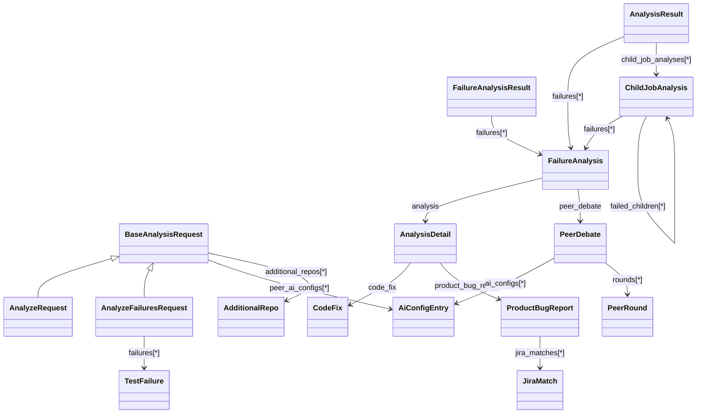

# Schemas and Data Models

Jenkins Job Insight has two primary analysis entry points:

- `AnalyzeRequest` starts from a Jenkins job and build number.
- `AnalyzeFailuresRequest` starts from either structured failures or raw JUnit XML.

Both flows eventually produce `FailureAnalysis` objects. Jenkins pipeline runs can also produce recursive `ChildJobAnalysis` trees when failures happen in downstream jobs.



## At a Glance

| Model | What it represents |
|---|---|
| `AnalyzeRequest` | Request body for `POST /analyze` |
| `AnalyzeFailuresRequest` | Request body for `POST /analyze-failures` |
| `AnalysisResult` | Full Jenkins-based analysis result |
| `FailureAnalysisResult` | Full direct-failure analysis result |
| `FailureAnalysis` | One analyzed test failure |
| `ChildJobAnalysis` | One failed child job, including nested child jobs |
| `JiraMatch` | One Jira issue candidate attached to a product bug report |

## Shared Request Fields

`AnalyzeRequest` and `AnalyzeFailuresRequest` both inherit from `BaseAnalysisRequest`. These shared fields let you control the analysis engine, repository context, and Jira behavior on a per-request basis.

| Field | Meaning |
|---|---|
| `tests_repo_url` | Repository URL used as source-code context for analysis |
| `ai_provider`, `ai_model` | Which AI CLI/provider/model to use |
| `ai_cli_timeout` | Timeout for the AI call, in minutes |
| `enable_jira` | Enables or disables Jira lookup for this request |
| `jira_url`, `jira_email`, `jira_api_token`, `jira_pat`, `jira_project_key`, `jira_ssl_verify`, `jira_max_results` | Jira connection and search settings |
| `raw_prompt` | Extra prompt text appended to the analysis prompt |
| `peer_ai_configs` | Array of peer reviewers, each shaped like `{ ai_provider, ai_model }` |
| `peer_analysis_max_rounds` | Maximum peer debate rounds, from `1` to `10` |
| `additional_repos` | Extra repositories cloned into the analysis workspace, each shaped like `{ name, url }` |

`AiConfigEntry` is intentionally strict: `ai_provider` must be `claude`, `gemini`, or `cursor`, and `ai_model` is trimmed and must not be blank. `AdditionalRepo` is also validated before cloning.

> **Warning:** `additional_repos[].name` is treated like a safe directory name. Path separators, `..`, dot-prefixed names, reserved names, and duplicate names are rejected.

A real config fixture in the repository shows how defaults can preload many of these values before a request overrides them:

```63:83:tests/test_cli_config.py
[default]
server = "dev"

[defaults]
jenkins_url = "https://jenkins.shared.local"
jenkins_user = "shared-user"
# ... secret omitted here ...
ai_provider = "claude"
ai_model = "opus-4"
tests_repo_url = "https://github.com/org/tests"

[servers.dev]
url = "http://localhost:8000"
username = "dev-user"
jenkins_ssl_verify = false

[servers.prod]
url = "https://jji.example.com"
username = "prod-user"
ai_provider = "cursor"
ai_model = "gpt-5"
```

> **Note:** Omitted override fields inherit server configuration. This matters especially for `wait_for_completion`, `poll_interval_minutes`, `max_wait_minutes`, and `peer_analysis_max_rounds`: they only override the server default when you send them explicitly.

## `AnalyzeRequest`

`AnalyzeRequest` is the request body for Jenkins-backed analysis. Use it when you know the Jenkins job name and build number.

| Field | Meaning |
|---|---|
| `job_name` | Jenkins job name, including folder paths such as `folder/job-name` |
| `build_number` | Jenkins build number to analyze |
| `wait_for_completion` | If `true`, the server can wait for Jenkins to finish before analyzing |
| `poll_interval_minutes` | Polling interval while waiting for Jenkins |
| `max_wait_minutes` | Maximum wait time; `0` means no time limit |
| `jenkins_url`, `jenkins_user`, `jenkins_password`, `jenkins_ssl_verify` | Per-request Jenkins connection overrides |
| `jenkins_artifacts_max_size_mb` | Maximum artifact download size for analysis context |
| `jenkins_artifacts_context_lines` | Number of artifact preview lines included in the prompt |
| `get_job_artifacts` | Whether artifacts should be downloaded for AI context |

A real request from the tests looks like this:

```201:209:tests/test_main.py
response = test_client.post(
    "/analyze",
    json={
        "job_name": "test-job",
        "build_number": 42,
        "ai_provider": "claude",
        "ai_model": "opus",
        "wait_for_completion": False,
    },
)
```

`POST /analyze` does **not** return an `AnalysisResult` immediately. It queues work and returns a job reference you can poll.

> **Note:** The immediate response from `POST /analyze` is a queue response with `status`, `job_id`, `message`, `base_url`, and `result_url`. You get the full analysis by polling `GET /results/{job_id}`.

## `AnalyzeFailuresRequest`

`AnalyzeFailuresRequest` is the request body for direct failure analysis. It is designed for cases where you already have failure data and do not want Jenkins collection to happen first.

It has two mutually exclusive input modes:

| Input mode | Field | Shape |
|---|---|---|
| Structured failures | `failures` | `TestFailure[]` |
| Raw JUnit XML | `raw_xml` | `string` |

`TestFailure` contains:

| Field | Meaning |
|---|---|
| `test_name` | Fully qualified test name |
| `error_message` | Failure or error message |
| `stack_trace` | Full stack trace, if available |
| `duration` | Test duration in seconds |
| `status` | Upstream test status such as `FAILED` or `ERROR` |

A real `failures` payload from the tests:

```368:380:tests/test_main.py
response = test_client.post(
    "/analyze-failures",
    json={
        "failures": [
            {
                "test_name": "test_foo",
                "error_message": "assert False",
                "stack_trace": "File test.py, line 10",
            }
        ],
        "ai_provider": "claude",
        "ai_model": "test-model",
    },
)
```

A real `raw_xml` payload from the tests:

```691:697:tests/test_main.py
response = test_client.post(
    "/analyze-failures",
    json={
        "raw_xml": self.SAMPLE_XML,
        "ai_provider": "claude",
        "ai_model": "test-model",
    },
)
```

> **Tip:** Use `raw_xml` when you want the server to return `enriched_xml` with AI analysis written back into the JUnit report.

> **Note:** `AnalyzeFailuresRequest` requires exactly one of `failures` or `raw_xml`. Sending both, or neither, fails validation. `raw_xml` is capped at `50_000_000` characters.

## Result Shapes

There are two result layers to keep in mind.

First, there is the polling envelope returned by `GET /results/{job_id}`. That envelope contains metadata about the analysis job itself:

| Field | Meaning |
|---|---|
| `job_id` | Analysis job identifier |
| `jenkins_url` | Top-level Jenkins URL, when applicable |
| `status` | Current lifecycle state |
| `result` | The nested analysis payload |
| `created_at` | When the analysis job record was created |
| `analysis_started_at` | When analysis actually started |
| `completed_at` | When the analysis finished |
| `base_url` | Public base URL if configured, otherwise often empty |
| `result_url` | Link to the stored result |

Second, there is the nested analysis payload inside `result`:

| Model | Used for | Core fields |
|---|---|---|
| `AnalysisResult` | Jenkins-backed analysis | `job_id`, `job_name`, `build_number`, `jenkins_url`, `status`, `summary`, `ai_provider`, `ai_model`, `failures`, `child_job_analyses` |
| `FailureAnalysisResult` | Direct failure analysis | `job_id`, `status`, `summary`, `ai_provider`, `ai_model`, `failures`, `enriched_xml` |

The repository’s test fixtures show a typical `FailureAnalysis` embedded inside an `AnalysisResult`:

```75:108:tests/conftest.py
return FailureAnalysis(
    test_name="test_login_success",
    error="AssertionError: Expected 200, got 500",
    analysis=AnalysisDetail(
        classification="PRODUCT BUG",
        affected_tests=["test_login_success"],
        details="The authentication service is returning an error.",
        product_bug_report=ProductBugReport(
            title="Login fails with valid credentials",
            severity="high",
            component="auth",
            description="Users cannot log in even with correct username and password",
            evidence="Error: Authentication service returned 500",
        ),
    ),
)

# ...

return AnalysisResult(
    job_id="test-job-123",
    job_name="my-job",
    build_number=123,
    jenkins_url="https://jenkins.example.com/job/my-job/123/",
    status="completed",
    summary="1 failure analyzed: 1 product bug found",
    ai_provider="claude",
    ai_model="test-model",
    failures=[sample_failure_analysis],
)
```

> **Note:** While a job is still `pending`, `waiting`, or `running`, `GET /results/{job_id}` returns HTTP `202`, not `200`. In that state, `result` may be only partially populated and can contain progress information or the effective `request_params` used for the run.

> **Note:** Sensitive request fields are stored so jobs can resume correctly, but they are redacted before API responses are returned.

## `FailureAnalysis`, `AnalysisDetail`, and `JiraMatch`

`FailureAnalysis` is the most important nested object for most API consumers. Every analyzed failure becomes one of these.

| Model | Fields | What to look at first |
|---|---|---|
| `FailureAnalysis` | `test_name`, `error`, `analysis`, `error_signature`, `peer_debate` | Start here for one failed test |
| `AnalysisDetail` | `classification`, `affected_tests`, `details`, `artifacts_evidence`, `code_fix`, `product_bug_report` | The structured AI explanation |
| `CodeFix` | `file`, `line`, `change` | Present for `CODE ISSUE` analyses |
| `ProductBugReport` | `title`, `severity`, `component`, `description`, `evidence`, `jira_search_keywords`, `jira_matches` | Present for `PRODUCT BUG` analyses |
| `JiraMatch` | `key`, `summary`, `status`, `priority`, `url`, `score` | A Jira issue candidate attached to a product bug report |

A few important details are easy to miss:

- `AnalysisDetail.code_fix` and `AnalysisDetail.product_bug_report` are mutually exclusive.
- `artifacts_evidence` is meant for verbatim evidence from build artifacts, not a paraphrased summary.
- `peer_debate` is optional and appears only when peer analysis was used.
- `JiraMatch` lives under `analysis.product_bug_report.jira_matches`, not at the top level of `FailureAnalysis`.

The deduplication key for `FailureAnalysis.error_signature` is calculated from the error message plus the first five stack-trace lines:

```273:291:src/jenkins_job_insight/analyzer.py
def get_failure_signature(failure: TestFailure) -> str:
    """Create a signature for grouping identical failures.

    Uses error message and first few lines of stack trace to identify
    failures that are essentially the same issue.
    """
    # Use error message and first 5 lines of stack trace for deduplication.
    # Intentionally limited to 5 lines: different stack depths for the same
    # root cause (e.g., varying call-site depth) should still collapse into
    # one group so the AI analyzes each unique error only once.
    stack_lines = failure.stack_trace.split("\n")[:5]
    signature_text = f"{failure.error_message}|{'|'.join(stack_lines)}"
    return hashlib.sha256(signature_text.encode()).hexdigest()
```

That signature is why multiple tests with the same root cause can share one analysis pass and still produce multiple `FailureAnalysis` records.

## `ChildJobAnalysis`

`ChildJobAnalysis` is the model that represents failed downstream jobs in a Jenkins pipeline.

| Field | Meaning |
|---|---|
| `job_name` | Name of the child job |
| `build_number` | Child build number |
| `jenkins_url` | URL of the child build |
| `summary` | Summary of the child-job analysis |
| `failures` | Direct failures found in that child job |
| `failed_children` | Nested downstream jobs that failed beneath it |
| `note` | Non-fatal analysis notes such as recursion limits or fetch problems |

This model is recursive: `failed_children` is itself a list of `ChildJobAnalysis`.

> **Note:** A pipeline node can have an empty `failures` list and still be very informative. For example, a parent job may fail only because one or more child jobs failed, with the real failure details living deeper in `failed_children`.

## How `raw_xml` Is Enriched

When you submit `raw_xml`, the server can return `FailureAnalysisResult.enriched_xml`. That XML is not just a copy of the original report; it is annotated with structured AI output.

The enrichment code writes properties like `ai_classification`, `ai_details`, code-fix fields, bug fields, and Jira match fields:

```241:285:src/jenkins_job_insight/xml_enrichment.py
_add_property(properties, "ai_classification", analysis.get("classification", ""))
_add_property(properties, "ai_details", analysis.get("details", ""))

affected = analysis.get("affected_tests", [])
if affected:
    _add_property(properties, "ai_affected_tests", ", ".join(affected))

code_fix = analysis.get("code_fix")
if code_fix and isinstance(code_fix, dict):
    _add_property(properties, "ai_code_fix_file", code_fix.get("file", ""))
    _add_property(properties, "ai_code_fix_line", str(code_fix.get("line", "")))
    _add_property(properties, "ai_code_fix_change", code_fix.get("change", ""))

bug_report = analysis.get("product_bug_report")
if bug_report and isinstance(bug_report, dict):
    _add_property(properties, "ai_bug_title", bug_report.get("title", ""))
    _add_property(properties, "ai_bug_severity", bug_report.get("severity", ""))
    _add_property(properties, "ai_bug_component", bug_report.get("component", ""))
    _add_property(
        properties, "ai_bug_description", bug_report.get("description", "")
    )

    jira_matches = bug_report.get("jira_matches", [])
    for idx, match in enumerate(jira_matches):
        if isinstance(match, dict):
            _add_property(
                properties, f"ai_jira_match_{idx}_key", match.get("key", "")
            )
            _add_property(
                properties, f"ai_jira_match_{idx}_summary", match.get("summary", "")
            )
            _add_property(
                properties, f"ai_jira_match_{idx}_status", match.get("status", "")
            )
            _add_property(
                properties, f"ai_jira_match_{idx}_url", match.get("url", "")
            )
            _add_property(
                properties,
                f"ai_jira_match_{idx}_priority",
                match.get("priority", ""),
            )
            score = match.get("score")
            if score is not None:
                _add_property(properties, f"ai_jira_match_{idx}_score", str(score))
```

The enriched report also adds a testsuite-level `report_url` property and appends a human-readable summary into `system-out`.

> **Tip:** If your test tooling already consumes JUnit XML, `enriched_xml` is often the easiest way to surface AI analysis without inventing a separate reporting format.

## Validation Rules That Matter in Practice

- `AnalyzeFailuresRequest` accepts exactly one of `failures` or `raw_xml`.
- `raw_xml` can be large, but it is still validated with a maximum length.
- `poll_interval_minutes`, `jira_max_results`, `ai_cli_timeout`, and artifact size/context limits must be positive integers.
- `max_wait_minutes` accepts `0`, which means “wait indefinitely.”
- `peer_analysis_max_rounds` must be between `1` and `10`.
- `AiConfigEntry.ai_model` is trimmed and must not be blank.
- `AdditionalRepo.name` must be unique within the request and safe to use as a clone directory.
- `AnalysisDetail` serializes only the relevant branch: either `code_fix` or `product_bug_report`.

For most integrations, the simplest mental model is:

1. Pick `AnalyzeRequest` if Jenkins is your source of truth.
2. Pick `AnalyzeFailuresRequest` if you already have failures or JUnit XML.
3. Read the top-level result envelope for lifecycle status.
4. Read `FailureAnalysis` objects for the actual diagnostic content.
5. Follow `child_job_analyses` and `failed_children` when the failure lives in downstream pipeline jobs.


## Related Pages

- [API Overview](api-overview.html)
- [POST /analyze](api-post-analyze.html)
- [POST /analyze-failures](api-post-analyze-failures.html)
- [Architecture and Project Structure](architecture-and-project-structure.html)
- [Pipeline Analysis and Failure Deduplication](pipeline-analysis-and-failure-deduplication.html)