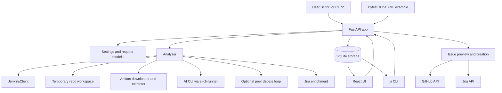
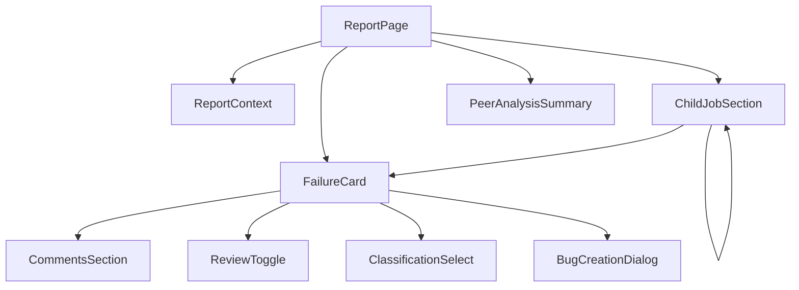

# Architecture and Project Structure

`jenkins-job-insight` is built as one FastAPI service with one bundled React application. The Python side owns orchestration, persistence, Jenkins access, AI analysis, and tracker integrations. The frontend, CLI, and example pytest plugin all talk to that same service, so there is one central analysis model and one storage model.

| Area | Main files | What it does |
| --- | --- | --- |
| App shell | `src/jenkins_job_insight/main.py`, `config.py`, `models.py` | FastAPI startup, request validation, settings merge, background jobs, frontend serving |
| Analyzer | `src/jenkins_job_insight/analyzer.py`, `peer_analysis.py` | Collects context, groups duplicate failures, calls AI CLIs, builds results |
| Jenkins access | `src/jenkins_job_insight/jenkins.py`, `jenkins_artifacts.py` | Reads build info, console output, test reports, and artifacts |
| Repo workspace | `src/jenkins_job_insight/repository.py` | Creates temporary workspaces and clones the test repo plus extra repos |
| Tracker integration | `src/jenkins_job_insight/jira.py`, `bug_creation.py`, `comment_enrichment.py` | Jira search, duplicate checking, issue preview/create, comment link enrichment |
| Persistence | `src/jenkins_job_insight/storage.py`, `encryption.py` | SQLite schema, progress tracking, history, comments, classifications, secret handling |
| HTML reporting | `frontend/src/pages/`, `frontend/src/pages/report/`, `frontend/src/lib/` | Dashboard, in-progress screen, report view, history pages, page-scoped state |
| CLI | `src/jenkins_job_insight/cli/` | Human-friendly wrapper over the REST API |
| Examples | `examples/pytest-junitxml/` | Drop-in JUnit XML enrichment workflow |
| Tests | `tests/`, `frontend/src/**/__tests__/` | Backend and frontend verification |

> **Note:** AI providers are integrated through installed CLI tools, not Python SDKs. The analyzer shells out through `ai-cli-runner`, and the container image installs the supported CLIs at build time.

The root deployment files package everything as one service. The checked-in `Dockerfile` builds the React app, installs the Python app with `uv`, installs the AI CLIs, and copies the built frontend into the final runtime image. `docker-compose.yaml` shows the main runtime knobs:

```69:99:docker-compose.yaml
environment:
  - JENKINS_URL=${JENKINS_URL:-https://jenkins.example.com}
  - JENKINS_USER=${JENKINS_USER:-your-username}
  - JENKINS_PASSWORD=${JENKINS_PASSWORD:-your-api-token}
  - AI_PROVIDER=${AI_PROVIDER:?AI_PROVIDER is required}
  - AI_MODEL=${AI_MODEL:?AI_MODEL is required}
  - ANTHROPIC_API_KEY=${ANTHROPIC_API_KEY:-}
  - GEMINI_API_KEY=${GEMINI_API_KEY:-}
  - AI_CLI_TIMEOUT=${AI_CLI_TIMEOUT:-10}
  # ... optional Jira, SSL, and dev-mode settings ...
```

## End-to-End Architecture

At a high level, the service accepts either a Jenkins build reference or raw failure data, collects as much context as it can, delegates reasoning to an AI CLI, stores the result, and then exposes that stored result to people through the web UI and the CLI.



## FastAPI App

`main.py` is the composition root. It initializes the database, resumes recoverable waiting jobs on startup, mounts built frontend assets, and adds a lightweight username middleware so the browser experience can support comments and reviews.

```434:490:src/jenkins_job_insight/main.py
@asynccontextmanager
async def lifespan(app: FastAPI):
    await init_db()
    waiting_jobs = await storage.mark_stale_results_failed()
    if waiting_jobs:
        task = asyncio.create_task(_deferred_resume_waiting_jobs(waiting_jobs))
        _background_tasks.add(task)
        task.add_done_callback(_background_tasks.discard)
    yield

app = FastAPI(
    title="Jenkins Job Insight",
    description="Analyzes Jenkins job failures and classifies them as code or product issues",
    version="0.1.0",
    lifespan=lifespan,
)

_FRONTEND_DIR = Path(__file__).resolve().parent.parent.parent / "frontend" / "dist"
if _FRONTEND_DIR.is_dir():
    app.mount(
        "/assets",
        StaticFiles(directory=str(_FRONTEND_DIR / "assets")),
        name="frontend-assets",
    )

class UsernameMiddleware(BaseHTTPMiddleware):
    """Middleware that checks for jji_username cookie and redirects to /register if missing."""
    async def dispatch(self, request: Request, call_next):
        path = request.url.path
        if (
            path in ("/register", "/health", "/favicon.ico", "/api")
            or path.startswith("/register")
            or path.startswith("/assets/")
            or path.startswith("/api/")
        ):
            return await call_next(request)
        # ... cookie handling omitted ...
```

A few architecture choices are worth calling out:

- `config.py` owns environment-based defaults such as Jenkins credentials, AI provider/model, Jira settings, artifact limits, peer analysis settings, and optional repo context.
- `models.py` defines the shared data vocabulary: `AnalyzeRequest`, `AnalyzeFailuresRequest`, `FailureAnalysis`, `ChildJobAnalysis`, `AnalysisResult`, tracker preview/create payloads, and comment/review payloads.
- The app has two main analysis modes:
  - Jenkins-backed analysis, where the server pulls job data itself.
  - Direct failure analysis, where callers submit raw failures or JUnit XML and reuse the same analyzer logic without Jenkins.
- Waiting jobs are resumable because the app stores effective request parameters up front, encrypts sensitive fields, and reconstructs the request after restart if needed.

> **Warning:** The username cookie is a collaboration feature, not real authentication. The code explicitly treats the app as a trusted-network deployment, so comments, reviews, and deletion flows should not be mistaken for an authorization boundary.

## Analyzer, Jenkins Client, and Workspace Flow

The analyzer is where most of the system behavior lives. `analyze_job()` coordinates the full Jenkins-backed path:

1. Build a `JenkinsClient` from effective settings.
2. Read Jenkins build metadata and return early if the build passed.
3. Download build artifacts and extract a searchable artifact context.
4. Clone the test repository and any additional repositories into one temporary workspace.
5. Detect child jobs and recurse when the failing build is really an orchestrator/pipeline job.
6. Pull a structured Jenkins test report when available, or fall back to console analysis.
7. Group failures by `error_signature` so one root cause is analyzed once.
8. Run one or more AI CLIs, optionally with peer review rounds.
9. Optionally enrich product bugs with Jira matches.
10. Save the result and populate failure history.

The deduplication step is one of the most important design choices, because it keeps repeated failures from triggering repeated AI calls:

```1674:1713:src/jenkins_job_insight/analyzer.py
# Analyze main job test failures, grouping by signature to deduplicate
unique_errors = 0
if test_failures:
    await _safe_update_progress(progress_job_id, "analyzing_failures")
    failure_groups: dict[str, list[TestFailure]] = defaultdict(list)
    for tf in test_failures:
        sig = get_failure_signature(tf)
        failure_groups[sig].append(tf)

    unique_errors = len(failure_groups)
    logger.info(
        f"Grouped {len(test_failures)} failures into {unique_errors} unique error types"
    )

    failure_tasks: list[Coroutine[Any, Any, Any]] = []
    for group_idx, (_sig, group) in enumerate(failure_groups.items(), 1):
        failure_tasks.append(
            analyze_failure_group(
                failures=group,
                console_context=console_context,
                repo_path=repo_path,
                ai_provider=ai_provider,
                ai_model=ai_model,
                ai_cli_timeout=settings.ai_cli_timeout,
                custom_prompt=custom_prompt,
                artifacts_context=artifacts_context,
                server_url=server_url,
                job_id=job_id,
                peer_ai_configs=peer_ai_configs,
                peer_analysis_max_rounds=peer_analysis_max_rounds,
                additional_repos=cloned_repos or None,
            )
        )
    group_results = await run_parallel_with_limit(failure_tasks)
```

That grouping logic depends on `get_failure_signature()`, which hashes the error message plus the first five stack-trace lines. In practice, that means repeated assertions or repeated product failures collapse into one AI analysis and then fan back out to all matching tests.

### Jenkins Client

`jenkins.py` intentionally keeps the Jenkins wrapper small. `JenkinsClient` extends `python-jenkins`, keeps an authenticated `requests.Session` available for artifact downloads, and provides the three access patterns the analyzer relies on most:

- `get_build_info_safe()` for build metadata
- `get_build_console()` for fallback text analysis
- `get_test_report()` for structured test failures

That split matters because the analyzer strongly prefers structured test results when Jenkins exposes them, but still works when only console output is available.

### Repository Workspace and Artifact Context

The analyzer does not paste entire repositories or archives into the prompt. Instead, it creates a temporary workspace through `RepositoryManager`, clones the main test repository and any named additional repositories into that workspace, symlinks downloaded artifacts into `build-artifacts/`, and then points the AI CLI at those real files.

Artifact handling is isolated in `jenkins_artifacts.py`:

```522:580:src/jenkins_job_insight/jenkins_artifacts.py
def process_build_artifacts(
    session: requests.Session,
    build_url: str,
    artifact_list: list[dict],
    max_size_mb: int = 500,
    max_context_lines: int = 1000,
) -> tuple[str, Path | None]:
    if not artifact_list:
        logger.debug("No artifacts to process")
        return "", None

    artifacts_dir = EXTRACT_BASE / f"artifacts-{uuid.uuid4().hex[:8]}"
    artifacts_dir.mkdir(parents=True, exist_ok=True)

    try:
        downloaded = 0
        for artifact in artifact_list:
            relative_path = artifact.get("relativePath", "")
            if not relative_path:
                continue

            if relative_path.startswith("/") or ".." in relative_path.split("/"):
                logger.warning(f"Skipping artifact with unsafe path: {relative_path}")
                continue

            data = download_artifact(session, build_url, relative_path, max_size_mb)
            if data is None:
                continue

            store_artifact(relative_path, data, artifacts_dir, max_size_mb)
            downloaded += 1

        if downloaded == 0:
            cleanup_extract_dir(artifacts_dir)
            return "NOTE: No artifacts could be downloaded.", None

        context = build_artifacts_context(artifacts_dir, max_context_lines)
        return context, artifacts_dir
```

This layer is intentionally defensive:

- Repository clone URLs are restricted to `https://` and `git://` in `repository.py`.
- Archive extraction blocks path traversal and oversized extraction in `jenkins_artifacts.py`.
- The AI gets a preview context, but the full artifact files remain available on disk for deeper inspection.

If you enable peer analysis, `peer_analysis.py` wraps the same failure group in a debate loop: one orchestrator AI analyzes first, peer AIs review it in parallel, and the orchestrator can revise its answer for multiple rounds. The report UI can then show the debate trail.

## Jira Integration and Tracker Automation

Tracker work happens in three layers:

- `jira.py` searches Jira for product-bug candidates and optionally asks the AI to filter for true matches.
- `bug_creation.py` generates preview content, looks for duplicates, and creates GitHub issues or Jira bugs.
- `comment_enrichment.py` scans comment text for GitHub PRs, GitHub issues, and Jira keys, then fetches live status badges.

The Jira enrichment path deduplicates by keyword set so the same suspected product bug does not trigger repeated Jira searches:

```354:452:src/jenkins_job_insight/jira.py
async def enrich_with_jira_matches(
    failures: Sequence[FailureAnalysis],
    settings: Settings,
    ai_provider: str = "",
    ai_model: str = "",
) -> None:
    if not settings.jira_enabled:
        return

    reports = _collect_product_bug_reports(failures)
    if not reports:
        return

    keyword_to_reports: dict[tuple[str, ...], list[ProductBugReport]] = {}
    for report in reports:
        if not report.jira_search_keywords:
            continue
        key = tuple(sorted(report.jira_search_keywords))
        keyword_to_reports.setdefault(key, []).append(report)

    if not keyword_to_reports:
        return

    async with JiraClient(settings) as client:
        async def _search_safe(keywords: list[str]) -> list[dict]:
            try:
                return await client.search(keywords)
            except Exception:
                logger.exception("Jira search failed for keywords: %s", keywords)
                return []

        tasks = [_search_safe(list(kw_tuple)) for kw_tuple in keyword_to_reports]
        search_results = await asyncio.gather(*tasks)

        for kw_tuple, candidates in zip(keyword_to_reports, search_results):
            if not candidates:
                continue

            representative = keyword_to_reports[kw_tuple][0]

            if ai_provider and ai_model:
                matches = await _filter_matches_with_ai(
                    bug_title=representative.title,
                    bug_description=representative.description,
                    candidates=candidates,
                    ai_provider=ai_provider,
                    ai_model=ai_model,
                    ai_cli_timeout=settings.ai_cli_timeout,
                )
            else:
                matches = [
                    JiraMatch(
                        key=c["key"],
                        summary=c["summary"],
                        status=c["status"],
                        priority=c["priority"],
                        url=c["url"],
                        score=0.0,
                    )
                    for c in candidates
                ]

            for report in keyword_to_reports[kw_tuple]:
                report.jira_matches = matches
```

A few practical consequences follow from this design:

- Jira Cloud versus Jira Server/Data Center is auto-detected from the configured credential shape.
- Only failures classified as product bugs participate in Jira search.
- Issue preview/create is separated from analysis. The report screen can generate editable tracker content first, show possible duplicates, and only then create the tracker ticket.
- When a tracker item is created, the server also auto-adds a comment back onto the analysis so humans can see the link in context.

For humans using the HTML report, the classification matters:

- `CODE ISSUE` flows are meant for GitHub issue creation against the test repository.
- `PRODUCT BUG` flows are meant for Jira bug creation.
- Mixed tracker statuses mentioned in comments are enriched live, so the report page can show whether linked PRs or tickets are open, merged, or closed.

## SQLite Storage and Encrypted State

The canonical stored artifact is the JSON result blob in `results.result_json`, but the database also keeps collaboration state and history tables alongside it.

```93:255:src/jenkins_job_insight/storage.py
await db.execute("""
    CREATE TABLE IF NOT EXISTS results (
        job_id TEXT PRIMARY KEY,
        jenkins_url TEXT,
        status TEXT,
        result_json TEXT,
        created_at TIMESTAMP DEFAULT CURRENT_TIMESTAMP,
        analysis_started_at TIMESTAMP
    )
""")
await db.execute("""
    CREATE TABLE IF NOT EXISTS comments (
        id INTEGER PRIMARY KEY AUTOINCREMENT,
        job_id TEXT NOT NULL,
        test_name TEXT NOT NULL,
        child_job_name TEXT NOT NULL DEFAULT '',
        child_build_number INTEGER NOT NULL DEFAULT 0,
        comment TEXT NOT NULL,
        error_signature TEXT NOT NULL DEFAULT '',
        username TEXT NOT NULL DEFAULT '',
        created_at TIMESTAMP DEFAULT CURRENT_TIMESTAMP
    )
""")
await db.execute("""
    CREATE TABLE IF NOT EXISTS failure_reviews (
        job_id TEXT NOT NULL,
        test_name TEXT NOT NULL,
        child_job_name TEXT NOT NULL DEFAULT '',
        child_build_number INTEGER NOT NULL DEFAULT 0,
        reviewed BOOLEAN DEFAULT 0,
        username TEXT NOT NULL DEFAULT '',
        updated_at TIMESTAMP DEFAULT CURRENT_TIMESTAMP,
        PRIMARY KEY (job_id, test_name, child_job_name, child_build_number)
    )
""")
# ... test_classifications and migrations omitted ...
await db.execute("""
    CREATE TABLE IF NOT EXISTS failure_history (
        id INTEGER PRIMARY KEY AUTOINCREMENT,
        job_id TEXT NOT NULL,
        job_name TEXT NOT NULL,
        build_number INTEGER NOT NULL,
        test_name TEXT NOT NULL,
        error_message TEXT NOT NULL DEFAULT '',
        error_signature TEXT NOT NULL DEFAULT '',
        classification TEXT NOT NULL DEFAULT '',
        child_job_name TEXT NOT NULL DEFAULT '',
        child_build_number INTEGER NOT NULL DEFAULT 0,
        analyzed_at TIMESTAMP DEFAULT CURRENT_TIMESTAMP
    )
""")
```

The storage layer is more than a thin key-value wrapper:

- `results` stores lifecycle state, timestamps, and the full structured analysis.
- `comments` and `failure_reviews` support human collaboration on individual failures.
- `test_classifications` stores review-time overrides and history labels.
- `failure_history` is populated from completed analyses and powers the history pages and trend endpoints.
- `patch_result_json()` updates progress state atomically, which is why the in-progress screen can survive refreshes.
- `mark_stale_results_failed()` handles restart recovery by failing unrecoverable work and resuming recoverable waiting jobs.

Sensitive request parameters are protected too. `encryption.py` encrypts Jenkins, Jira, and GitHub credentials before they are written into stored request parameters, and `strip_sensitive_from_response()` removes them again before the API sends results back to clients.

## HTML Reporting

The built frontend lives under `frontend/`, is compiled by Vite, and is served by the same FastAPI process that serves the API. There is no separate frontend server in production.

The page layout is straightforward:

- `frontend/src/pages/DashboardPage.tsx` shows analysis runs, review counts, comment counts, and child-job counts.
- `frontend/src/pages/StatusPage.tsx` renders in-progress work using the server-persisted progress log.
- `frontend/src/pages/ReportPage.tsx` loads one completed analysis and composes the detailed report experience.
- `frontend/src/pages/HistoryPage.tsx` and `frontend/src/pages/TestHistoryPage.tsx` expose cross-run history.
- `frontend/src/pages/report/` contains report-specific building blocks such as `FailureCard`, `CommentsSection`, `ReviewToggle`, `ClassificationSelect`, `ChildJobSection`, `PeerAnalysisSummary`, and `BugCreationDialog`.
- `frontend/src/lib/api.ts` is the central fetch wrapper.
- `frontend/src/types/index.ts` is the frontend-side contract mirror for backend responses.
- `frontend/src/pages/report/ReportContext.tsx` keeps report state local to the page rather than using a global store.

The report view is a tree, not a flat page, because one failed top-level job can contain nested failed child jobs:



The frontend intentionally mirrors backend grouping, so repeated failures with the same signature appear as one report card rather than as many nearly identical cards:

```25:55:frontend/src/lib/grouping.ts
export function groupingKey(failure: FailureAnalysis): string {
  return failure.error_signature || `unique-${failure.test_name}`
}

export function groupFailures(
  failures: FailureAnalysis[],
  prefix = '',
): GroupedFailure[] {
  const groupMap = new Map<string, FailureAnalysis[]>()
  const idPrefix = prefix || 'group'

  for (const f of failures ?? []) {
    const key = groupingKey(f)
    if (!groupMap.has(key)) {
      groupMap.set(key, [])
    }
    groupMap.get(key)!.push(f)
  }

  const groups: GroupedFailure[] = []
  for (const [signature, tests] of groupMap) {
    groups.push({
      signature,
      tests,
      count: tests.length,
      id: `${idPrefix}-${encodeURIComponent(signature)}`,
    })
  }
  return groups
}
```

That parity matters: the backend deduplicates AI work, and the frontend presents the same grouping back to the user.

## Project Tree

A useful mental model is to treat the repository as five main zones: backend package, frontend app, examples, tests, and root deployment/config files.

```text
src/jenkins_job_insight/
  main.py
  config.py
  models.py
  analyzer.py
  peer_analysis.py
  jenkins.py
  jenkins_artifacts.py
  repository.py
  jira.py
  bug_creation.py
  comment_enrichment.py
  xml_enrichment.py
  storage.py
  encryption.py
  ai-prompts/
  cli/
    client.py
    main.py
    config.py
    output.py

frontend/
  src/
    App.tsx
    main.tsx
    pages/
    pages/report/
    components/
    lib/
    types/
  package.json
  vite.config.ts

examples/
  pytest-junitxml/
    conftest_junit_ai.py
    conftest_junit_ai_utils.py

tests/
  test_main.py
  test_analyzer.py
  test_peer_analysis.py
  test_jenkins.py
  test_jenkins_artifacts.py
  test_jira.py
  test_storage.py
  test_history.py
  test_comments.py
  test_repository.py
  test_encryption.py
  test_cli_client.py
  test_cli_main.py
  # ... additional backend tests ...

docs/
  *.md
  *.html
  assets/
  search-index.json

Dockerfile
docker-compose.yaml
entrypoint.sh
pyproject.toml
tox.toml
.pre-commit-config.yaml
```

## Examples, Tests, and Automation

> **Tip:** If you want to plug `jenkins-job-insight` into an existing pytest workflow, start in `examples/pytest-junitxml/`. It is the shortest path from “I already emit JUnit XML” to “I want AI-enriched test reports.”

The example utility is intentionally small: it reads the generated JUnit XML, posts it to the service, and overwrites the file with the enriched XML if analysis succeeds.

```102:120:examples/pytest-junitxml/conftest_junit_ai_utils.py
response = requests.post(
    f"{server_url.rstrip('/')}/analyze-failures",
    json={
        "raw_xml": raw_xml,
        "ai_provider": ai_provider,
        "ai_model": ai_model,
    },
    timeout=timeout_value,
)
response.raise_for_status()
result = response.json()

if enriched_xml := result.get("enriched_xml"):
    xml_path.write_text(enriched_xml)
    logger.info("JUnit XML enriched with AI analysis: %s", xml_path)
```

The test suite is organized by subsystem, which makes it easy to trace architecture back to verification:

- `tests/test_main.py` covers API behavior, waiting-job recovery, preview/create tracker flows, and progress-phase behavior.
- `tests/test_analyzer.py` and `tests/test_peer_analysis.py` cover retry logic, failure grouping, parsing, and multi-AI consensus.
- `tests/test_jenkins.py` and `tests/test_jenkins_artifacts.py` cover Jenkins access and archive/artifact safety checks.
- `tests/test_jira.py` covers Jira auth mode detection, search behavior, and enrichment.
- `tests/test_storage.py`, `tests/test_history.py`, `tests/test_comments.py`, and `tests/test_models.py` cover persistence, history, collaboration state, and schemas.
- `tests/test_repository.py` and `tests/test_encryption.py` cover repo safety rules and at-rest secret handling.
- `tests/test_cli_client.py` and `tests/test_cli_main.py` keep the CLI behavior aligned with the server.
- Frontend tests live next to the code in `frontend/src/**/__tests__/`, covering the API wrapper, grouping logic, cookies, peer debate helpers, and report state.

`tox.toml` is the checked-in test entrypoint for both halves of the project:

```1:30:tox.toml
skipsdist = true
envlist = ["backend", "frontend"]

[env.backend]
description = "Run Python tests"
commands = [["uv", "run", "--extra", "tests", "pytest", "tests/", "-q"]]
allowlist_externals = ["uv"]

[env.frontend]
commands = [
  ["npm", "ci", "--no-audit", "--no-fund"],
  ["npx", "vite", "build"],
  ["npm", "test"],
]
description = "Run frontend build and tests"
skip_install = true
allowlist_externals = ["npm", "npx"]
change_dir = "frontend"
```

For local quality gates, `.pre-commit-config.yaml` adds Ruff, Flake8, mypy, ESLint, gitleaks, and secret detection.

> **Note:** There is no checked-in GitHub Actions workflow or Jenkinsfile in this repository. The automation that is present in the codebase is local test/build tooling, container packaging, health checks, and pre-commit enforcement.


## Related Pages

- [Overview](overview.html)
- [Schemas and Data Models](api-schemas-and-models.html)
- [Storage and Result Lifecycle](storage-and-result-lifecycle.html)
- [HTML Reports and Dashboard](html-reports-and-dashboard.html)
- [Pipeline Analysis and Failure Deduplication](pipeline-analysis-and-failure-deduplication.html)