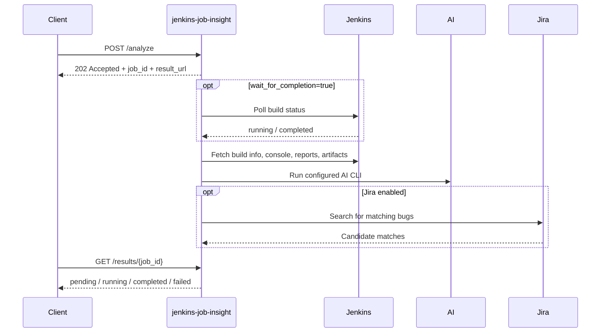

# Configuration Reference

`jenkins-job-insight` reads configuration from four places:

- Server environment variables, including an optional local `.env` file.
- Per-request JSON fields on `POST /analyze` and `POST /analyze-failures`.
- `jji` CLI configuration in `$XDG_CONFIG_HOME/jji/config.toml` or `~/.config/jji/config.toml`.
- AI-provider CLI authentication settings such as API keys, which are consumed by the provider CLI rather than by the FastAPI app itself.

The shipped Compose setup shows the intended pattern: load a `.env` file, then pass those values into the container.

```yaml
env_file:
  - .env

environment:
  - JENKINS_URL=${JENKINS_URL:-https://jenkins.example.com}
  - JENKINS_USER=${JENKINS_USER:-your-username}
  - JENKINS_PASSWORD=${JENKINS_PASSWORD:-your-api-token}
  - AI_PROVIDER=${AI_PROVIDER:?AI_PROVIDER is required}
  - AI_MODEL=${AI_MODEL:?AI_MODEL is required}
```

> **Note:** There is no outbound callback or webhook URL setting in the current codebase. Analysis is asynchronous: the server returns a `job_id` and `result_url`, and clients poll for completion.



## Precedence

For the two analysis endpoints, effective values are chosen in this order:

1. Explicit request-body field.
2. Server environment variable or `.env`.
3. Built-in default.

A few special cases are worth knowing:

- Omit `peer_ai_configs` to inherit `PEER_AI_CONFIGS`. Send `[]` to disable peers for one request.
- Omit `additional_repos` to inherit `ADDITIONAL_REPOS`. Send `[]` to disable extra repos for one request.
- `wait_for_completion`, `poll_interval_minutes`, `max_wait_minutes`, and `peer_analysis_max_rounds` only override the server when you explicitly send them. Simply omitting them keeps the server default.
- `AI_PROVIDER` and `AI_MODEL` must resolve to non-empty values before a job is queued. If neither the request nor the server environment provides them, the API rejects the request.
- Request-body URL fields are validated. Malformed URLs are rejected before the job is queued.

The test suite exercises request overrides like this:

```python
response = test_client.post(
    "/analyze",
    json={
        "job_name": "test",
        "build_number": 123,
        "tests_repo_url": "https://github.com/example/repo",
        "ai_provider": "claude",
        "ai_model": "test-model",
    },
)
```

## Jenkins And Repository Context

These settings control how the service reaches Jenkins, how much Jenkins context it collects, and whether it clones repositories for the AI to inspect.

| Environment variable | Request override | Default | Applies to | What it does |
| --- | --- | --- | --- | --- |
| `JENKINS_URL` | `jenkins_url` | empty | `/analyze` | Base Jenkins URL used to fetch build info, console output, test reports, child jobs, and artifacts. |
| `JENKINS_USER` | `jenkins_user` | empty | `/analyze` | Jenkins username for authenticated API access. |
| `JENKINS_PASSWORD` | `jenkins_password` | empty | `/analyze` | Jenkins password or API token. |
| `JENKINS_SSL_VERIFY` | `jenkins_ssl_verify` | `true` | `/analyze` | Enables or disables TLS certificate verification for Jenkins HTTPS calls. |
| `TESTS_REPO_URL` | `tests_repo_url` | unset | Both analysis endpoints | Repository cloned into the AI workspace for code context. Also part of GitHub issue auto-enable logic. |
| `JENKINS_ARTIFACTS_MAX_SIZE_MB` | `jenkins_artifacts_max_size_mb` | `500` | `/analyze` | Maximum total artifact size downloaded for AI context. |
| `JENKINS_ARTIFACTS_CONTEXT_LINES` | `jenkins_artifacts_context_lines` | `200` | `/analyze` | Maximum number of artifact preview lines added to the AI prompt. |
| `GET_JOB_ARTIFACTS` | `get_job_artifacts` | `true` | `/analyze` | Turns artifact download on or off. |

> **Note:** `JENKINS_URL` is optional at startup only because you can provide `jenkins_url` in the request body. For Jenkins-backed analysis, the effective value still needs to be present somewhere.

> **Warning:** Setting `JENKINS_SSL_VERIFY=false` is useful for self-signed lab Jenkins servers, but it disables certificate verification. Use it only when you trust the network path.

The starter `.env.example` includes the core Jenkins settings like this:

```dotenv
JENKINS_URL=https://jenkins.example.com
JENKINS_USER=your-username
JENKINS_PASSWORD=your-api-token
JENKINS_SSL_VERIFY=true
```

## AI Selection, Peer Review, And Prompt Tuning

These settings choose the main AI, set timeouts, and optionally enable multi-model review.

| Environment variable | Request override | Default | Applies to | What it does |
| --- | --- | --- | --- | --- |
| `AI_PROVIDER` | `ai_provider` | none | Both analysis endpoints | Main AI provider. Valid values are `claude`, `gemini`, and `cursor`. |
| `AI_MODEL` | `ai_model` | none | Both analysis endpoints | Model name passed to the selected provider CLI. |
| `AI_CLI_TIMEOUT` | `ai_cli_timeout` | `10` minutes | Both analysis endpoints | Timeout for each AI CLI call. |
| `PEER_AI_CONFIGS` | `peer_ai_configs` | empty | Both analysis endpoints | Default peer-analysis reviewers. Environment/config format is `provider:model,provider:model`; request-body format is a JSON array of objects. |
| `PEER_ANALYSIS_MAX_ROUNDS` | `peer_analysis_max_rounds` | `3` | Both analysis endpoints | Maximum debate rounds for peer analysis. Valid range: `1` to `10`. |
| `ADDITIONAL_REPOS` | `additional_repos` | empty | Both analysis endpoints | Extra repositories cloned into the AI workspace. Environment/config format is `name:url,name:url`; request-body format is a JSON array of `{name, url}` objects. |
| `—` | `raw_prompt` | none | Both analysis endpoints | Request-only extra instructions appended to the AI analysis prompt. |

> **Tip:** `additional_repos` names must be unique. In request bodies they are validated as structured objects, and in environment/config form they use `name:url,name:url`.

> **Tip:** Omit `peer_ai_configs` to inherit the server default. Send `[]` to turn peer analysis off for one request. The same omit-vs-empty-array rule applies to `additional_repos`.

Peer-analysis overrides are also exercised directly in the test suite:

```python
response = test_client.post(
    "/analyze",
    json={
        "job_name": "test",
        "build_number": 123,
        "ai_provider": "claude",
        "ai_model": "test-model",
        "peer_ai_configs": [
            {"ai_provider": "gemini", "ai_model": "pro"},
        ],
        "peer_analysis_max_rounds": 5,
    },
)
```

The example `.env.example` includes peer-analysis settings in environment format:

```dotenv
# PEER_AI_CONFIGS=cursor:gpt-5.4-xhigh,gemini:gemini-2.5-pro
# PEER_ANALYSIS_MAX_ROUNDS=3
```

## Jira And GitHub Automation

These settings control Jira-assisted bug matching, GitHub issue creation, and related tracker lookups.

| Environment variable | Request override | Default | Applies to | What it does |
| --- | --- | --- | --- | --- |
| `ENABLE_JIRA` | `enable_jira` | auto-detect | Both analysis endpoints | Explicit on/off switch for Jira-assisted triage. If omitted, the server enables Jira only when the Jira settings below form a valid configuration. |
| `JIRA_URL` | `jira_url` | unset | Both analysis endpoints | Jira base URL. |
| `JIRA_EMAIL` | `jira_email` | unset | Both analysis endpoints | Jira Cloud email. |
| `JIRA_API_TOKEN` | `jira_api_token` | unset | Both analysis endpoints | Jira Cloud API token. In Server/Data Center mode it is also accepted as a fallback bearer token when `JIRA_PAT` is absent. |
| `JIRA_PAT` | `jira_pat` | unset | Both analysis endpoints | Preferred bearer token for Jira Server/Data Center. |
| `JIRA_PROJECT_KEY` | `jira_project_key` | unset | Both analysis endpoints | Project key used by this app to enable Jira features and scope searches. |
| `JIRA_SSL_VERIFY` | `jira_ssl_verify` | `true` | Both analysis endpoints | Enables or disables TLS verification for Jira search, enrichment, duplicate detection, and bug creation. |
| `JIRA_MAX_RESULTS` | `jira_max_results` | `5` | Both analysis endpoints | Maximum Jira hits returned per search. |
| `GITHUB_TOKEN` | `github_token` | unset | Analysis requests accept the field; GitHub issue workflows are server-level | GitHub API token used for duplicate search, issue creation, and private GitHub status lookups. |
| `ENABLE_GITHUB_ISSUES` | `—` | auto-detect from `TESTS_REPO_URL` and `GITHUB_TOKEN` | Server only | Explicitly enable or disable GitHub issue creation in the UI and API. |

> **Warning:** Jira Cloud mode is narrower than many setups assume. The app switches to Jira Cloud auth only when `JIRA_EMAIL` and `JIRA_API_TOKEN` are both set. If you set `JIRA_EMAIL` together with `JIRA_PAT`, the app still uses bearer-token Server/Data Center behavior.

> **Tip:** For Server/Data Center, prefer `JIRA_PAT`. `JIRA_API_TOKEN` remains accepted as a fallback.

> **Note:** GitHub issue preview/create and Jira bug preview/create are deployment-level features. Per-request analysis overrides do not turn those endpoints on. If you want those features in the UI or API, configure the server environment.

## Callbacks, Waiting, And Result URLs

There are no callback URL settings in the current codebase. What you can configure instead is how long the service waits for Jenkins and how it builds public-facing links.

| Environment variable | Request override | Default | Applies to | What it does |
| --- | --- | --- | --- | --- |
| `WAIT_FOR_COMPLETION` | `wait_for_completion` | `true` | `/analyze` | Waits for the Jenkins build to finish before starting analysis. |
| `POLL_INTERVAL_MINUTES` | `poll_interval_minutes` | `2` | `/analyze` | Minutes between Jenkins status polls while waiting. |
| `MAX_WAIT_MINUTES` | `max_wait_minutes` | `0` | `/analyze` | Total wait limit. `0` means no limit. |
| `PUBLIC_BASE_URL` | `—` | unset | Server only | Trusted external base URL used to build `result_url`, report links, issue-preview links, and enriched XML report URLs. |

> **Note:** If `PUBLIC_BASE_URL` is unset, the service returns relative URLs such as `/results/<job_id>` and intentionally ignores forwarded host headers. That is by design.

> **Warning:** `PUBLIC_BASE_URL` should be a trusted, server-side value. The service does not derive it from request headers, which protects you from host-header and forwarded-header spoofing.

## Logging, Runtime, And Storage

These settings affect process behavior, logging, the HTTP port, and how secrets are stored.

| Environment variable | Request override | Default | Applies to | What it does |
| --- | --- | --- | --- | --- |
| `LOG_LEVEL` | `—` | `INFO` | Server only | Log verbosity for the app's module-level loggers. Common values used in the repo are `DEBUG`, `INFO`, `WARNING`, and `ERROR`. |
| `DEBUG` | `—` | unset / `false` | Server only | Enables uvicorn auto-reload when the Python entrypoint starts the app. |
| `PORT` | `—` | `8000` | Server only | HTTP bind port. The app also uses it to build its internal localhost URL for AI tool access. |
| `DEV_MODE` | `—` | unset / `false` | Container only | In `entrypoint.sh`, starts the Vite dev server and adds uvicorn reload flags. |
| `DB_PATH` | `—` | `/data/results.db` | Server only | SQLite database path. |
| `JJI_ENCRYPTION_KEY` | `—` | unset | Server only | Explicit encryption secret for sensitive fields stored in `request_params`. Recommended for production. |
| `XDG_DATA_HOME` | `—` | `~/.local/share` | Server only | Base directory for the fallback encryption-key file when `JJI_ENCRYPTION_KEY` is not set. |

Sensitive request values are encrypted before they are stored and removed from API responses. That includes:

- `jenkins_user`
- `jenkins_password`
- `jira_email`
- `jira_api_token`
- `jira_pat`
- `github_token`

> **Warning:** Changing `JJI_ENCRYPTION_KEY` after waiting jobs have been stored can prevent those jobs from resuming, because the saved credentials no longer decrypt with the new key.

The container entrypoint handles `PORT` and `DEV_MODE` exactly like this:

```bash
export PORT="${PORT:-8000}"

if [ "${DEV_MODE:-}" = "true" ] && [ -f /app/frontend/package.json ]; then
    npm run dev -- --host 0.0.0.0 --port 5173 &
fi

if [ "$has_uvicorn" = true ] && [ "$has_port" = false ]; then
    extra_args="$extra_args --port $PORT"
fi
```

> **Note:** The default `DB_PATH` works with the provided Compose file because it mounts `./data` on the host to `/data` in the container.

## `jji` CLI Configuration

The `jji` client has its own small configuration layer on top of the server's API. It can read a profile file, a few CLI-only environment variables, and some option-specific environment variables.

The shipped `config.example.toml` starts like this:

```toml
[default]
server = "dev"

[defaults]
jenkins_url = "https://jenkins.example.com"
jenkins_user = "your-jenkins-user"
jenkins_password = "your-jenkins-token"
jenkins_ssl_verify = true
tests_repo_url = "https://github.com/your-org/your-tests"

[servers.dev]
url = "http://localhost:8000"
username = "your-username"
no_verify_ssl = false
```

CLI-only environment variables:

| Environment variable | Default | Used by | What it does |
| --- | --- | --- | --- |
| `JJI_SERVER` | unset | `jji` | Server name from `config.toml` or a literal server URL. |
| `JJI_USERNAME` | empty | `jji` | Username sent as the `jji_username` cookie for comments, reviews, and deletes. |
| `JJI_NO_VERIFY_SSL` | `false` | `jji` | Disables TLS verification between the CLI and the JJI server. |
| `XDG_CONFIG_HOME` | `~/.config` | `jji` and container entrypoint | Changes the config directory root, including `jji`'s config file location at `$XDG_CONFIG_HOME/jji/config.toml`. |

For `jji`, precedence works like this:

1. CLI flags and CLI env-bound options.
2. The selected server profile from `config.toml`.
3. The profile's inherited `[defaults]`.
4. Whatever server-side defaults are still in effect when the request reaches the API.

A few CLI-specific details matter in practice:

- If `JJI_SERVER` or `--server` is a full URL, `jji` treats it as self-contained and does not inherit username or SSL settings from a named profile.
- `no_verify_ssl` in `config.toml` and `JJI_NO_VERIFY_SSL` affect the CLI-to-server connection only. They do not change `JENKINS_SSL_VERIFY` or `JIRA_SSL_VERIFY`.
- The CLI config file uses `peers = "provider:model,..."`, while the API request body uses `peer_ai_configs` as a JSON array.
- Many `jji analyze` options bind directly to the same environment-variable names as the server-side request fields, including `JENKINS_URL`, `JENKINS_USER`, `JENKINS_PASSWORD`, `TESTS_REPO_URL`, `JIRA_URL`, `JIRA_EMAIL`, `JIRA_API_TOKEN`, `JIRA_PAT`, `JIRA_PROJECT_KEY`, and `GITHUB_TOKEN`.
- `AI_PROVIDER` and `AI_MODEL` are not CLI env-bound options. For `jji`, set them with CLI flags or in `config.toml`.

> **Note:** In `config.toml`, integer fields such as `ai_cli_timeout`, `jira_max_results`, `poll_interval_minutes`, `max_wait_minutes`, and `peer_analysis_max_rounds` use `0` as "not set; let the server decide." That is different from server-side `MAX_WAIT_MINUTES=0`, which means "wait forever."

## AI Provider CLI Authentication

These settings are part of the overall deployment story, but they are read by the installed AI CLI tools rather than by `jenkins-job-insight` itself.

The example `.env.example` shows the supported patterns:

```dotenv
AI_PROVIDER=claude
AI_MODEL=your-model-name

ANTHROPIC_API_KEY=your-anthropic-api-key
# CLAUDE_CODE_USE_VERTEX=1
# CLOUD_ML_REGION=us-east5
# ANTHROPIC_VERTEX_PROJECT_ID=your-project-id

GEMINI_API_KEY=your-gemini-api-key

# CURSOR_API_KEY=your-cursor-api-key
```

| Environment variable | Default | Used by | What it does |
| --- | --- | --- | --- |
| `ANTHROPIC_API_KEY` | unset | Claude CLI | Direct Claude authentication. |
| `CLAUDE_CODE_USE_VERTEX` | unset | Claude CLI | Switches Claude to Vertex AI auth. |
| `CLOUD_ML_REGION` | unset in app code | Claude CLI | Vertex AI region. The Compose example uses `us-east5`. |
| `ANTHROPIC_VERTEX_PROJECT_ID` | unset | Claude CLI | GCP project ID for Claude on Vertex AI. |
| `GEMINI_API_KEY` | unset | Gemini CLI | API-key auth for Gemini. |
| `CURSOR_API_KEY` | unset | Cursor Agent CLI | API-key auth for Cursor. |

> **Tip:** Gemini also supports OAuth login with `gemini auth login`, so `GEMINI_API_KEY` is optional if you prefer that flow.

> **Tip:** In containerized or OpenShift-style deployments, the entrypoint can stage file-based Cursor credentials from `/cursor-credentials` into `${XDG_CONFIG_HOME:-/home/appuser/.config}/cursor`.

## Example Pytest JUnit XML Helper

The example helper under `examples/pytest-junitxml/` has its own environment variables. These do not configure the server; they configure the helper script that calls `POST /analyze-failures`.

| Environment variable | Default | Used by | What it does |
| --- | --- | --- | --- |
| `JJI_SERVER` | unset | Example helper | Base URL of the `jenkins-job-insight` server. |
| `JJI_AI_PROVIDER` | none | Example helper | Provider sent in the helper's request body. The current helper requires it. |
| `JJI_AI_MODEL` | none | Example helper | Model sent in the helper's request body. The current helper requires it. |
| `JJI_TIMEOUT` | `600` seconds | Example helper | HTTP timeout for the helper's `POST /analyze-failures`. Invalid values fall back to `600`. |

> **Note:** The example helper loads a local `.env` with `python-dotenv`, then disables itself if `JJI_SERVER`, `JJI_AI_PROVIDER`, or `JJI_AI_MODEL` are missing.

## Quick Reference

If you only need a minimal production-ish setup, these are the highest-impact settings to get right first:

- `AI_PROVIDER` and `AI_MODEL` so analysis can run at all.
- `JENKINS_URL`, `JENKINS_USER`, and `JENKINS_PASSWORD` for Jenkins-backed analysis.
- `TESTS_REPO_URL` if you want the AI to inspect repository code or you plan to create GitHub issues.
- `JIRA_URL`, `JIRA_PROJECT_KEY`, and either `JIRA_API_TOKEN` or `JIRA_PAT` if you want Jira-assisted triage.
- `PUBLIC_BASE_URL` if users or external systems need absolute result links.
- `JJI_ENCRYPTION_KEY` if you want stable, explicit secret encryption across deployments.
- `DB_PATH` if the default `/data/results.db` does not fit your runtime environment.


## Related Pages

- [AI Provider Setup](ai-provider-setup.html)
- [Jenkins, Repository Context, and Prompts](jenkins-repository-and-prompts.html)
- [Jira Integration](jira-integration.html)
- [Reverse Proxy and Base URL Handling](reverse-proxy-and-base-urls.html)
- [Container Deployment](container-deployment.html)