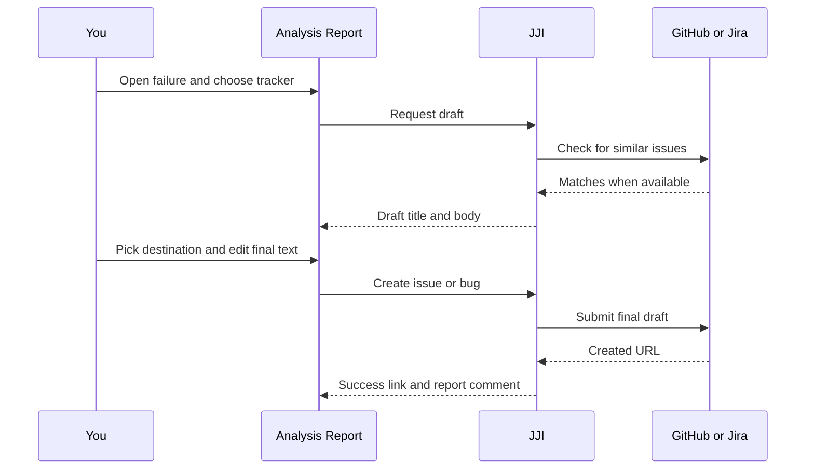

# Creating GitHub Issues and Jira Bugs

Use this flow when you want to turn a failed test into tracked follow-up work without copying analysis details by hand. JJI drafts the issue text from the report, lets you adjust the destination and wording, and adds the created link back to the same failure so the trail stays in one place.

## Prerequisites
- A completed analysis report. If you need one, see [Running Your First Analysis](quickstart.html).
- A saved username in `Settings`.
- A saved `GitHub Token` or `Jira Token` in `Settings`. Jira Cloud also needs `Jira Email`.
- The tracker you want to use must be available in your JJI deployment.

## Quick Example
```text
completed report -> expand failure -> GitHub Issue -> edit Title/Body -> Create GitHub Issue
```

1. Open a completed report and expand the failure you want to track.
2. Click `GitHub Issue`.
3. If `Repository` is shown, choose the repo you want.
4. Review the generated draft, edit `Title` or `Body`, then click `Create GitHub Issue`.
5. Use `Open GitHub Issue`, then return to the report to confirm the new follow-up link was added to that failure.

> **Note:** The Jira flow is the same, but you click `Jira Bug` and choose a `Jira Project` before creating it.


> **Note:** You can open the preview before saving a tracker token, but JJI does not enable the final create button until the matching token is saved in `Settings`.



## Step-by-Step
1. Open a completed analysis report.

   Expand the failure card you want to file. The tracker actions live on each expanded failure card, not on the summary view.

2. Choose the tracker.

   | If you want to file in | Click | Pick before creating |
   | --- | --- | --- |
   | GitHub | `GitHub Issue` | `Repository` when more than one repo is available |
   | Jira | `Jira Bug` | `Jira Project`, and optionally `Security Level` |

   > **Warning:** If a tracker button is greyed out, that tracker is not available in your current deployment.

3. Review the generated preview.

   JJI fills in `Title` and `Body` automatically from the failure details. When it can find possible duplicates, it shows them above the editor with links and current status so you can decide whether to create a new item or reuse an existing one.

4. Pick the destination.

   For GitHub, use `Repository` when the dialog offers more than one repo. If no repo picker appears, there is no repo choice to make in the dialog.

   For Jira, type at least two characters in `Jira Project` to search accessible projects, then pick the right project from the list.

5. Optionally set Jira visibility.

   After you pick a Jira project, `Security Level` can show project-specific visibility choices. Leave it empty if you want the bug to use the project's normal visibility.

6. Edit the final text.

   Update `Title` and `Body` before you submit. Turn on `Include links` when you want the draft to reference the Jenkins build and the JJI report.

7. Create the follow-up work.

   Click `Create GitHub Issue` or `Create Jira Bug`. JJI shows a success link, and it also adds a comment back on the same failure so the report keeps the tracker URL with the analysis.

## Advanced Usage
- If the failure card shows `AI for issue generation`, you can choose a different provider and model before opening the dialog. If draft generation fails, JJI still builds a structured draft from the existing analysis so you can keep working.
- JJI shapes the draft from the current failure classification. If you change the classification first, the next preview uses that updated classification.
- The GitHub `Repository` picker only appears when the report gives you more than one repo to choose from. Otherwise there is no repo selection step in the dialog.
- A Jira project key may already be filled in for you. Project suggestions narrow as you type, and security levels appear only after a project is selected.
- `Include links` produces clickable report links only when your deployment has a public external URL. Otherwise JJI falls back to plain-text references.
- On grouped failure cards, JJI builds the draft from the test shown at the top of the card.

## Troubleshooting
- `Create GitHub Issue` or `Create Jira Bug` is disabled: save the matching token in `Settings`. For Jira Cloud, also save `Jira Email`.
- The dialog opens, but preview fails with a tracker-disabled or configuration message: your admin needs to finish enabling that tracker on the server.
- GitHub creation fails because no repository is available: JJI does not have a GitHub destination for this report. Run the analysis again with the right repository information, or ask an admin to configure a default GitHub repo. See [Analyzing Jenkins Jobs](analyzing-jenkins-jobs.html) for details.
- Jira project search or `Security Level` is empty: check that your Jira token is valid, add `Jira Email` for Jira Cloud, and select a project before looking for security levels.
- Your GitHub or Jira token is invalid or expired: update it in `Settings` and try again.
- The similar issues list is empty: duplicate lookup is best effort, so you can still review the draft and create the issue manually.

## Related Pages

- [Managing Your Profile and Personal Tokens](managing-your-profile-and-personal-tokens.html)
- [Reviewing, Commenting, and Reclassifying Failures](reviewing-commenting-and-reclassifying-failures.html)
- [Tracking Failure History](tracking-failure-history.html)
- [CLI Command Reference](cli-command-reference.html)
- [Configuration and Environment Reference](configuration-and-environment-reference.html)