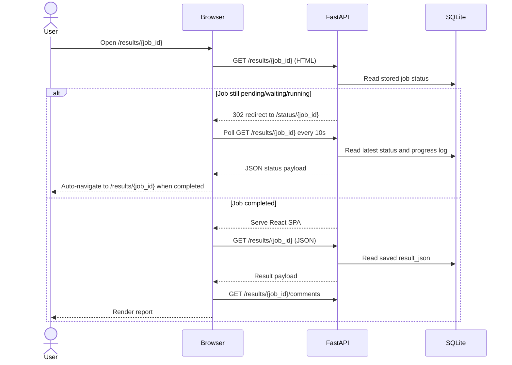

# HTML Reports and Dashboard

`jenkins-job-insight` gives you one browser UI for both live triage and finished analysis. Open `/` for the dashboard, `/results/{job_id}` for a specific run, and `/status/{job_id}` while analysis is still in progress.

The most useful mental model is this: JJI does not create a separate `.html` file for every job. The HTML shell is the built React app, and the saved report data is fetched when someone opens the route. If you think of report rendering as "lazy", the laziness is in loading the saved data on demand, not in generating a new standalone HTML artifact for each result.

```1332:1341:src/jenkins_job_insight/main.py
@app.get("/results/{job_id}", response_model=None)
async def get_job_result(request: Request, job_id: str, response: Response):
    """Retrieve stored result by job_id, or serve SPA for browser requests."""
    # Content negotiation: browsers requesting HTML get the SPA
    accept = request.headers.get("accept", "")
    if "text/html" in accept and "application/json" not in accept:
        result = await get_result(job_id)
        if result and result.get("status") in IN_PROGRESS_STATUSES:
            return RedirectResponse(url=f"/status/{job_id}", status_code=302)
        return _serve_spa()
```



> **Note:** Browser UI routes use a lightweight `jji_username` cookie. If you have not registered a name yet, HTML requests are redirected to `/register` first.

> **Warning:** The browser UI only works when the frontend bundle exists. On a local source checkout, build the frontend before starting the server; otherwise browser routes return `Frontend not built`. The frontend test environment in this repo also builds the UI before running tests.

```2468:2473:src/jenkins_job_insight/main.py
def _serve_spa() -> HTMLResponse:
    """Read and serve the React SPA index.html."""
    index_file = _FRONTEND_DIR / "index.html"
    if not index_file.is_file():
        raise HTTPException(status_code=404, detail="Frontend not built")
    return HTMLResponse(content=index_file.read_text(encoding="utf-8"))
```

```9:30:tox.toml
[env.frontend]
commands = [
  [
    "npm",
    "ci",
    "--no-audit",
    "--no-fund",
  ],
  [
    "npx",
    "vite",
    "build",
  ],
  [
    "npm",
    "test",
  ],
]
description = "Run frontend build and tests"
skip_install = true
allowlist_externals = ["npm", "npx"]
change_dir = "frontend"
```

## Refresh Behavior

Refreshing a page never reruns the AI analysis. It reloads saved state from the database and any live collaboration data the UI polls for.

The refresh story is different depending on where you are:

- The dashboard refreshes itself every 10 seconds.
- The status page polls every 10 seconds and automatically switches to the finished report when the job completes.
- The report page loads the main result once per page load, then polls comments and review state on an interval.
- There is no separate report-regeneration step to trigger when you refresh a browser tab.

```135:204:frontend/src/pages/DashboardPage.tsx
useEffect(() => {
  fetchJobs()
  const interval = setInterval(fetchJobs, 10_000)
  return () => clearInterval(interval)
}, [fetchJobs])

function getJobRoute(job: DashboardJob): string {
  return ['waiting', 'pending', 'running'].includes(job.status)
    ? `/status/${job.job_id}`
    : `/results/${job.job_id}`
}
```

```101:158:frontend/src/pages/StatusPage.tsx
async function poll() {
  if (inFlight || cancelled) return
  inFlight = true
  try {
    const res = await api.get<ResultResponse>(`/results/${jobId}`)
    if (cancelled) return
    setError('')
    setData(res)

    if (res.status === 'completed') {
      stopPolling()
      navigate(`/results/${jobId}`, { replace: true })
    } else if (res.status === 'failed') {
      stopPolling()
      setTerminalErrorKind('failed')
      setError(res.result?.error ?? 'Analysis failed')
    }
  } catch (err) {
    // ... error handling omitted ...
  } finally {
    inFlight = false
  }
}

// ... later in the same file ...

const rawProgressLog = data?.result?.progress_log
const progressLog = Array.isArray(rawProgressLog) ? rawProgressLog : []
const stepLog: StepLogEntry[] = useMemo(
  () => progressLog.map(entry => ({
    phase: entry.phase,
    label: getPhaseLabel(entry.phase) ?? entry.phase,
    timestamp: new Date(entry.timestamp * 1000).toLocaleTimeString(),
  })),
  [progressLog],
)
```

The status page is especially useful if you hand someone a report URL before analysis has finished. They will land on `/status/{job_id}`, see live status, and then get forwarded to the real report as soon as the job reaches `completed`.

For finished reports, the comment/review poll interval defaults to 30 seconds and can be changed at build time with `VITE_COMMENT_POLL_MS`. The code clamps the value to stay between 5 seconds and 300 seconds.

```22:224:frontend/src/pages/ReportPage.tsx
const COMMENT_POLL_MS = Math.max(5_000, Math.min(300_000,
  Number(import.meta.env.VITE_COMMENT_POLL_MS) || 30_000,
))

// ... later in the component ...

useEffect(() => {
  if (!jobId || state.error || !state.result) return

  const interval = setInterval(() => {
    if (state.commentDraftCount > 0) return
    fetchComments(jobId)
  }, COMMENT_POLL_MS)

  return () => {
    clearInterval(interval)
  }
}, [jobId, fetchComments, state.commentDraftCount, state.error, state.result])
```

> **Tip:** Same-tab refresh is friendly on long reports. JJI keeps things like scroll position, expand/collapse state, and dashboard sort state in `sessionStorage`, so `F5` usually brings you back close to where you were.

## Grouped Root-Cause Cards

The report page is designed to keep noisy builds readable. Instead of rendering one giant flat list, JJI groups failures by `error_signature`. In practice, that means one report card can stand in for a whole cluster of tests that failed for the same underlying reason.

If a failure has no `error_signature`, it is kept as its own unique card and is not merged with anything else just because the test names look similar.

```26:55:frontend/src/lib/grouping.ts
export function groupingKey(failure: FailureAnalysis): string {
  return failure.error_signature || `unique-${failure.test_name}`
}

export function groupFailures(
  failures: FailureAnalysis[],
  prefix = '',
): GroupedFailure[] {
  const groupMap = new Map<string, FailureAnalysis[]>()
  const idPrefix = prefix || 'group'

  for (const f of failures ?? []) {
    const key = groupingKey(f)
    if (!groupMap.has(key)) {
      groupMap.set(key, [])
    }
    groupMap.get(key)!.push(f)
  }

  const groups: GroupedFailure[] = []
  for (const [signature, tests] of groupMap) {
    groups.push({
      signature,
      tests,
      count: tests.length,
      id: `${idPrefix}-${encodeURIComponent(signature)}`,
    })
  }
  return groups
}
```

Each grouped card uses one representative test name in the collapsed header and then tells you how many sibling failures share that same error. When you expand it, you get the full error, analysis, evidence, affected tests, review controls, comments, and any follow-up actions that apply.

```172:235:frontend/src/pages/report/FailureCard.tsx
<Card
  className={`border-l-4 ${borderColor} animate-slide-up`}
>
  {/* Header */}
  <div className="flex w-full items-center gap-3 p-4">
    <button
      className="flex min-w-0 flex-1 items-center gap-3 text-left"
      onClick={() => setExpanded(!expanded)}
      aria-expanded={expanded}
    >
      <div className="min-w-0 flex-1">
        <p className="truncate font-display text-sm font-medium text-text-primary">{rep.test_name}</p>
        {group.count > 1 && <span className="text-xs text-text-tertiary">+{group.count - 1} more with same error</span>}
      </div>
    </button>
  </div>

  {/* Expanded body */}
  {expanded && (
    <CardContent className="space-y-4 border-t border-border-muted pt-4">
      {/* Review-all toggle for groups */}
      {group.count > 1 && (
        <div className="flex items-center gap-2">
          <button
            onClick={handleReviewAll}
            disabled={reviewingAll}
          >
            {allReviewed ? 'All Reviewed' : `Review All (${reviewedCount}/${group.count})`}
          </button>
        </div>
      )}
```

That grouped view is not just cosmetic. When someone overrides the classification for a grouped failure, the backend updates the whole signature group and also patches the stored result so the next page refresh still shows the updated classification.

```2205:2220:src/jenkins_job_insight/main.py
group_tests = await storage.override_classification(
    job_id=job_id,
    test_name=body.test_name,
    classification=body.classification,
    child_job_name=body.child_job_name,
    child_build_number=body.child_build_number,
    username=username,
    parent_job_name=parent_job_name,
)

# Persist the override into result_json so page refresh reflects it.
# Uses an atomic read-modify-write inside a single SQLite transaction
# so concurrent overrides by different reviewers cannot clobber each other.
# Patch ALL tests in the signature group so grouped siblings also update.
```

A few practical consequences fall out of this design:

- One card often represents the real "root cause" you care about, even if many tests failed.
- The card header can show comment count and review progress for the whole group.
- Child pipeline jobs use the same grouping behavior inside their own sections.
- Manual classification changes survive refresh because they are written back into stored state.

> **Note:** You can review an entire grouped card, but posting a new comment is currently only supported when the card contains exactly one test. Grouped cards still show existing comments that belong to tests inside that group.

## Browsing Results

A finished report is meant for investigation, not just display. In normal use you move through it in roughly this order:

- Start at the sticky header for job name, build number, status, failure count, review progress, and Jenkins link.
- Read the `Key Takeaway` summary if one exists.
- Open grouped top-level failures to see the main root causes.
- Drill into `Child Jobs` for downstream job failures.
- Use deep links into child-job sections when you need to share a specific subtree with someone else.

Child-job browsing is intentionally shareable. Expanding a child-job section updates the URL hash, and reloading a matching hash automatically re-expands that section and scrolls it into view.

```28:60:frontend/src/pages/report/ChildJobSection.tsx
useEffect(() => {
  if (activeHash && (activeHash === hashId || activeHash.startsWith(`${hashId}--`))) {
    if (!expanded) {
      setExpanded(true)
    }
    if (activeHash === hashId) {
      requestAnimationFrame(() => {
        sectionRef.current?.scrollIntoView({ behavior: 'smooth', block: 'start' })
      })
    }
  }
}, [activeHash, hashId, expanded, setExpanded])

const handleToggle = useCallback(() => {
  const replaceHash = (url: string) => {
    history.replaceState(null, '', url)
    window.dispatchEvent(new HashChangeEvent('hashchange'))
  }

  const next = !expanded
  setExpanded(next)
  if (next) {
    replaceHash(`#${hashId}`)
  }
```

> **Tip:** If you are reviewing a big pipeline tree with teammates, share the report URL after expanding the relevant child job first. The hash-based deep link makes it much faster for the next person to land in the right place.

## Dashboard Search and Pagination

The dashboard is a live table of recent analyses powered by `GET /api/dashboard`. It is not just a list of job IDs. Each row can include the job name, build number, status, failure count, review count, comment count, child-job count, and a short summary or error hint.

On the backend, those numbers are assembled from stored result data plus live review/comment tables. The important detail is that the failure count is recursive across nested child jobs, while the `Children` count is the number of top-level child-job analyses attached to the result.

```1477:1545:src/jenkins_job_insight/storage.py
DEFAULT_DASHBOARD_LIMIT = 500

async def list_results_for_dashboard(
    limit: int = DEFAULT_DASHBOARD_LIMIT,
) -> list[dict]:
    """List analysis results with summary data for dashboard display."""
    # ...
    sql = """
        SELECT r.job_id, r.jenkins_url, r.status, r.result_json,
            r.created_at, r.completed_at, r.analysis_started_at,
            (SELECT COUNT(*) FROM failure_reviews fr
             WHERE fr.job_id = r.job_id AND fr.reviewed = 1) AS reviewed_count,
            (SELECT COUNT(*) FROM comments c
             WHERE c.job_id = r.job_id) AS comment_count
        FROM results r
        ORDER BY r.created_at DESC
    """
    # ...
    if result_data:
        entry["job_name"] = result_data.get("job_name", "")
        if "build_number" in result_data:
            entry["build_number"] = result_data["build_number"]
        entry["failure_count"] = count_all_failures(result_data)
        child_jobs = result_data.get("child_job_analyses", [])
        if child_jobs:
            entry["child_job_count"] = len(child_jobs)
```

In the browser, search, status filtering, sorting, and pagination are all applied on top of the loaded dashboard rows.

```135:243:frontend/src/pages/DashboardPage.tsx
useEffect(() => {
  fetchJobs()
  const interval = setInterval(fetchJobs, 10_000)
  return () => clearInterval(interval)
}, [fetchJobs])

const filtered = useMemo(() => {
  return jobs.filter((j) => {
    const displayStatus = isAnalysisTimeout(j.status, j.error, j.summary) ? 'timeout' : j.status
    if (statusFilter !== STATUS_FILTER_ALL && displayStatus !== statusFilter) return false
    if (!search) return true
    const q = search.toLowerCase()
    return (j.job_name ?? '').toLowerCase().includes(q) || j.job_id.toLowerCase().includes(q)
  })
}, [jobs, search, statusFilter])

const totalPages = Math.max(1, Math.ceil(sorted.length / perPage))
const safePage = Math.min(page, totalPages)
const pageJobs = sorted.slice((safePage - 1) * perPage, safePage * perPage)

// ... later in the same component ...

<SelectItem value="10">10</SelectItem>
<SelectItem value="20">20</SelectItem>
<SelectItem value="50">50</SelectItem>

function getJobRoute(job: DashboardJob): string {
  return ['waiting', 'pending', 'running'].includes(job.status)
    ? `/status/${job.job_id}`
    : `/results/${job.job_id}`
}
```

In practice, that means:

- Search is a case-insensitive substring match on `job_name` and `job_id` only.
- Status filtering includes the usual states plus the UI-level `timeout` label.
- Sorting is client-side and defaults to `Created` descending.
- Pagination is client-side, with 10, 20, and 50 rows per page.
- Changing the search text, status filter, or page size resets you to page 1.
- Clicking an active job takes you to `/status/{job_id}`. Clicking a completed job takes you to `/results/{job_id}`.

> **Note:** Dashboard search, filtering, sorting, and pagination only apply to the rows already loaded into the browser. By default, the backend sends the 500 newest results.

> **Tip:** Leave the dashboard open during triage if you want a live overview. Because it refreshes every 10 seconds and recomputes review/comment counters from stored data, it stays useful even after the original analysis run is finished.


## Related Pages

- [Results, Reports, and Dashboard Endpoints](api-results-and-dashboard.html)
- [Storage and Result Lifecycle](storage-and-result-lifecycle.html)
- [Analyze Jenkins Jobs](analyze-jenkins-jobs.html)
- [Jira-Assisted Bug Triage](jira-assisted-bug-triage.html)
- [Reverse Proxy and Base URL Handling](reverse-proxy-and-base-urls.html)