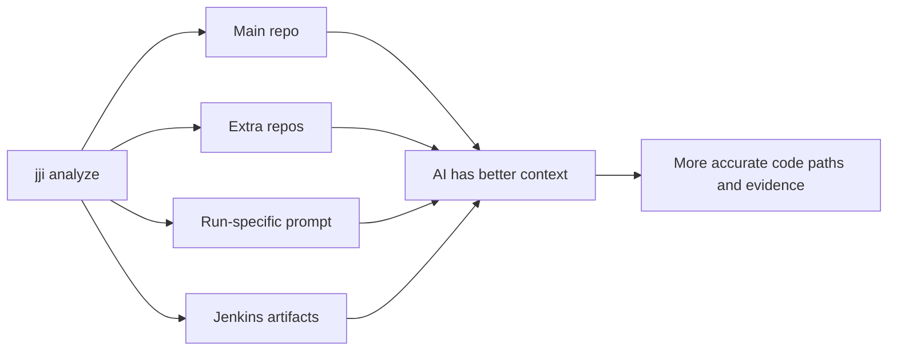

# Improving Analysis with Repository Context

You want the AI to inspect the same repositories, prompts, and build evidence your team uses so it can point to the right files and quote the right evidence instead of guessing from stack traces alone. The best results usually come from combining a main repo, any supporting repos, a short run-specific prompt, and Jenkins artifacts when the proof lives outside the test report.

Prerequisites:
- `jji` is already configured to talk to your JJI server.
- The machine running JJI can clone the repositories you reference.
- Your Jenkins account can read build artifacts if you want artifact-based evidence.

## Quick Example

```bash
jji analyze \
  --job-name my-job \
  --build-number 1 \
  --tests-repo-url https://github.com/org/tests \
  --additional-repos "infra:https://github.com/org/infra" \
  --raw-prompt "Focus on the failing code path and cite artifact evidence when it exists." \
  --jenkins-artifacts-max-size-mb 50
```

This gives JJI one main repository, one supporting repository, temporary instructions for this run, and a larger artifact budget for evidence collection.

| Add this | What it improves | Best for |
| --- | --- | --- |
| `--tests-repo-url` | Main code and test context | Finding the exact file or branch involved |
| `--additional-repos` | Cross-repo context | Shared libraries, infra repos, or split codebases |
| `--raw-prompt` | Run-specific guidance | Temporary instructions you do not want to commit |
| `--get-job-artifacts` and `--jenkins-artifacts-max-size-mb` | File and log evidence | Failures explained by generated files, logs, or archives |



## Step-by-Step

1. Start with the main repository the AI should inspect.

```bash
jji analyze \
  --job-name my-job \
  --build-number 1 \
  --tests-repo-url https://github.com/org/tests
```

If you give JJI a repository URL, it clones that repo before analysis starts. If you do not, analysis still runs, but it has to rely on the Jenkins test report, console output, and any artifact evidence instead of source code.

> **Tip:** You can pin a branch or tag by appending `:ref`, such as `https://github.com/org/my-tests:develop` or `https://github.com/org/repo.git:feature-x`.

2. Add supporting repositories when the failing path crosses repo boundaries.

```bash
jji analyze \
  --job-name my-job \
  --build-number 1 \
  --tests-repo-url https://github.com/org/tests \
  --additional-repos "infra:https://github.com/org/infra,product:https://github.com/org/product"
```

Use short, unique names such as `infra` or `product`. Those names identify each extra repository during analysis, so they should be stable and easy to recognize.

3. Add one-off instructions with `--raw-prompt`.

```bash
jji analyze \
  --job-name my-job \
  --build-number 1 \
  --tests-repo-url https://github.com/org/tests \
  --raw-prompt "Check shared fixtures before calling this a product bug. Prefer quoting log or artifact lines over summarizing them."
```

Use `--raw-prompt` when you want to steer a single run without changing any repository content. This is the right tool for incident-specific instructions, temporary experiments, or a one-time request to bias the analysis toward a particular kind of evidence.

4. Keep Jenkins artifacts available when the proof is in logs, archives, or generated files.

```bash
jji analyze \
  --job-name my-job \
  --build-number 1 \
  --get-job-artifacts \
  --jenkins-artifacts-max-size-mb 50
```

Artifact download is enabled by default for Jenkins-backed analyses, so most of the time you only need to change the size cap. If artifacts are noisy, unavailable, or too expensive to download, turn them off explicitly:

```bash
jji analyze \
  --job-name my-job \
  --build-number 1 \
  --no-get-job-artifacts
```

> **Note:** Artifact settings apply to Jenkins-backed analysis. They do not apply when you send raw failures or JUnit XML directly.

5. Save the repository defaults you use all the time.

```toml
[default]
server = "dev"

[defaults]
tests_repo_url = "https://github.com/org/tests"

[servers.dev]
url = "http://localhost:8000"
additional_repos = "infra:https://github.com/org/infra,product:https://github.com/org/product"
```

Put this in `~/.config/jji/config.toml` to avoid repeating the same repository context on every run. Per-run CLI flags still win, so you can keep stable defaults and override them when a single analysis needs a different branch, repo, or prompt.

> **Tip:** The config file is a good home for `tests_repo_url` and `additional_repos`. Keep `--raw-prompt` for per-run guidance instead of trying to make it a saved default.

## Advanced Usage

Use branch or tag refs on both the main repo and extra repos when the failure only makes sense on a non-default line of development.

```bash
jji analyze \
  --job-name my-job \
  --build-number 1 \
  --tests-repo-url https://github.com/org/my-tests:develop \
  --additional-repos "infra:https://gitlab.internal:8443/org/infra:main"
```

The repository URL must use `https://` or `git://`. JJI rejects `ssh://` and `file://` repository URLs.

For long-lived project guidance, add a `JOB_INSIGHT_PROMPT.md` file at the root of a cloned repository. When that file exists, JJI tells the AI to read it alongside the rest of the repository context.

> **Warning:** `JOB_INSIGHT_PROMPT.md` is only auto-discovered at the cloned repository root, not in subdirectories.

If you already have a result and want to improve the next run without changing saved defaults, use the report page's `Re-Analyze` action. The dialog lets you adjust `Tests Repo URL`, `Ref / Branch`, `Additional Repositories`, `Raw Prompt`, and `Jenkins Artifacts` before queuing a new analysis. See [Monitoring and Re-Running Analyses](monitoring-and-rerunning-analyses.html) for details.

The same repository and prompt settings also work when you analyze raw failures or JUnit XML directly. Artifact download does not, because there is no Jenkins build to fetch from. See [Analyzing JUnit XML and Raw Failures](analyzing-junit-xml-and-raw-failures.html) for details.

Use this quick rule of thumb when deciding where to save each setting:

| Setting | Save in `~/.config/jji/config.toml` | Set per run | Set as a server default |
| --- | --- | --- | --- |
| Main repo | Yes | Yes | Yes |
| Additional repos | Yes | Yes | Yes |
| Raw prompt | No | Yes | No |
| Artifact download on/off | No | Yes | Yes |
| Artifact size cap | No | Yes | Yes |

For the full list of flags and server-side defaults, see [CLI Command Reference](cli-command-reference.html) and [Configuration and Environment Reference](configuration-and-environment-reference.html) for details.

## Troubleshooting

- If `--additional-repos` is rejected, use comma-separated `name:url` pairs such as `infra:https://github.com/org/infra`. Each name must be unique.
- If JJI inspects the wrong branch, add `:ref` to the repo URL instead of assuming the default branch matches the failing run.
- If the result has little or no artifact evidence, check whether the build actually published artifacts, whether artifact download was disabled, whether your Jenkins account can read them, and whether the size cap is too low.
- If repository cloning fails immediately, switch to `https://` or `git://` URLs. `ssh://` and `file://` URLs are not accepted.

## Related Pages

- [Analyzing Jenkins Jobs](analyzing-jenkins-jobs.html)
- [Analyzing JUnit XML and Raw Failures](analyzing-junit-xml-and-raw-failures.html)
- [Monitoring and Re-Running Analyses](monitoring-and-rerunning-analyses.html)
- [Adding Peer Review with Multiple AI Models](adding-peer-review-with-multiple-ai-models.html)
- [Configuration and Environment Reference](configuration-and-environment-reference.html)