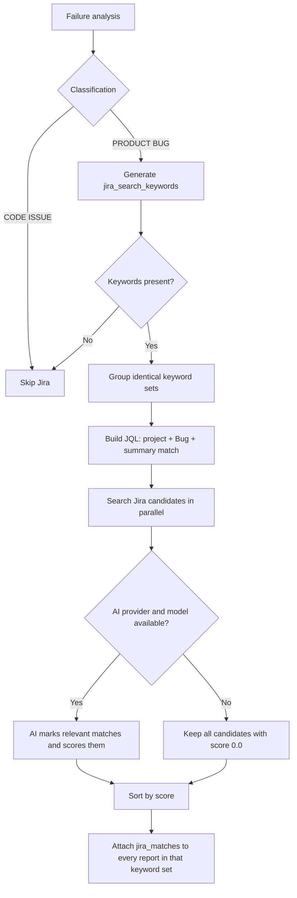

# Jira Integration

Jira integration helps `jenkins-job-insight` answer one practical triage question: is this failure already tracked? After a failure is classified as `PRODUCT BUG`, the service can generate Jira-oriented search keywords, search Jira for existing `Bug` issues, and attach the strongest matches to the stored analysis result.

The same server-side Jira configuration is also reused when Jira bug preview and creation are available, but the matching flow described here is the part that runs automatically during analysis.

## Configure Jira

To enable Jira matching, you need:

- `JIRA_URL`
- valid Jira credentials for your deployment type
- `JIRA_PROJECT_KEY`

The shipped example config includes the Jira fields together:

```32:38:config.example.toml
# Jira
jira_url = "https://your-jira.atlassian.net"
jira_email = "you@example.com"
jira_api_token = "your-jira-token"
jira_pat = ""
jira_project_key = "PROJ"
jira_ssl_verify = true
```

The runtime defaults come from `Settings`:

```104:114:src/jenkins_job_insight/config.py
# Jira integration (optional)
jira_url: str | None = None
jira_email: str | None = None
jira_api_token: SecretStr | None = None
jira_pat: SecretStr | None = None
jira_project_key: str | None = None
jira_ssl_verify: bool = True
jira_max_results: int = Field(default=5, gt=0)

# Explicit Jira toggle (optional)
enable_jira: bool | None = None
```

Use the auth fields like this:

- Jira Cloud: set `JIRA_EMAIL` and `JIRA_API_TOKEN`
- Jira Server/Data Center: set `JIRA_PAT`
- Optional tuning: `JIRA_SSL_VERIFY`, `JIRA_MAX_RESULTS`, and `ENABLE_JIRA`

The same Jira settings are also exposed for container deployments in `docker-compose.yaml`, and the `jji` CLI exposes matching per-run flags such as `--jira`, `--no-jira`, `--jira-url`, `--jira-email`, `--jira-api-token`, `--jira-pat`, `--jira-project-key`, `--jira-ssl-verify`, and `--jira-max-results`.

> **Note:** `JIRA_PROJECT_KEY` is required for Jira matching in the current code. If it is missing, matching stays off.

> **Tip:** To check whether a server currently considers Jira available, call `GET /api/capabilities` or run `jji capabilities`. Both report the `jira_bugs` capability from the same server-side enablement check.

## Cloud and Server/DC Authentication

You do not set a separate "mode" flag. The code chooses Cloud vs Server/DC automatically from the credentials you provide.

| Deployment | Required settings for matching | Auth used for matching | Search endpoint |
| --- | --- | --- | --- |
| Jira Cloud | `JIRA_URL`, `JIRA_EMAIL`, `JIRA_API_TOKEN`, `JIRA_PROJECT_KEY` | Basic auth with `email:api_token` | `/rest/api/3/search/jql` |
| Jira Server/DC | `JIRA_URL`, `JIRA_PAT`, `JIRA_PROJECT_KEY` | Bearer token | `/rest/api/2/search` |

The auth resolver makes that distinction explicit:

```227:260:src/jenkins_job_insight/config.py
def _resolve_jira_auth(settings: Settings) -> tuple[bool, str]:
    has_api_token = bool(
        settings.jira_api_token and settings.jira_api_token.get_secret_value()
    )
    has_pat = bool(settings.jira_pat and settings.jira_pat.get_secret_value())
    has_email = bool(settings.jira_email)

    is_cloud = has_email and has_api_token

    if is_cloud:
        return True, settings.jira_api_token.get_secret_value()

    # Server/DC: prefer PAT, fall back to API token
    if has_pat and settings.jira_pat:
        return False, settings.jira_pat.get_secret_value()
    if has_api_token and settings.jira_api_token:
        return False, settings.jira_api_token.get_secret_value()
```

> **Warning:** `JIRA_EMAIL` plus `JIRA_PAT` does **not** activate Cloud mode. The code intentionally keeps that combination on the Server/DC path. If you are integrating with Jira Cloud, use `JIRA_API_TOKEN`.

> **Note:** On Server/DC, `JIRA_API_TOKEN` still works as a bearer-token fallback when `JIRA_PAT` is not set and `JIRA_EMAIL` is not set.

This behavior is covered by `tests/test_jira.py` and `tests/test_config.py`, including the edge case where `JIRA_EMAIL` and `JIRA_PAT` are both present.

## Automatic Enablement

Jira matching is controlled in two layers:

1. The request can explicitly say "on" or "off" with `enable_jira`.
2. The server still requires a valid Jira setup before it treats Jira as enabled.

The hard enablement check lives on `Settings.jira_enabled`:

```184:206:src/jenkins_job_insight/config.py
@property
def jira_enabled(self) -> bool:
    if self.enable_jira is False:
        return False
    if not self.jira_url:
        return False
    _, token_value = _resolve_jira_auth(self)
    if not token_value:
        return False
    if not self.jira_project_key:
        return False
    return True
```

Then `main.py` applies the request-level override first:

```573:590:src/jenkins_job_insight/main.py
def _resolve_enable_jira(body: BaseAnalysisRequest, settings: Settings) -> bool:
    """Resolve enable_jira flag from request, env var, or auto-detection.

    Priority order:
    1. Request body field (highest)
    2. ENABLE_JIRA env var (via settings)
    3. Auto-detect from Jira credentials (lowest)
    """
    if body.enable_jira is not None:
        return body.enable_jira
    return settings.jira_enabled
```

In practice, that means:

- Request field `enable_jira` wins.
- If `enable_jira` is omitted, the service falls back to merged server settings.
- `ENABLE_JIRA=false` disables Jira even if the rest of the Jira config is valid.
- `ENABLE_JIRA=true` does not bypass missing configuration. Missing URL, credentials, or project key still leaves Jira effectively off.
- The same Jira override fields exist on both analysis request models, so this works for both `/analyze` and `/analyze-failures`.

> **Note:** Per-analysis Jira overrides apply to analysis requests. Jira bug preview and creation use the server's configured Jira connection, not caller-supplied ad hoc Jira credentials.

## Project Scoping and Search Behavior

Current matching is always project-scoped. `JIRA_PROJECT_KEY` is part of the enablement check, and it is also injected into the JQL query itself.

Before any Jira search happens, the analysis prompt tells the AI to generate short, specific Jira search keywords for `PRODUCT BUG` results:

```223:245:src/jenkins_job_insight/analyzer.py
If PRODUCT BUG:
{
  "classification": "PRODUCT BUG",
  "affected_tests": ["test_name_1", "test_name_2"],
  "details": "Your detailed analysis of what caused this failure",
  "artifacts_evidence": "VERBATIM lines from files under build-artifacts/ that prove the product defect. Format each line as [file-path]: content. Example: [build-artifacts/logs/error.log]: 2026-03-16 ERROR NullPointerException in AuthService. Include the specific log lines showing the product failure.",
  "product_bug_report": {
    "title": "concise bug title",
    "severity": "critical/high/medium/low",
    "component": "affected component",
    "description": "what product behavior is broken",
    "evidence": "relevant log snippets",
    "jira_search_keywords": ["specific error symptom", "component + behavior", "error type"]
  }
}

jira_search_keywords rules:
- Generate 3-5 SHORT specific keywords for finding matching bugs in Jira
- Focus on the specific error symptom and broken behavior, NOT test infrastructure
- Combine component name with the specific failure (e.g. "VM start failure migration", "API timeout authentication")
- AVOID generic/broad terms alone like "timeout", "failure", "error"
- Each keyword should be specific enough to narrow Jira search results to relevant bugs
```

Those keywords are then turned into JQL like this:

```120:134:src/jenkins_job_insight/jira.py
# Build JQL: summary ~ "kw1" OR summary ~ "kw2" ...
text_clauses = " OR ".join(
    f'summary ~ "{_sanitize_jql_keyword(kw)}"' for kw in keywords
)
jql = f"issuetype = Bug AND ({text_clauses})"
if self._project_key:
    jql = f'project = "{self._project_key}" AND {jql}'

jql += " ORDER BY updated DESC"

params = {
    "jql": jql,
    "maxResults": self._max_results,
    "fields": "summary,description,status,priority",
}
```

What that means for users:

- Only failures already classified as `PRODUCT BUG` participate in Jira matching.
- A `PRODUCT BUG` report without `jira_search_keywords` is skipped.
- Search is summary-based through `summary ~ "keyword"`, not full-description JQL search.
- Only Jira issues of type `Bug` are searched.
- Results are ordered by `updated DESC`, so newer bugs are considered first.
- JQL-reserved characters are stripped from keywords before the query is sent.
- The response includes `summary`, `description`, `status`, `priority`, and a browse URL for each candidate.
- Jira Cloud descriptions returned as Atlassian Document Format are flattened to plain text before relevance filtering.
- Failures with the same keyword set are deduplicated and searched once; unique keyword sets are searched in parallel.



> **Tip:** A good `JIRA_PROJECT_KEY` usually improves match quality more than simply increasing `JIRA_MAX_RESULTS`.

> **Note:** During this stage, the status UI uses the `enriching_jira` phase label `Searching Jira for matching bugs...`.

## AI-Based Relevance Filtering

The Jira query is intentionally broad. After Jira returns candidate bugs, `jenkins-job-insight` asks the AI whether each candidate really describes the same bug, or a closely related issue such as a regression of a previously fixed bug.

The filtering prompt is explicit about that:

```245:267:src/jenkins_job_insight/jira.py
prompt = f"""You are evaluating whether existing Jira bug tickets match a newly discovered bug.

NEW BUG:
Title: {bug_title}
Description: {bug_description}

JIRA CANDIDATES:
{chr(10).join(candidate_lines)}

For each candidate, determine if it describes the SAME bug or a closely related issue
(including regressions of previously fixed bugs).

A match means the Jira ticket describes essentially the same broken behavior,
not just that it mentions similar components or technologies.

Respond with ONLY a JSON array. For each candidate include:
- "key": the Jira issue key
- "relevant": true or false
- "score": relevance score 0.0 to 1.0 (1.0 = exact same bug, 0.5+ = likely related)
```

After that step:

- Only candidates marked `relevant: true` are kept.
- Kept matches are sorted by `score` from highest to lowest.
- There is no hard numeric score cutoff in the code. The `relevant` flag controls inclusion, and `score` controls ranking.
- In normal analysis runs, the same AI provider/model used for the main analysis is reused for Jira relevance filtering.
- The code also has a non-AI fallback path: if Jira enrichment is invoked without an AI provider/model, all raw candidates are attached with `score = 0.0`.
- If filtering is attempted but the AI call fails or returns invalid JSON, that keyword set ends up with no filtered matches.

> **Warning:** "No AI configuration" and "AI filtering failed" are different outcomes. No AI configuration keeps all candidates with `score = 0.0`; a failed filtering call returns no filtered matches for that keyword set.

> **Note:** Jira lookup is best-effort. `tests/test_jira.py` verifies that Jira errors are swallowed so the overall analysis still completes even if Jira is unreachable or filtering fails.

## Where Jira Data Shows Up

When matching succeeds, the resulting Jira data is visible in several user-facing places:

- In the stored analysis result, under `analysis.product_bug_report.jira_matches`
- In `GET /results/{job_id}`, alongside the `capabilities.jira_bugs` flag
- In enriched JUnit XML, where `src/jenkins_job_insight/xml_enrichment.py` writes machine-readable `ai_jira_match_*` testcase properties
- In the status flow while analysis is running, during the `enriching_jira` phase

Each stored Jira match includes:

- `key`
- `summary`
- `status`
- `priority`
- `url`
- `score`

> **Tip:** If you already export enriched JUnit XML to downstream tooling, the `ai_jira_match_*` properties are the cleanest machine-readable source of Jira match data.


## Related Pages

- [Jira-Assisted Bug Triage](jira-assisted-bug-triage.html)
- [Configuration Reference](configuration-reference.html)
- [Analyze Jenkins Jobs](analyze-jenkins-jobs.html)
- [Analyze Raw Failures and JUnit XML](direct-failure-analysis.html)
- [Schemas and Data Models](api-schemas-and-models.html)