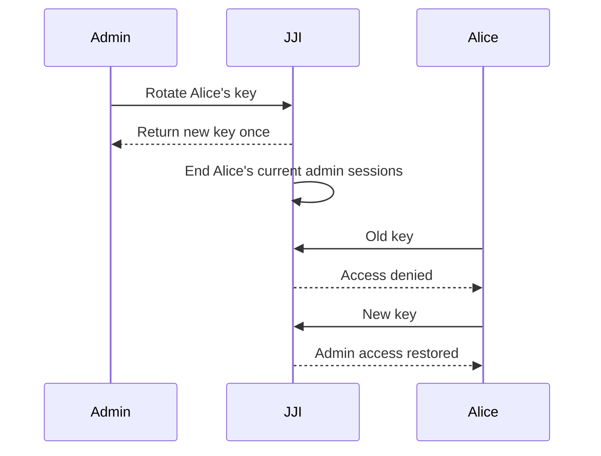

# Managing Admin Users and API Keys

You want to grant, rotate, and revoke admin access without sharing one long-lived secret or locking out the team. In JJI, the safe pattern is to use the server `ADMIN_KEY` only to bootstrap access, then create named admins and manage their keys separately.

## Prerequisites
- A running JJI server you can reach from a browser or with `jji`. If you still need that setup, see [Running Your First Analysis](quickstart.html).
- The server's `ADMIN_KEY`.
- `jji` installed if you want the CLI examples.
- If you plan to promote an existing regular user, that username must already exist in JJI.

## Quick Example
```bash
jji --server https://jji.example.com --api-key "$ADMIN_KEY" admin users create alice
```

Run that once with the bootstrap key. JJI creates a named admin, prints a new API key once, and that new admin can then sign in in the browser, run CLI admin commands, or call the API with a Bearer token.

> **Warning:** Copy the generated key immediately. JJI does not let you retrieve it later; you can only rotate it.

| Task | Fastest option | What happens |
| --- | --- | --- |
| Create a named admin | UI `Users` page or `jji admin users create` | A new admin key is returned once |
| Promote a tracked user | Role change in UI or `jji admin users change-role <user> admin` | The user becomes admin and gets a new key |
| Rotate an admin key | UI rotate button or `jji admin users rotate-key <user>` | The old key stops working immediately |
| Demote an admin | Role change in UI or `jji admin users change-role <user> user` | The admin key is revoked and current admin sessions end |
| Remove access | UI delete button or `jji admin users delete <user>` | The user is removed and current admin sessions end |

## Step-by-Step
1. Use the bootstrap admin once.

```bash
jji --server https://jji.example.com --api-key "$ADMIN_KEY" auth whoami
```

Verify the bootstrap key first. In the browser, go to `/register`, enter username `admin`, paste the same `ADMIN_KEY`, and click `Save`. After that, the `Users` navigation item appears.

> **Note:** The browser creates an admin session. The CLI does not keep an admin session between later commands, so use `--api-key`, `JJI_API_KEY`, or a saved `api_key` in CLI config for the commands you run.

2. Create a named admin and stop sharing the bootstrap key.

```bash
jji --server https://jji.example.com --api-key "$ADMIN_KEY" admin users create alice
```

In the UI, open `Users` and select `Create Admin`. For API automation, the equivalent operation is `POST /api/admin/users` with a Bearer admin key.

> **Note:** Managed usernames must be 2-50 characters, start with a letter or digit, and may contain `.`, `_`, and `-`. The username `admin` is reserved for the bootstrap login.

3. Have the new admin sign in and verify access.

```bash
export JJI_API_KEY="paste-alice-key-here"
jji --server https://jji.example.com auth whoami
```

In the browser, the new admin signs in at `/register` with username `alice` and that key. For API calls, send the same key as a Bearer token instead of relying on browser cookies.

```bash
curl -sS \
  -H "Authorization: Bearer $JJI_API_KEY" \
  https://jji.example.com/api/admin/users
```

4. Rotate a key when you suspect exposure or during a handoff.

```bash
jji --server https://jji.example.com --api-key "$ADMIN_KEY" admin users rotate-key alice
```

In the UI, use the rotate button next to the admin user. The old key stops working immediately, and JJI ends that user's current admin sessions, so they must sign in again with the new key.



5. Promote, demote, or delete access.

```bash
jji --server https://jji.example.com --api-key "$ADMIN_KEY" admin users change-role bob admin
jji --server https://jji.example.com --api-key "$ADMIN_KEY" admin users change-role alice user
jji --server https://jji.example.com --api-key "$ADMIN_KEY" admin users delete carol --force
```

The `Users` page shows tracked users and named admins, so you can promote an existing user or demote an admin without leaving the UI. API automation uses the same flow with `PUT /api/admin/users/{username}/role` and `DELETE /api/admin/users/{username}`.

> **Tip:** If someone is not listed yet, have them open JJI once and save a username. After that, refresh `Users` and promote them from `user` to `admin`.


> **Warning:** You cannot change or delete your own current admin account, and JJI blocks deleting or demoting the last admin user.

## Advanced Usage

### Choose the right admin auth method

| Interface | Recommended auth | What persists |
| --- | --- | --- |
| Browser UI | Sign in at `/register` with username and admin key | A server-side admin session, up to 8 hours |
| CLI | `--api-key`, `JJI_API_KEY`, or a saved `api_key` | Only what you keep in your shell or config |
| API | `Authorization: Bearer <key>` | Nothing unless you intentionally use login cookies |

> **Note:** `jji auth login --username ... --api-key ...` validates credentials, but it does not make later CLI commands remember them.

### Save a CLI admin key in your config

```toml
[default]
server = "prod"

[servers.prod]
url = "https://jji.example.com"
username = "alice"
api_key = "paste-admin-key-here"
```

After that, commands like `jji admin users list` use the saved key automatically. Treat this file as sensitive and do not share it or check it into version control.

### Set a specific replacement key through the API

```bash
curl -sS -X POST \
  -H "Authorization: Bearer $JJI_API_KEY" \
  -H "Content-Type: application/json" \
  -d '{"new_key":"replace-with-a-password-manager-generated-key"}' \
  https://jji.example.com/api/admin/users/alice/rotate-key
```

Only the API lets you supply `new_key` yourself; the UI and CLI always generate one for you. The replacement key must be at least 16 characters long.

### Rotate the bootstrap `ADMIN_KEY`

The reserved `admin` login is separate from the managed user list. There is no UI, CLI, or admin-users API action for rotating that bootstrap secret.

Use this sequence instead:

1. Create and verify at least one named admin.
2. Change the server `ADMIN_KEY`.
3. Restart or redeploy JJI.
4. Test the new bootstrap login only if you still need it.

> **Note:** Rotating `ADMIN_KEY` changes only the reserved `admin` login. Existing named admin keys continue to work.

### Reduce exposure when you finish

```bash
unset JJI_API_KEY
```

Use the browser logout button when you are done with interactive admin work. If you saved `api_key` in CLI config, remove it when you no longer need admin access.

> **Tip:** `jji auth logout` clears a server session. It does not unset `JJI_API_KEY` or remove `api_key` from your CLI config.

## Troubleshooting

- **`Invalid username or API key`**: For bootstrap browser login, the username must be exactly `admin`. For named admins, the username and key must belong to the same account.
- **`Admin access required`**: You are signed in as a regular user, or your CLI/API request is missing `--api-key` or a Bearer token. Check with `jji auth whoami` or `GET /api/auth/me`.
- **The user you want to promote is not listed**: JJI can only promote existing usernames. Have that person open JJI once and save a username, then refresh the `Users` page.
- **A demote or delete action is blocked**: JJI prevents deleting or demoting the last admin user and also prevents changing or deleting your own active admin account.
- **The browser does not keep the admin session on local HTTP**: The server may still be using secure cookies. Use HTTPS, or turn off `SECURE_COOKIES` only for local HTTP development.

## Related Pages

- [Managing Your Profile and Personal Tokens](managing-your-profile-and-personal-tokens.html)
- [Configuration and Environment Reference](configuration-and-environment-reference.html)
- [REST API Reference](rest-api-reference.html)
- [CLI Command Reference](cli-command-reference.html)
- [Running Your First Analysis](quickstart.html)