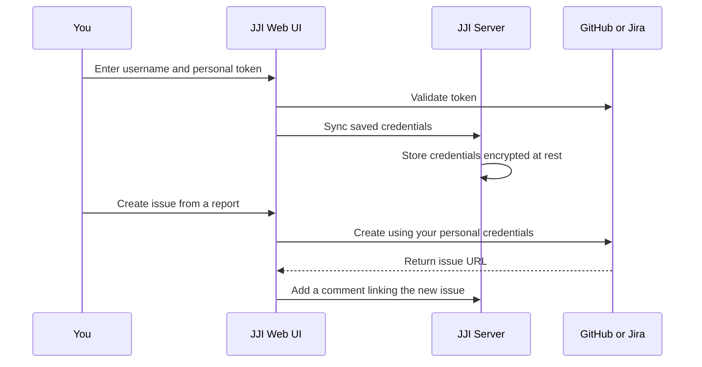

# Managing Your Profile and Personal Tokens

Set the username JJI should show for you, save your own GitHub and Jira credentials, and validate them so report follow-up runs as you. Once this is set up, JJI uses your personal tracker credentials instead of shared server credentials and adds your username to the attribution it includes when it files a tracker item for you.

## Prerequisites
- Access to the JJI web UI.
- A username you want JJI to use for comments, reviews, and issue attribution.
- A GitHub personal access token with `repo` scope if you want GitHub issue creation.
- For Jira Cloud, your Atlassian email plus an API token. For Jira Server/Data Center, a personal access token.
- A completed analysis report if you want to test issue creation right away. Need one first? See [Running Your First Analysis](quickstart.html).

## Quick Example
```bash
jji validate-token github --token "<your-github-token>"
```

If that succeeds, open `/register` or `Settings`, enter your username, paste the same value into `GitHub Token`, and click **Save**. Then open a completed report and choose `GitHub Issue` to file under your own GitHub account.

| What you save | What you can do |
| --- | --- |
| Username only | Use JJI normally and preview generated issue or bug text. |
| Username plus a personal tracker token | Create GitHub issues or Jira bugs directly from the report UI as your own tracker account. |

> **Note:** You can still preview generated content without personal tokens, but the final create action in the report UI stays disabled until the matching token is saved.

## Step-by-Step
1. Open your profile page.

   On first use, go to `/register`. After that, use the `Settings` icon in the user badge.

> **Note:** Leave `API Key` blank unless you need admin access. It is separate from your GitHub and Jira tokens. For admin-specific access, see [Managing Admin Users and API Keys](managing-admin-users-and-api-keys.html).

2. Enter your username.

   This is the name JJI uses for comments, review actions, and the `Reported by: <username> via jenkins-job-insight` line it adds when it creates a tracker item for you.

3. Fill in only the tracker fields you need.

   | You want to create | Fill in | Credential to use |
   | --- | --- | --- |
   | GitHub issue | `GitHub Token` | GitHub personal access token with `repo` scope |
   | Jira Cloud bug | `Jira Email` and `Jira Token` | Atlassian account email and API token |
   | Jira Server/Data Center bug | `Jira Token` | Personal access token, with `Jira Email` left blank |

> **Warning:** For Jira Cloud, `Jira Email` is required. If you leave it blank, JJI treats the token like a non-Cloud token and Jira Cloud validation or bug creation can fail.


> **Tip:** GitHub and Jira are independent. Save only the credentials you actually use, and clear any field you want to stop using before you click **Save**.

4. Click **Save** and let JJI validate the new credentials.

   There is no separate validation step in the web UI. Saving a new or changed token triggers validation automatically, and a successful check shows `Authenticated as ...`.

5. Test the result from a report.

   Open a completed analysis report and choose `GitHub Issue` or `Jira Bug`. JJI generates a preview first, lets you edit the title and body, and then submits with the matching personal token from `Settings`.

## Advanced Usage
### Validate tokens from the CLI
```bash
jji validate-token github --token "<your-github-token>"
jji validate-token jira --token "<your-jira-token>" --email "you@example.com"
```

Use this when you want a quick pass/fail check before updating the UI, or when you want something scriptable. For Jira Server/Data Center, omit `--email`.

If you create issues from the CLI instead of the web UI, pass your personal credentials per command with `--github-token`, `--jira-token`, `--jira-email`, `--jira-project-key`, and `--jira-security-level`.

### Check which Jira projects and security levels your account can use
```bash
jji jira-projects --jira-token "<your-jira-token>" --jira-email "you@example.com" --query PROJ
jji jira-security-levels PROJ --jira-token "<your-jira-token>" --jira-email "you@example.com"
```

This is useful when the bug dialog needs a project key or optional security level and you want to confirm what your own Jira account can access. For Jira Server/Data Center, omit `--jira-email`.

### How your saved profile is used


JJI keeps your active profile in the browser and syncs saved tracker credentials to the server so they can be restored later for the same username. If you switch to a different username, save the matching credentials again for that profile.

## Troubleshooting
- **`Invalid token` or `Invalid token (HTTP 401/403)` while saving:** the token is wrong or expired. Generate a new one and try again.
- **Jira validation or creation fails even though the token looks right:** for Jira Cloud, make sure `Jira Email` matches your Atlassian account. For Jira Server/Data Center, leave `Jira Email` blank and use a personal access token.
- **You see `Jira URL not configured on server`:** your administrator needs to finish Jira setup on the JJI server. Your personal token alone cannot fix this.
- **The `GitHub Issue` or `Jira Bug` action stays disabled after you saved a token:** the server may have GitHub or Jira issue creation turned off. Run `jji capabilities --json` or ask your administrator to confirm the integration is enabled.
- **Your tokens seem to disappear after you change usernames:** server-side saved credentials are tied to the username you selected. Switch back to the old username or save the credentials again under the new one.
- **GitHub issue creation says no repository URL is available:** the analysis did not have a usable repository target, so JJI has nowhere to open the issue. Re-run the analysis with repository context available.

## Related Pages

- [Creating GitHub Issues and Jira Bugs](creating-github-issues-and-jira-bugs.html)
- [Reviewing, Commenting, and Reclassifying Failures](reviewing-commenting-and-reclassifying-failures.html)
- [Managing Admin Users and API Keys](managing-admin-users-and-api-keys.html)
- [CLI Command Reference](cli-command-reference.html)
- [Running Your First Analysis](quickstart.html)