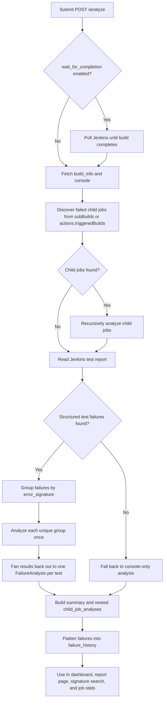

# Pipeline Analysis and Failure Deduplication

When a Jenkins pipeline fails, the hard part is usually not finding the red build. It is figuring out which child job actually failed, whether many failed tests are really the same root cause, and why different parts of the UI sometimes show different totals.

`jenkins-job-insight` handles that by treating a failed pipeline as a tree, not a flat list. It walks failed child jobs until it reaches the jobs that actually contain failures, groups identical failures by a shared signature, and then stores the result in a way that keeps summaries and history counts useful.

## What You Need To Know

- `POST /analyze` does full Jenkins-backed analysis, including child-job discovery.
- `POST /analyze-failures` skips Jenkins discovery but reuses the same signature-based deduplication once failures are already available.
- Deduplication reduces repeated analysis work. It does not remove failures from the result. Each failed test still gets its own `FailureAnalysis` entry.
- Pipeline results are tree-shaped: direct failures live in `failures`, top-level downstream jobs live in `child_job_analyses`, and deeper downstream jobs live in `failed_children`.

## End-To-End Flow



`POST /analyze` queues background work and stores status while the analysis runs. `POST /analyze-failures` is synchronous, so there is no Jenkins wait or child-job discovery step, but from the grouping step onward it uses the same deduplication flow.

## How Failed Child Jobs Are Discovered

JJI starts with Jenkins build metadata. It prefers structured pipeline metadata because it is cleaner and less ambiguous, and only falls back to console parsing when that metadata is missing.

From `src/jenkins_job_insight/analyzer.py`:

```python
def extract_failed_child_jobs(build_info: dict) -> list[tuple[str, int]]:
    """Extract failed child job names and build numbers from pipeline build info.

    Looks for failed jobs in subBuilds (Pipeline plugin) and triggeredBuilds
    (older Jenkins plugins).
    """
    failed_jobs: list[tuple[str, int]] = []

    # Check for subBuilds in pipeline (Blue Ocean / Pipeline plugin)
    sub_builds = build_info.get("subBuilds", [])
    for sub in sub_builds:
        if sub.get("result") in ("FAILURE", "UNSTABLE"):
            job_name = sub.get("jobName", "")
            build_num = sub.get("buildNumber", 0)
            if job_name and build_num:
                failed_jobs.append((job_name, build_num))

    # Also check actions for triggered builds (older Jenkins plugins)
    for action in build_info.get("actions", []):
        if action is None:
            continue
        action_class = action.get("_class", "")
        triggered_builds = action.get("triggeredBuilds", [])

        # Check for BuildAction or similar action types
        if triggered_builds or "BuildAction" in action_class:
            for triggered in triggered_builds:
                if triggered.get("result") in ("FAILURE", "UNSTABLE"):
                    # Try to get job name from different possible fields
                    job_name = triggered.get("jobName", "")
                    if not job_name:
                        # Try to parse from URL if available
                        url = triggered.get("url", "")
                        if url:
                            try:
                                job_name, _ = JenkinsClient.parse_jenkins_url(url)
                            except ValueError:
                                continue
                    build_num = triggered.get("number", triggered.get("buildNumber", 0))
                    if job_name and build_num:
                        failed_jobs.append((job_name, build_num))

    return failed_jobs


def extract_failed_child_jobs_from_console(
    console_output: str,
) -> list[tuple[str, int]]:
    """Extract failed child jobs from console output using regex."""
    failed_jobs: list[tuple[str, int]] = []

    # Pattern: Build [job path] #[number] completed: FAILURE/UNSTABLE
    pattern = r"Build\s+(.+?)\s+#(\d+)\s+completed:\s*(FAILURE|UNSTABLE)"
    matches = re.findall(pattern, console_output)

    for match in matches:
        job_path = match[0].strip()
        build_num = int(match[1])
        # Convert "folder » job" to "folder/job" format for Jenkins API
        job_name = job_path.replace(" » ", "/")
        failed_jobs.append((job_name, build_num))

    return failed_jobs
```

A few practical details matter here:

- `FAILURE` and `UNSTABLE` are both treated as failed child jobs worth following.
- `subBuilds` is checked first.
- Older plugin data in `actions[].triggeredBuilds` is supported too.
- If Jenkins only exposes the failure in console text, lines such as `Build folder » child-job #123 completed: FAILURE` are still detected and followed.

Once child jobs are found, JJI analyzes them recursively. If a child job is itself just another pipeline wrapper, JJI does not waste an AI call on that wrapper. It follows its failed children instead and returns a nested summary.

From `src/jenkins_job_insight/analyzer.py`:

```python
failed_children = extract_failed_child_jobs(build_info)

# Fallback to console parsing if none found from build_info
if not failed_children:
    failed_children = extract_failed_child_jobs_from_console(console_output)

if failed_children:
    # Recursively analyze failed children IN PARALLEL with bounded concurrency
    child_tasks: list[Coroutine[Any, Any, Any]] = [
        analyze_child_job(
            child_name,
            child_num,
            jenkins_client,
            jenkins_base_url,
            depth + 1,
            max_depth,
            repo_path,
            ai_provider,
            ai_model,
            ai_cli_timeout,
            custom_prompt,
            artifacts_context="",
            server_url=server_url,
            job_id=job_id,
            peer_ai_configs=peer_ai_configs,
            peer_analysis_max_rounds=peer_analysis_max_rounds,
            additional_repos=additional_repos,
        )
        for child_name, child_num in failed_children
    ]
    child_results = await run_parallel_with_limit(child_tasks)

    # Handle exceptions in results
    child_analyses = []
    for i, result in enumerate(child_results):
        if isinstance(result, Exception):
            child_name, child_num = failed_children[i]
            child_analyses.append(
                ChildJobAnalysis(
                    job_name=child_name,
                    build_number=child_num,
                    jenkins_url="",
                    note=f"Analysis failed: {format_exception_with_type(result)}",
                )
            )
        else:
            child_analyses.append(result)

    # This job failed because children failed - skip Claude CLI analysis
    # Count failures from child analyses
    total_failures = sum(len(child.failures) for child in child_analyses)
    summary = f"Pipeline failed due to {len(child_analyses)} child job(s)."
    if total_failures > 0:
        summary += f" Total: {total_failures} failure(s) analyzed. See child analyses below."

    return ChildJobAnalysis(
        job_name=job_name,
        build_number=build_number,
        jenkins_url=jenkins_url,
        summary=summary,
        failures=[],  # Pipeline has no direct failures
        failed_children=child_analyses,
    )
```

When JJI reaches a leaf job, it tries Jenkins' structured test report first and extracts only cases with status `FAILED` or `REGRESSION`. Those extracted test failures are the inputs to deduplication. If no test report exists, JJI falls back to console-only analysis for that leaf job.

> **Warning:** Recursive child-job analysis stops at depth `3` in the current implementation to avoid infinite loops in unusual Jenkins graphs.

> **Note:** A top-level result with `failures: []` can still be completely valid. It usually means the top-level job was an orchestrator and the actionable failures live under `child_job_analyses` or deeper `failed_children`.

> **Note:** If Jenkins does not expose a structured test report for a leaf job, JJI falls back to a single console-only analysis for that job. You still get a result, but you do not get per-test deduplication for that leaf.

## How Identical Failures Are Grouped

When structured test failures are available, JJI builds a stable signature from the error message plus the first five lines of the stack trace. That choice is deliberate: it keeps the grouping stable even when the same root cause produces slightly different stack depths.

From `src/jenkins_job_insight/analyzer.py`:

```python
def get_failure_signature(failure: TestFailure) -> str:
    """Create a signature for grouping identical failures.

    Uses error message and first few lines of stack trace to identify
    failures that are essentially the same issue.
    """
    # Use error message and first 5 lines of stack trace for deduplication.
    # Intentionally limited to 5 lines: different stack depths for the same
    # root cause (e.g., varying call-site depth) should still collapse into
    # one group so the AI analyzes each unique error only once.
    stack_lines = failure.stack_trace.split("\n")[:5]
    signature_text = f"{failure.error_message}|{'|'.join(stack_lines)}"
    return hashlib.sha256(signature_text.encode()).hexdigest()
```

Once JJI has those signatures, it groups failures by signature and analyzes each group once. The direct-failure endpoint shows this especially clearly because it builds the groups, runs one group-analysis task per signature, and then reports both the submitted-failure count and the unique-signature count.

From `src/jenkins_job_insight/main.py`:

```python
# Group failures by error signature for deduplication
groups: dict[str, list] = defaultdict(list)
for failure in test_failures:
    sig = get_failure_signature(failure)
    groups[sig].append(failure)

# Analyze each unique failure group in parallel
coroutines: list[Coroutine[Any, Any, Any]] = [
    analyze_failure_group(
        failures=group_failures,
        console_context="",
        repo_path=repo_path,
        ai_provider=ai_provider,
        ai_model=ai_model,
        ai_cli_timeout=merged.ai_cli_timeout,
        custom_prompt=custom_prompt,
        server_url=server_url,
        job_id=job_id,
        peer_ai_configs=peer_ai_configs,
        peer_analysis_max_rounds=merged.peer_analysis_max_rounds,
        additional_repos=cloned_repos or None,
    )
    for group_failures in groups.values()
]

results = await run_parallel_with_limit(coroutines)

# Flatten results and filter out exceptions
all_analyses = []
for result in results:
    if isinstance(result, Exception):
        logger.error(
            f"Failed to analyze failure group: {result}", exc_info=result
        )
    else:
        all_analyses.extend(result)

unique_errors = len(groups)
summary = f"Analyzed {len(test_failures)} test failures ({unique_errors} unique errors). {len(all_analyses)} analyzed successfully."
```

A few practical consequences follow from this design:

- Ten tests with the same signature trigger one analysis, not ten.
- Each failed test still gets its own `FailureAnalysis` entry in the final result.
- Each of those entries keeps the shared `error_signature`, so later history search can tie them back together.
- Peer analysis does not change the grouping unit. If peer review is enabled, the peer debate still happens once per signature group, not once per test.

> **Note:** Deduplication removes repeated analysis work. It does not hide duplicate failures from the result. Users still see one failure record per test.

> **Tip:** `POST /analyze-failures` uses the same signature grouping logic as Jenkins-backed analysis. It is a good way to test deduplication behavior when you already have JUnit XML or raw failure data.

> **Note:** The direct-failure summary can report partial success. If one signature group fails to analyze but others succeed, the response can still be `completed`, and the summary will reflect how many analyses succeeded.

## How Summaries And Counts Are Computed

Different parts of JJI count slightly different things on purpose. The table below is the easiest way to keep them straight.

| Where you see it | What it counts |
| --- | --- |
| Result summary for a job with direct test failures | Total returned `FailureAnalysis` records. If deduplication reduced repeated work, the summary adds the number of unique error types. |
| Result summary for a pipeline-only job | Immediate failed child jobs in `child_job_analyses`. The optional `Total: ... failure(s) analyzed` suffix is based on the immediate child objects' `failures` lists. |
| Result summary for a mixed job | Direct-failure summary, plus `Additionally, X failed child job(s) were analyzed recursively.` |
| Dashboard `failure_count` | Recursive total across top-level `failures`, top-level `child_job_analyses`, and nested `failed_children`. |
| Report page total | The same recursive traversal, mirrored in the frontend. |
| Signature search | `total_occurrences` is the number of matching `failure_history` rows for that signature. `unique_tests` is the number of distinct `test_name` values in that set. |
| Job stats | `total_builds_analyzed` comes from completed rows in `results`. `builds_with_failures` comes from distinct failing `job_id` values in `failure_history`. Failure rate is `builds_with_failures / total_builds_analyzed`. |
| Test history pass count | Only estimated when `job_name` is provided, because `failure_history` stores failures, not complete pass records. |

The recursive dashboard and report totals come from shared tree traversal logic. The backend uses `count_all_failures()`, and the React report page mirrors the same idea in `countAllFailures()`.

From `src/jenkins_job_insight/storage.py`:

```python
def count_all_failures(result_data: dict) -> int:
    """Count all failures including those in nested child job analyses."""
    count = len(result_data.get("failures", []))
    for child in result_data.get("child_job_analyses", []):
        count += _count_child_failures_recursive(child)
    return count
```

From `frontend/src/pages/ReportPage.tsx`:

```ts
function countAllFailures(failures: { test_name: string }[], children: ChildJobAnalysis[]): number {
  let count = 0
  walkChildTree(failures, children, (nodeFailures) => {
    count += nodeFailures.length
  })
  return count
}
```

The history-side signature counts come directly from SQL over `failure_history`.

From `src/jenkins_job_insight/storage.py`:

```python
# Total occurrences
cursor = await db.execute(
    f"SELECT COUNT(*) FROM failure_history WHERE error_signature = ?{exclude_filter}",
    base_params,
)
total_occurrences = (await cursor.fetchone())[0]

# Tests with this signature and their occurrence counts
cursor = await db.execute(
    f"SELECT test_name, COUNT(*) as occurrences FROM failure_history "
    f"WHERE error_signature = ?{exclude_filter} GROUP BY test_name ORDER BY occurrences DESC",
    base_params,
)
tests = [dict(row) for row in await cursor.fetchall()]
unique_tests = len(tests)
```

> **Note:** The one-line `summary` string and the recursive dashboard/report totals are not always identical on deep pipelines. The dashboard and report recurse through the whole child-job tree. The short pipeline summary is built from the current analysis layer.

> **Note:** Per-test history cannot infer true passes without a `job_name` filter. That is because `failure_history` records failures, not every execution of every test.

## How History Preserves Deduplicated Results

After analysis completes, JJI flattens the result tree into `failure_history`. That flattening is what makes signature search, job statistics, and per-test history work later without re-walking every stored result JSON blob.

Child-job context is preserved while flattening. The stored history row keeps the parent job, the child job name and build number, the test name, the error text, the classification, and the shared `error_signature`.

From `src/jenkins_job_insight/storage.py`:

```python
def _extract_child_failures_for_history(
    child: dict,
    job_id: str,
    job_name: str,
    build_number: int,
    rows: list[tuple],
    analyzed_at: str = "",
) -> None:
    """Recursively extract failures from a child job analysis dict."""
    child_job = child.get("job_name", "")
    child_build = child.get("build_number", 0)

    for f in child.get("failures", []):
        rows.append(
            _failure_to_history_row(
                f,
                job_id,
                job_name,
                build_number,
                child_job,
                child_build,
                analyzed_at=analyzed_at,
            )
        )

    for nested in child.get("failed_children", []):
        _extract_child_failures_for_history(
            nested, job_id, job_name, build_number, rows, analyzed_at=analyzed_at
        )
```

This is why a signature search can answer practical questions such as:

- How many times has this exact failure signature shown up?
- Which tests share it?
- What was the last classification?
- Are there comments already attached to the same signature?

JJI also backfills `failure_history` from completed stored results when needed, so historical counts remain available after upgrades or restarts.

> **Tip:** If several different tests suddenly fail in the same build, start with signature search instead of per-test history. It is usually the fastest way to confirm whether you are looking at one repeated root cause or several independent failures.

## Relevant Configuration

Two kinds of settings matter most for this page:

- settings that control when Jenkins-backed analysis begins,
- settings that affect how much context JJI gives the analyzer once it reaches a leaf failure.

From `.env.example`:

```dotenv
JENKINS_URL=https://jenkins.example.com
JENKINS_USER=your-username
JENKINS_PASSWORD=your-api-token
JENKINS_SSL_VERIFY=true

AI_PROVIDER=claude
AI_MODEL=your-model-name

# Timeout for AI CLI calls in minutes (default: 10)
# Increase for slower models like gpt-5.2
# AI_CLI_TIMEOUT=10

# Enable multi-AI consensus by configuring peer AI providers
# PEER_AI_CONFIGS=cursor:gpt-5.4-xhigh,gemini:gemini-2.5-pro
# PEER_ANALYSIS_MAX_ROUNDS=3
```

From `config.example.toml`:

```toml
[defaults]
jenkins_url = "https://jenkins.example.com"
jenkins_user = "your-jenkins-user"
jenkins_password = "your-jenkins-token"
tests_repo_url = "https://github.com/your-org/your-tests"
ai_provider = "claude"
ai_model = "claude-opus-4-6[1m]"
ai_cli_timeout = 10
# Peer analysis (multi-AI consensus)
# peers = "cursor:gpt-5.4-xhigh,gemini:gemini-2.5-pro"
# peer_analysis_max_rounds = 3
# Monitoring
wait_for_completion = true
poll_interval_minutes = 2
max_wait_minutes = 0  # 0 = no limit (wait forever)
```

Here is how those settings affect pipeline analysis:

- `wait_for_completion` tells `POST /analyze` to wait until the Jenkins build is finished before child-job discovery starts.
- `poll_interval_minutes` controls how often JJI checks Jenkins while waiting.
- `max_wait_minutes` sets a hard stop for that wait. `0` means no limit.
- `AI_CLI_TIMEOUT` controls how long each analysis call can run.
- `PEER_AI_CONFIGS` and `PEER_ANALYSIS_MAX_ROUNDS` switch a deduplicated failure group from single-AI analysis to peer review. They do not change how signatures are computed.
- `tests_repo_url` gives the analyzer source-code context while keeping the same child-job discovery and deduplication behavior.
- `get_job_artifacts`, `jenkins_artifacts_max_size_mb`, and `jenkins_artifacts_context_lines` affect how much artifact evidence is available for leaf-job analysis. They do not change child-job discovery or signature generation.

> **Tip:** If you often analyze long-running pipelines, `wait_for_completion`, `poll_interval_minutes`, and `max_wait_minutes` are the settings that most directly change the user experience.

## Practical Reading Guide

If you are looking at a result and want to understand it quickly:

- Start with the top-level `summary`, but treat it as a short explanation, not the authoritative recursive total.
- If the result has `child_job_analyses`, expand those first. That is usually where the real leaf failures live in pipeline jobs.
- If several tests look suspiciously similar, compare their `error_signature` values or run `GET /history/search?signature=...`.
- If you prefer the CLI, `jji history search --signature ...`, `jji history test TEST_NAME`, and `jji history stats JOB_NAME` map directly to the same stored history data.

That combination is what makes `jenkins-job-insight` useful on large Jenkins pipelines: it turns a nested pipeline failure into a smaller set of real root causes, keeps duplicate analysis work under control, and makes the counts in the UI explainable once you know which layer each count comes from.


## Related Pages

- [Analyze Jenkins Jobs](analyze-jenkins-jobs.html)
- [Analyze Raw Failures and JUnit XML](direct-failure-analysis.html)
- [Architecture and Project Structure](architecture-and-project-structure.html)
- [Storage and Result Lifecycle](storage-and-result-lifecycle.html)
- [HTML Reports and Dashboard](html-reports-and-dashboard.html)