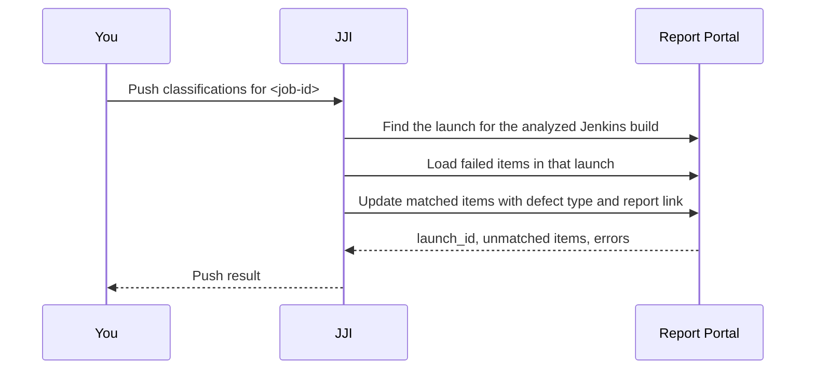

# Pushing Classifications to Report Portal

Use this workflow when you want the classifications you already have in JJI to show up on the matching Report Portal failures, so your triage stays in sync without relabeling items by hand. It also works for child-job runs inside pipeline-style analyses.

## Prerequisites
- A completed JJI analysis and its `job_id`. See [Analyzing Jenkins Jobs](analyzing-jenkins-jobs.html) if you need to create one first.
- JJI running with `REPORTPORTAL_URL`, `REPORTPORTAL_PROJECT`, `REPORTPORTAL_API_TOKEN`, and `PUBLIC_BASE_URL` set on the server.
- A Report Portal token that is allowed to update the target launch.
- If your Report Portal uses a self-signed certificate, set `REPORTPORTAL_VERIFY_SSL=false`.
- Do not leave `ENABLE_REPORTPORTAL=false` if you want the feature available.

## Quick Example
```bash
jji push-reportportal <job-id>
```

This pushes the saved analysis for `<job-id>` into the matching Report Portal launch. JJI prints how many items were updated, the launch ID, and whether anything was unmatched or failed.

## Step-by-Step
1. Enable Report Portal integration on the JJI server.

```bash
REPORTPORTAL_URL=https://reportportal.example.com
REPORTPORTAL_PROJECT=my-project
REPORTPORTAL_API_TOKEN=your-rp-token
PUBLIC_BASE_URL=https://jji.example.com

# Optional explicit toggle
ENABLE_REPORTPORTAL=true

# Optional for self-signed certificates
REPORTPORTAL_VERIFY_SSL=false
```

`REPORTPORTAL_URL`, `REPORTPORTAL_PROJECT`, and `REPORTPORTAL_API_TOKEN` make the integration available. `PUBLIC_BASE_URL` is required for pushes because JJI includes a link back to the saved JJI report in each Report Portal update.

> **Tip:** You usually do not need `ENABLE_REPORTPORTAL=true`. JJI enables the feature automatically when the URL, project, and token are present.

2. Push the completed analysis.

```bash
jji push-reportportal <job-id>
```

JJI looks up the matching Report Portal launch from the Jenkins build URL stored with the analysis, then updates matched failed items with the JJI classification and a link back to the JJI report.

JJI maps classifications like this:
- `PRODUCT BUG` -> `Product Bug`
- `CODE ISSUE` -> `Automation Bug`
- `INFRASTRUCTURE` -> `System Issue`



3. Push a child-job run when the report contains pipeline children.

```bash
jji push-reportportal <job-id> \
  --child-job-name "<child-job-name>" \
  --child-build-number <child-build-number>
```

Use this when the failures you want live under a child job instead of the top-level run. The same flags work for nested child jobs too.

> **Warning:** `--child-job-name` and `--child-build-number` are a pair. If you supply the child job name, you must also supply the child build number.

4. Use the web UI when you prefer point-and-click.

Open the saved JJI report and use **Push to Report Portal**. For reports without child jobs, the button appears in the main report header; for pipeline-style reports, use the button on the child job you want to push.

5. Capture the result when the push needs follow-up.

```bash
jji --json push-reportportal <job-id>
```

The JSON result tells you:
- `pushed`: how many Report Portal items were updated
- `unmatched`: items that were found but could not be matched or mapped
- `errors`: push problems that still need attention
- `launch_id`: the Report Portal launch JJI targeted

## Advanced Usage
Use JSON output whenever you need to distinguish full success, partial success, and no-op results without guessing from terminal text.

```bash
jji --json push-reportportal <job-id>
```

| Result | What it means | What to do next |
| --- | --- | --- |
| `pushed > 0`, `unmatched = []`, `errors = []` | Everything matched and updated. | No follow-up needed. |
| `pushed > 0`, plus `unmatched` or `errors` | Some items were updated, but not all. | Review the unmatched items or error text, fix the cause, then rerun the same command. |
| `pushed = 0`, `unmatched` populated | JJI found candidates but could not match or map them. | Check naming differences between JJI failures and Report Portal items. |
| `pushed = 0`, `errors` populated | JJI could not complete the push. | Fix the reported problem, then rerun. |

The plain `jji push-reportportal` command is best for interactive use. In automation, inspect the JSON fields instead of relying only on the process exit code, because a structured push result can still contain `errors` or `unmatched`.

Matching is forgiving, but not unlimited. JJI can match fully qualified test names and short-name variants, so a fully qualified JJI test name can still line up with a shorter Report Portal item name, but unrelated naming schemes stay unmatched.

Only failed Report Portal items are updated. If JJI already has Jira matches attached to a product bug, those issue links are pushed into Report Portal along with the classification.

> **Note:** If you do not have a saved analysis yet, see [Analyzing Jenkins Jobs](analyzing-jenkins-jobs.html).

## Troubleshooting
- `Report Portal integration is disabled or not configured`: make sure `REPORTPORTAL_URL`, `REPORTPORTAL_PROJECT`, and `REPORTPORTAL_API_TOKEN` are set, and that `ENABLE_REPORTPORTAL` is not forcing the feature off.
- `PUBLIC_BASE_URL must be set`: point `PUBLIC_BASE_URL` at the external JJI URL users actually open in the browser.
- The **Push to Report Portal** button is missing: the server is not currently exposing Report Portal integration, or it has been explicitly disabled.
- `Job <id> not found`: use the JJI analysis `job_id`, not the Jenkins build number.
- `Child job ... not found`: recheck both the child job name and child build number from the JJI report.
- `No Report Portal launch found`: make sure the matching Report Portal launch description contains the Jenkins build URL from the analyzed run.
- `Ambiguous RP launch`: JJI found more than one launch for the same build. Remove or consolidate the duplicate launches, then rerun the push.
- `No failed test items found in RP launch`: JJI only updates failed items, so there was nothing eligible to change in that launch.
- `No overlap` or many `unmatched` items: the Report Portal item names do not line up closely enough with the JJI failure names. Keep the test names consistent between the two systems.
- `403` or `Not a launch owner`: use a Report Portal token that is allowed to update that launch.
- TLS or certificate errors against an internal Report Portal: set `REPORTPORTAL_VERIFY_SSL=false` if you are using a self-signed certificate.

## Related Pages

- [Reviewing, Commenting, and Reclassifying Failures](reviewing-commenting-and-reclassifying-failures.html)
- [Analyzing Jenkins Jobs](analyzing-jenkins-jobs.html)
- [Configuration and Environment Reference](configuration-and-environment-reference.html)
- [CLI Command Reference](cli-command-reference.html)
- [REST API Reference](rest-api-reference.html)