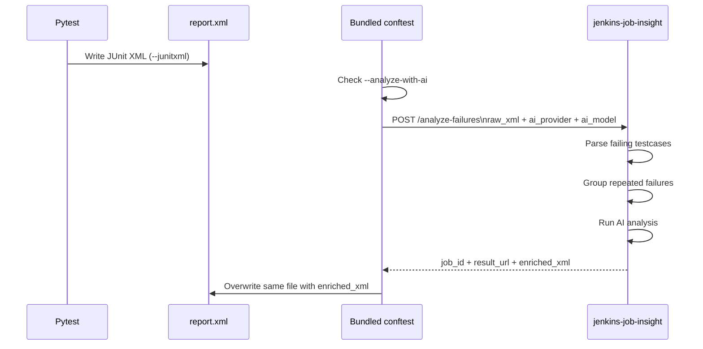

# Pytest JUnit XML Integration

`jenkins-job-insight` includes a bundled pytest example in `examples/pytest-junitxml/`. Use it when your tests already produce JUnit XML and you want that same artifact rewritten with AI annotations after the run finishes.

This integration uses `POST /analyze-failures` directly. Pytest writes the XML, the helper uploads the raw document, JJI analyzes the failing testcases, and the helper overwrites the same file with `enriched_xml`. Because the logic lives in pytest hooks, it works the same locally or in any CI runner that already invokes `pytest`.

> **Note:** This is a copy-and-adapt example, not an installable pytest plugin. Copy `examples/pytest-junitxml/conftest_junit_ai.py` into your test repository as `conftest.py`, and keep `examples/pytest-junitxml/conftest_junit_ai_utils.py` alongside it.

## End-to-End Flow

1. Run pytest with `--junitxml=...` so it writes a JUnit XML file.
2. Add `--analyze-with-ai` to opt into the bundled hook.
3. The helper reads that XML file and posts it to JJI.
4. JJI extracts failures, deduplicates repeated errors, runs AI analysis, and returns `enriched_xml`.
5. The helper writes the enriched XML back to the same path.



## Set It Up

1. Copy `examples/pytest-junitxml/conftest_junit_ai.py` into your test repository root and rename it to `conftest.py`.
2. Copy `examples/pytest-junitxml/conftest_junit_ai_utils.py` into the same directory.
3. Install the helper dependencies in the environment where pytest runs: `requests` and `python-dotenv`.
4. Set `JJI_SERVER`, `JJI_AI_PROVIDER`, `JJI_AI_MODEL`, and optionally `JJI_TIMEOUT`.
5. Run pytest with both `--junitxml=report.xml` and `--analyze-with-ai`.

The JJI server still needs its own AI provider and model configured. The checked-in environment template shows the core server-side settings:

```14:19:.env.example
# Choose AI provider (required): "claude", "gemini", or "cursor"
AI_PROVIDER=claude

# AI model to use (required, applies to any provider)
# Can also be set per-request in webhook body
AI_MODEL=your-model-name
```

> **Warning:** The example header mentions defaults for `JJI_AI_PROVIDER` and `JJI_AI_MODEL`, but the current helper code requires both to be set. If either one is missing, it disables enrichment instead of falling back.

> **Tip:** The helper calls `load_dotenv()`, so a project-local `.env` file is a convenient place to keep the pytest-side `JJI_*` settings.

## How the Pytest Hook Works

The bundled `conftest` adds an opt-in CLI flag and runs enrichment at session finish:

```33:67:examples/pytest-junitxml/conftest_junit_ai.py
def pytest_addoption(parser):
    """Add --analyze-with-ai CLI option."""
    group = parser.getgroup("jenkins-job-insight", "AI-powered failure analysis")
    group.addoption(
        "--analyze-with-ai",
        action="store_true",
        default=False,
        help="Enrich JUnit XML with AI-powered failure analysis from jenkins-job-insight",
    )


def pytest_sessionstart(session):
    """Set up AI analysis if --analyze-with-ai is passed."""
    if session.config.option.analyze_with_ai:
        setup_ai_analysis(session)


@pytest.hookimpl(trylast=True)
def pytest_sessionfinish(session, exitstatus):
    """Enrich JUnit XML with AI analysis when tests fail."""
    if session.config.option.analyze_with_ai:
        if exitstatus == 0:
            logger.info(
                "No test failures (exit code %d), skipping AI analysis", exitstatus
            )

        else:
            try:
                enrich_junit_xml(session)
            except Exception:
                logger.exception("Failed to enrich JUnit XML, original preserved")
```

In practice, that means:

- You must pass `--analyze-with-ai`. Nothing happens by default.
- You must also pass `--junitxml=...`, because the helper rewrites the file pytest created.
- The hook uses `trylast=True`, so it runs after pytest has had a chance to write the XML artifact.
- Clean runs are skipped.
- Any non-zero exit triggers an enrichment attempt.
- If enrichment fails, the helper keeps the original XML file.

The setup utility also turns the feature off for `--collectonly` and `--setupplan`, and disables it when required environment variables are missing.

## What the Helper Uploads

The XML sent to JJI is a normal JUnit document. The tests include a small example like this:

```648:656:tests/test_main.py
SAMPLE_XML = """<?xml version="1.0" encoding="UTF-8"?>
<testsuite name="TestSuite" tests="2" failures="1" errors="0">
    <testcase classname="tests.test_auth" name="test_login" time="0.5">
        <failure message="assert False" type="AssertionError">
            at tests/test_auth.py:42
        </failure>
    </testcase>
    <testcase classname="tests.test_auth" name="test_logout" time="0.1"/>
</testsuite>"""
```

At session finish, the helper reads the XML from disk, posts it to `POST /analyze-failures`, and writes the response back to the same file only when `enriched_xml` is present:

```93:120:examples/pytest-junitxml/conftest_junit_ai_utils.py
server_url = os.environ.get("JJI_SERVER", "")
raw_xml = xml_path.read_text()

try:
    timeout_value = int(os.environ.get("JJI_TIMEOUT", "600"))
except ValueError:
    logger.warning("Invalid JJI_TIMEOUT value, using default 600 seconds")
    timeout_value = 600

try:
    response = requests.post(
        f"{server_url.rstrip('/')}/analyze-failures",
        json={
            "raw_xml": raw_xml,
            "ai_provider": ai_provider,
            "ai_model": ai_model,
        },
        timeout=timeout_value,
    )
    response.raise_for_status()
    result = response.json()
except Exception as ex:
    logger.exception(f"Failed to enrich JUnit XML, original preserved. {ex}")
    return

if enriched_xml := result.get("enriched_xml"):
    xml_path.write_text(enriched_xml)
    logger.info("JUnit XML enriched with AI analysis: %s", xml_path)
```

The bundled example sends a deliberately small payload:

- `raw_xml`
- `ai_provider`
- `ai_model`

That keeps the example easy to understand. If you need additional request options, extend the JSON body in `conftest_junit_ai_utils.py`.

> **Note:** `raw_xml` is sent as a JSON string in the request body. This endpoint is not a multipart file-upload API.

> **Note:** The request model caps `raw_xml` at `50,000,000` characters.

## What JJI Does With the XML

### Extract failing testcases

On the server, JJI walks each `testcase`, looks for both `<failure>` and `<error>`, and builds the analysis input from the XML itself:

```35:60:src/jenkins_job_insight/xml_enrichment.py
for testcase in root.iter("testcase"):
    failure_elem = testcase.find("failure")
    error_elem = testcase.find("error")
    result_elem = failure_elem if failure_elem is not None else error_elem

    if result_elem is None:
        continue

    classname = testcase.get("classname", "")
    name = testcase.get("name", "")
    test_name = f"{classname}.{name}" if classname else name

    if not test_name:
        logger.warning("Skipping testcase with empty name attribute")
        continue

    failures.append(
        {
            "test_name": test_name,
            "error_message": result_elem.get("message", "")
            or ((result_elem.text or "").split("\n")[0].strip()),
            "stack_trace": result_elem.text or "",
            "status": "ERROR"
            if error_elem is not None and failure_elem is None
            else "FAILED",
        }
    )
```

This gives you a few useful guarantees:

- JJI recognizes both failed tests and test errors.
- It uses `classname.name` when the XML provides both fields.
- It preserves the full element text as the stack trace.
- If the XML has no `message` attribute, it falls back to the first line of the failure text.

### Deduplicate repeated failures

If many tests fail for the same reason, JJI does not ask the AI to analyze each one separately. It groups failures by a signature built from the error message plus the first five stack-trace lines:

```273:291:src/jenkins_job_insight/analyzer.py
def get_failure_signature(failure: TestFailure) -> str:
    """Create a signature for grouping identical failures."""
    # Use error message and first 5 lines of stack trace for deduplication.
    # Intentionally limited to 5 lines: different stack depths for the same
    # root cause (e.g., varying call-site depth) should still collapse into
    # one group so the AI analyzes each unique error only once.
    stack_lines = failure.stack_trace.split("\n")[:5]
    signature_text = f"{failure.error_message}|{'|'.join(stack_lines)}"
    return hashlib.sha256(signature_text.encode()).hexdigest()
```

That is especially useful for parameterized tests, shared-environment outages, and any failure pattern where many red tests all point back to the same root cause.

## What Gets Added Back to the Artifact

When analysis completes, JJI rewrites the XML with two kinds of additions:

- a `report_url` property on the first `testsuite`
- structured AI annotations plus readable summary text on each matching `testcase`

The rewrite is driven by the XML enrichment layer:

```95:148:src/jenkins_job_insight/xml_enrichment.py
def apply_analysis_to_xml(
    raw_xml: str,
    analysis_map: dict[tuple[str, str], dict[str, Any]],
    report_url: str = "",
) -> str:
    root = safe_fromstring(raw_xml)
    matched_keys: set[tuple[str, str]] = set()

    for testcase in root.iter("testcase"):
        key = (testcase.get("classname", ""), testcase.get("name", ""))
        analysis = analysis_map.get(key)
        if analysis:
            _inject_analysis(testcase, analysis)
            matched_keys.add(key)

    unmatched = set(analysis_map.keys()) - matched_keys
    if unmatched:
        logger.warning(
            "%d analysis results did not match any testcase: %s",
            len(unmatched),
            unmatched,
        )

    # Add report_url to the first testsuite only
    if report_url:
        first_testsuite = next(root.iter("testsuite"), None)
        if first_testsuite is None and root.tag == "testsuite":
            first_testsuite = root
        if first_testsuite is not None:
            ts_props = first_testsuite.find("properties")
            if ts_props is None:
                ts_props = ET.Element("properties")
                first_testsuite.insert(0, ts_props)
            _add_property(ts_props, "report_url", report_url)

    return ET.tostring(root, encoding="unicode", xml_declaration=True)
```

The testcase-level annotations come from `_inject_analysis()`:

```226:297:src/jenkins_job_insight/xml_enrichment.py
properties = testcase.find("properties")
if properties is None:
    properties = ET.SubElement(testcase, "properties")

_add_property(properties, "ai_classification", analysis.get("classification", ""))
_add_property(properties, "ai_details", analysis.get("details", ""))

affected = analysis.get("affected_tests", [])
if affected:
    _add_property(properties, "ai_affected_tests", ", ".join(affected))

code_fix = analysis.get("code_fix")
if code_fix and isinstance(code_fix, dict):
    _add_property(properties, "ai_code_fix_file", code_fix.get("file", ""))
    _add_property(properties, "ai_code_fix_line", str(code_fix.get("line", "")))
    _add_property(properties, "ai_code_fix_change", code_fix.get("change", ""))

bug_report = analysis.get("product_bug_report")
if bug_report and isinstance(bug_report, dict):
    _add_property(properties, "ai_bug_title", bug_report.get("title", ""))
    _add_property(properties, "ai_bug_severity", bug_report.get("severity", ""))
    _add_property(properties, "ai_bug_component", bug_report.get("component", ""))
    _add_property(
        properties, "ai_bug_description", bug_report.get("description", "")
    )

# ... jira match properties are added here when available ...

text = _format_analysis_text(analysis)
if text:
    system_out = testcase.find("system-out")
    if system_out is None:
        system_out = ET.SubElement(testcase, "system-out")
        system_out.text = text
    else:
        existing = system_out.text or ""
        system_out.text = (
            f"{existing}\n\n--- AI Analysis ---\n{text}" if existing else text
        )
```

### XML annotations you can rely on

| XML location | Added data | When it appears |
| --- | --- | --- |
| First `testsuite` `properties` | `report_url` | When JJI stores the analysis result |
| `testcase` `properties` | `ai_classification`, `ai_details` | For analyzed failures |
| `testcase` `properties` | `ai_affected_tests` | When one analysis applies to multiple tests |
| `testcase` `properties` | `ai_code_fix_file`, `ai_code_fix_line`, `ai_code_fix_change` | For `CODE ISSUE` results |
| `testcase` `properties` | `ai_bug_title`, `ai_bug_severity`, `ai_bug_component`, `ai_bug_description` | For `PRODUCT BUG` results |
| `testcase` `properties` | `ai_jira_match_<n>_*` | When Jira matching is enabled and relevant matches are found |
| `testcase` `system-out` | Human-readable AI summary | When JJI has formatted analysis text |

By default, the stored-result link written into `report_url` is a relative path such as `/results/<job_id>`. That makes the XML artifact self-contained while still pointing back to the full JJI result.

> **Tip:** Rewriting the same JUnit file means you can keep publishing the artifact you already use. Tools that surface testcase properties or `system-out` can show the AI annotations without needing a second report format.

> **Note:** If a testcase already has `system-out`, JJI appends the AI section after `--- AI Analysis ---` instead of replacing the original text.

## Response Behavior to Expect

In raw-XML mode, a successful `POST /analyze-failures` response includes:

- `job_id`
- `status`
- `summary`
- `ai_provider`
- `ai_model`
- `failures`
- `enriched_xml`

A few behaviors are worth knowing:

- If the XML contains no failing `testcase` elements, JJI returns `completed` and echoes the original XML back as `enriched_xml`.
- If the XML is malformed, the endpoint returns HTTP `400`.
- If a request sends both `raw_xml` and `failures`, or sends neither, validation returns HTTP `422`.
- The result is stored, so the XML can link back to the JJI result page.

> **Note:** The rewritten document stays valid XML. The enrichment tests parse the result again with `ElementTree` after injection.

## Troubleshooting

- If nothing changes, make sure you passed both `--junitxml=...` and `--analyze-with-ai`.
- If pytest exits `0`, the helper skips the request by design.
- If you run `--collectonly` or `--setupplan`, the helper disables itself during setup.
- If `JJI_SERVER`, `JJI_AI_PROVIDER`, or `JJI_AI_MODEL` is missing, the helper disables itself and leaves the XML untouched.
- If `JJI_TIMEOUT` is not an integer, the helper falls back to `600` seconds.
- If the network request fails or the server does not return `enriched_xml`, the original XML file is preserved.
- If your XML contains no failures, JJI stores a result but returns the original XML unchanged.

This bundled example is the simplest way to attach AI analysis directly to the JUnit artifact your CI already understands: one pytest flag, one POST request, and one rewritten XML file with structured annotations plus a backlink to the full JJI report.


## Related Pages

- [Analyze Raw Failures and JUnit XML](direct-failure-analysis.html)
- [POST /analyze-failures](api-post-analyze-failures.html)
- [Schemas and Data Models](api-schemas-and-models.html)
- [Troubleshooting](troubleshooting.html)
- [Development and Testing](development-and-testing.html)