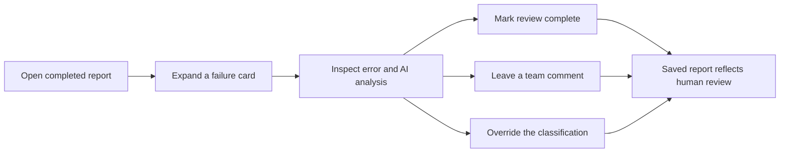

# Reviewing, Commenting, and Reclassifying Failures

Use the report page to turn an AI-generated failure analysis into a reviewed team record. You do this so the next person sees which failures are understood, what context matters, and where human judgment overruled the AI.

## Prerequisites
- You can open a completed analysis report in the web UI. See [Running Your First Analysis](quickstart.html) if you need one.
- You have already saved a username in the UI, so your reviews and comments are attributed to you.

## Quick Example
1. Open a completed report from the dashboard.
2. Expand a failure card that shows `+2 more with same error`.
3. Click `Review All (0/3)`.
4. Type a note in `Add a comment...` and press `Post`.
5. Change the classification dropdown to `INFRASTRUCTURE`.
6. Confirm the sticky header changes from `Needs Review` to `3/3 Reviewed`.

> **Tip:** Press `Enter` to post a comment. Use `Shift+Enter` for a multiline note.

## Step-by-Step
1. Open the failure card you want to review.
- Look for `+N more with same error` when several tests were grouped under the same root cause.
- Expand the card to inspect `Error`, `Analysis`, `Artifacts Evidence`, and, for grouped cards, `Affected Tests`.

2. Mark the failure as reviewed.
- On a single-test card, click `Review`.
- On a grouped card, click `Review All (x/y)` to mark the whole group at once, or use the smaller `Review` buttons next to individual tests.
- Click `Reviewed` again if you need to clear the mark.

3. Add a comment for your team.
- Type into `Add a comment...` and click `Post`.
- Each comment shows the author and timestamp.
- If the comment was posted under your current username, a trash icon appears on hover so you can delete it.

4. Correct the classification when the AI got it wrong.
- Use the dropdown at the bottom of the card.
- The available overrides are `CODE ISSUE`, `PRODUCT BUG`, and `INFRASTRUCTURE`.

| Choose this | Use it when | What you will see next |
| --- | --- | --- |
| `CODE ISSUE` | The fix belongs on the code or test side | Any `Bug Report` section disappears; `Suggested Fix` stays visible if one was generated |
| `PRODUCT BUG` | The product behavior is the real problem | Any `Suggested Fix` section disappears; `Bug Report` stays visible if one was generated |
| `INFRASTRUCTURE` | The failure came from Jenkins, the lab, the environment, or another external dependency | Both `Suggested Fix` and `Bug Report` disappear |

> **Warning:** On a grouped card, changing the classification updates the whole group, not just the representative test name shown in the header.

5. Verify that your changes stuck.
- The sticky header shows overall progress as `Needs Review`, `x/y Reviewed`, or `Reviewed`.
- There is no final `Save` button. Review toggles, comments, and classification changes are saved as you make them.

## Advanced Usage
Grouped cards change the scope of your actions, not just the layout.

| Action | Single failure card | Grouped failure card |
| --- | --- | --- |
| Review | Marks one test | `Review All` marks the full group, or you can review tests individually |
| Comment | Adds one comment | Posts the same comment to every test in the group |
| Classification | Changes one test | Applies the override across the full group |

> **Note:** Because grouped comments are stored per affected test, posting once on a large group can create several comment entries with the same text. That is expected.

If one grouped card shows more than one classification badge, the tests inside that group already have mixed saved overrides. Choosing a new value from the dropdown is the quickest way to standardize the group again.

For pipeline results, expand `Child Jobs` and make the change inside the exact child build you mean to update. The same test name can appear in more than one child build, and each build keeps its own review state, comments, and classification override.

Comments and review state refresh automatically, usually about every 30 seconds. While you are typing a draft comment, that refresh pauses so your in-progress note is not interrupted.

> **Tip:** Paste a full URL into a comment when you want a clickable link to a Jenkins console page, a runbook, or another external reference.

## Troubleshooting
- I do not see a delete icon for my comment: switch back to the same username that was active when the comment was posted.
- My comment appeared several times: you likely posted it on a grouped card, so JJI stored one copy for each affected test.
- I saw `Posted X/Y. Failed: ...`: some copies were saved and some were not. Press `Post` again without editing the text to retry only the failed tests.
- I saw `Failed to update...` or `Failed to save...`: some tests in the group did not change. Retry from the same card; the message names the failures.
- Not every similar failure changed when I reclassified one card: if the same test name appears in another child build, reclassify it in that child build too.
- I am not seeing a teammate's latest note yet: wait for the automatic refresh cycle, or reload the page when you are not typing in a comment box.
- I am not seeing a teammate's new classification yet: refresh the page. Comments and review state auto-refresh, but classification changes still require a reload for other open viewers.

## Related Pages

- [Monitoring and Re-Running Analyses](monitoring-and-rerunning-analyses.html)
- [Tracking Failure History](tracking-failure-history.html)
- [Creating GitHub Issues and Jira Bugs](creating-github-issues-and-jira-bugs.html)
- [Managing Your Profile and Personal Tokens](managing-your-profile-and-personal-tokens.html)
- [Pushing Classifications to Report Portal](pushing-classifications-to-report-portal.html)