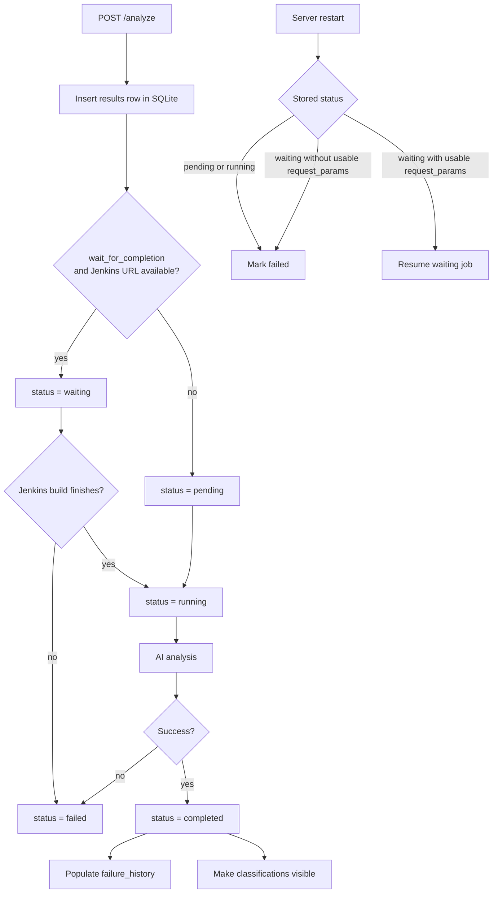

# Storage and Result Lifecycle

Jenkins Job Insight (JJI) stores analysis state in SQLite. That database is the source of truth for queued jobs, finished results, comments, review state, classifications, and history. The web UI does not read a standalone per-report HTML file; it reads stored data and renders the report on demand.

> **Note:** The canonical report URL is `/results/{job_id}`. JJI does not generate a separate per-job HTML artifact that needs to be cached, copied, or cleaned up.

## Quick Reference

| Item | Default / behavior |
| --- | --- |
| SQLite database | `/data/results.db` |
| Browser report URL | `/results/{job_id}` |
| In-progress browser URL | `/status/{job_id}` |
| Result lookup API | `GET /results/{job_id}` |
| Dashboard API | `GET /api/dashboard` |

## Where JJI Stores Data

`src/jenkins_job_insight/storage.py` sets the default database path directly:

```python
DB_PATH = Path(os.getenv("DB_PATH", "/data/results.db"))
```

The default container deployment is built around that location. In `docker-compose.yaml`, the host `./data` directory is mounted into the container at `/data`, so the database survives container restarts:

```yaml
# Persist SQLite database across container restarts
# The ./data directory on host maps to /data in container
volumes:
  - ./data:/data
```

That single database holds more than just the final AI summary. JJI creates tables for:

- `results`: one row per analysis job, including status, timestamps, Jenkins URL, and the stored result payload
- `comments`: free-form comments attached to failures
- `failure_reviews`: reviewed/not reviewed state for each failure
- `test_classifications`: classifications and human overrides
- `failure_history`: flattened historical failure data used by history and trend views

The central table is `results`:

```sql
CREATE TABLE IF NOT EXISTS results (
    job_id TEXT PRIMARY KEY,
    jenkins_url TEXT,
    status TEXT,
    result_json TEXT,
    created_at TIMESTAMP DEFAULT CURRENT_TIMESTAMP,
    analysis_started_at TIMESTAMP
)
```

JJI also persists the request parameters needed to recover a waiting job after restart. Sensitive values inside those stored parameters are encrypted at rest. If `JJI_ENCRYPTION_KEY` is unset, JJI creates a local key file under `$XDG_DATA_HOME/jji/.encryption_key` or `~/.local/share/jji/.encryption_key`.

> **Tip:** If you want the database somewhere else, set `DB_PATH` in the server environment. Only the database location changes. The user-facing report URL still stays under `/results/{job_id}`.

## Result States

In practice, JJI uses five result states:

| State | What it means |
| --- | --- |
| `pending` | The job has been accepted and stored, but AI analysis has not started yet. |
| `waiting` | JJI is waiting for the Jenkins build to finish before analysis begins. |
| `running` | AI analysis is in progress. |
| `completed` | Analysis finished successfully and the result is fully stored. |
| `failed` | JJI could not finish the analysis. The stored result includes an error message. |

The initial state depends on whether JJI can wait on Jenkins before analyzing. In `src/jenkins_job_insight/main.py`, the request is stored immediately as either `waiting` or `pending`:

```python
can_resume_wait = merged.wait_for_completion and bool(merged.jenkins_url)
await save_result(
    job_id,
    jenkins_url,
    "waiting" if can_resume_wait else "pending",
    initial_result,
)
```

Once analysis actually starts, JJI records lifecycle timestamps automatically:

```python
if status == "running":
    set_parts.append(
        "analysis_started_at = COALESCE(analysis_started_at, CURRENT_TIMESTAMP)"
    )
if status == "completed":
    set_parts.append("completed_at = COALESCE(completed_at, CURRENT_TIMESTAMP)")
```

That means:

- `created_at` tells you when the row was first inserted
- `analysis_started_at` tells you when work really began
- `completed_at` tells you when the final successful result was saved

The dashboard and report page use those timestamps to show duration and recency.

> **Note:** `/analyze-failures` does not use `waiting`. It goes straight through `pending -> running -> completed` or `failed`, because there is no Jenkins build to poll.

## End-to-End Lifecycle



A few user-visible details are worth knowing:

- JJI stores the row before background work starts, so the job is visible immediately in the UI, API, and CLI.
- While a job is active, JJI also stores progress phases like `waiting_for_jenkins`, `analyzing`, `enriching_jira`, and `saving`.
- Because those progress entries are stored in the result payload, refreshing `/status/{job_id}` does not lose the step history.
- When a job reaches `completed`, JJI flattens top-level and child-job failures into `failure_history`, which is what powers history and trend views.
- On startup, JJI backfills missing `failure_history` rows from older completed results.

## What Survives a Restart

Completed data survives because it is stored in SQLite, not kept only in memory.

In-progress work is handled differently. On startup, JJI deliberately marks `pending` and `running` jobs as failed, because their original background tasks are gone:

```python
cursor = await db.execute(
    "UPDATE results SET status = 'failed' "
    "WHERE status IN ('pending', 'running')"
)
```

`waiting` jobs are special. JJI tries to resume them by reading the stored request parameters:

```python
cursor = await db.execute(
    "SELECT job_id, result_json FROM results WHERE status = 'waiting'"
)
```

If the stored payload is incomplete or unusable, that waiting job is also marked `failed` instead of being resumed.

> **Warning:** `pending` and `running` jobs are not resumed after a restart. Only `waiting` jobs are candidates for recovery.

> **Warning:** Waiting-job recovery depends on the stored request parameters remaining readable. If you change the encryption key used for stored secrets, a previously waiting job may fail instead of resuming.

## Report URLs and HTML Behavior

The report route is `/results/{job_id}`. That same path serves two different use cases:

- Browser navigation: JJI serves the React app
- API or CLI access: JJI returns JSON from SQLite

The backend decides which behavior to use through content negotiation:

```python
if "text/html" in accept and "application/json" not in accept:
    result = await get_result(job_id)
    if result and result.get("status") in IN_PROGRESS_STATUSES:
        return RedirectResponse(url=f"/status/{job_id}", status_code=302)
    return _serve_spa()

result = await get_result(job_id)
if result.get("status") in IN_PROGRESS_STATUSES:
    response.status_code = 202
```

This has a few practical consequences:

- If a browser opens an in-progress result, JJI sends it to `/status/{job_id}`.
- If a script, API client, or `jji` requests the same job as JSON, it gets the stored row from SQLite.
- In-progress JSON responses return HTTP `202`, which makes them easy to poll.

The frontend status page then polls the same stored result until it finishes:

```tsx
const POLL_MS = 10_000

if (res.status === 'completed') {
  stopPolling()
  navigate(`/results/${jobId}`, { replace: true })
} else if (res.status === 'failed') {
  stopPolling()
  setTerminalErrorKind('failed')
  setError(res.result?.error ?? 'Analysis failed')
}
```

## HTML Report Caching

JJI does not cache per-job HTML report files. Instead:

- the app shell comes from the built React frontend
- the report content comes from live API reads against SQLite

That means there is no separate report artifact to invalidate when data changes. Comments, review toggles, classifications, and history-related updates are persisted in SQLite and shown the next time the UI fetches the latest data.

This is why the report experience stays current without a "rebuild report" step:

- the browser report page loads the stored result from `/results/{job_id}`
- comments and reviews are loaded from `/results/{job_id}/comments`
- dashboard rows are built from SQLite via `/api/dashboard`

> **Note:** The static frontend assets are built once, but individual analysis reports are not stored as standalone HTML files. A report is rendered from the latest stored data each time it is opened.

If you want links returned by the API to be absolute instead of relative, set `PUBLIC_BASE_URL`. When it is not set, JJI intentionally returns relative links such as `/results/{job_id}`.

> **Tip:** Set `PUBLIC_BASE_URL` when JJI sits behind a reverse proxy or external hostname and you want shareable absolute `result_url` values in API responses and issue previews.

## Deletion and Cleanup

Deleting a job removes the stored result and all related database records for that `job_id`, including comments, review state, classifications, and failure history.

Because the report is derived from SQLite data, cleanup is straightforward: once those database rows are gone, the report is gone too.

## Useful Commands

If you want to inspect stored lifecycle data from the CLI, these are the main commands:

```bash
jji status <job_id>
jji results show <job_id>
jji results dashboard
```

Use `jji status` when you only care about the current state, `jji results show` when you want the stored result payload, and `jji results dashboard` when you want the persisted run list with summary metadata.


## Related Pages

- [Results, Reports, and Dashboard Endpoints](api-results-and-dashboard.html)
- [HTML Reports and Dashboard](html-reports-and-dashboard.html)
- [Architecture and Project Structure](architecture-and-project-structure.html)
- [Pipeline Analysis and Failure Deduplication](pipeline-analysis-and-failure-deduplication.html)
- [Reverse Proxy and Base URL Handling](reverse-proxy-and-base-urls.html)