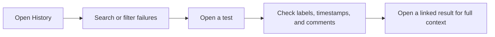

# Tracking Failure History

Use failure history when you want to answer two practical questions quickly: have we seen this failure before, and does it keep coming back in the same way? JJI helps you search stored failures, open one test's record, and reuse earlier labels and comments so you can separate flaky noise from a recurring product or infrastructure problem faster.

## Prerequisites

- JJI is running and you already have at least one completed analysis with stored results. See [Running Your First Analysis](quickstart.html).
- For the web UI, sign in first. See [Managing Your Profile and Personal Tokens](managing-your-profile-and-personal-tokens.html).
- The CLI examples assume `jji` is already configured. If it is not, add `--server <url>` to the commands.

## Quick Example

```bash
jji history failures --search "DNS resolution failed"
jji history test "tests.network.TestDNS.test_lookup" --job-name "ocp-e2e"
```

The first command finds matching historical failures across JJI. The second drills into one exact test so you can check how often it has failed in `ocp-e2e`, what classifications were saved, and whether earlier comments already point to a bug or fix.

| If you want to... | Fastest path |
| --- | --- |
| Browse recent failures and click into a result | Open `History` in the web UI |
| Inspect one exact test over time | `jji history test ... --job-name ...` |
| Page through a large filtered result set | `jji history failures ... --limit ... --offset ...` |

## Step-by-Step



1. Open `History` in the web UI.

2. Narrow the list until you see the failure you care about.
   - Use the search box for part of a test name, a stored error string, or a job name.
   - Use the classification filter when you want to focus on labels such as `PRODUCT BUG`, `CODE ISSUE`, `FLAKY`, `REGRESSION`, `INFRASTRUCTURE`, `KNOWN_BUG`, or `INTERMITTENT`.
   - The newest entries appear first, and you can sort the current page by test name, job, classification, or date.

3. Open the right level of detail.
   - Click the test name to open that test's history page.
   - Click the row itself to open the original analysis result for that specific job.

4. Read the single-test view to decide whether the problem is repeating.
   - Check `First seen` and `Last seen` to see how long the failure has been around.
   - Look at the classification breakdown to see whether earlier triage kept landing on the same label.
   - Use `Recent Runs` to jump straight to matching analyzed failures.
   - Read the `Comments` section for earlier notes such as `Opened bug: OCPBUGS-12345` or `Fix PR merged`.

> **Note:** The web UI test page is centered on recorded failures. If you need build totals, pass counts, or a failure-rate estimate for one Jenkins job, use `jji history test ... --job-name ...`.

5. Use what you found to make a faster triage decision.
   - Repeated `PRODUCT BUG` or `INFRASTRUCTURE` labels across several results usually point to a systemic issue.
   - Repeated `FLAKY` or `INTERMITTENT` labels usually point to unstable tests or environment noise.
   - If you need a fresh run to confirm the pattern, see [Monitoring and Re-Running Analyses](monitoring-and-rerunning-analyses.html).
   - If the history points to a new bug that should be tracked, see [Creating GitHub Issues and Jira Bugs](creating-github-issues-and-jira-bugs.html).

## Advanced Usage

### Scope one test to one Jenkins job

```bash
jji history test "tests.network.TestDNS.test_lookup" --job-name "ocp-e2e"
```

Add `--job-name` whenever you want an estimated `Failures` / `Total Runs` view for one job. Without it, JJI can still show recorded failure history, but it cannot calculate a reliable pass count.

### Page through a large filtered history list

```bash
jji history failures --job-name "ocp-e2e" --classification "FLAKY" --limit 50 --offset 50
```

Use this when the web UI list is too broad or when you want exact job scoping. `--search`, `--job-name`, and `--classification` can be combined.

### Exclude the run you are currently triaging

```bash
jji history test "tests.network.TestDNS.test_lookup" --job-name "ocp-e2e" --exclude-job-id "job-99"
```

This is useful when you want to compare the current failure against older history without letting the current run change the totals.

### Pivot from an existing failure signature

```bash
jji --json history search --signature "sig-dns"
```

Use this when another JJI command or JSON result already gave you an `error_signature` and you want to see every test that has failed with the same stored signature. JSON output is the easiest way to capture the matching tests and any saved comments tied to that signature.

> **Tip:** If a test history page already has useful comments, start there before you re-open a stack of older results one by one.


> **Note:** Older completed analyses are also loaded into failure history automatically when JJI starts, so past results can appear after a restart even if you are opening `History` for the first time.

## Troubleshooting

- **The single-test page shows `N/A` for failure rate, or the totals look smaller than expected.** The web UI page is failure-centered. Use `jji history test "..." --job-name "..."` to estimate totals across completed builds of one job.
- **History looks empty.** Make sure you have at least one completed analysis. If you just started or restarted JJI, refresh after startup finishes so previously stored results have time to appear.
- **I need to narrow history to one Jenkins job in the UI.** Use `jji history failures --job-name "..."` from the CLI. The web UI list does not expose a job-name filter.
- **I only see failure-centered history, not a full pass timeline.** That is expected in the current history views. Use the job-scoped CLI form when you need estimated totals across completed builds.

## Related Pages

- [Reviewing, Commenting, and Reclassifying Failures](reviewing-commenting-and-reclassifying-failures.html)
- [Monitoring and Re-Running Analyses](monitoring-and-rerunning-analyses.html)
- [Creating GitHub Issues and Jira Bugs](creating-github-issues-and-jira-bugs.html)
- [CLI Command Reference](cli-command-reference.html)
- [REST API Reference](rest-api-reference.html)